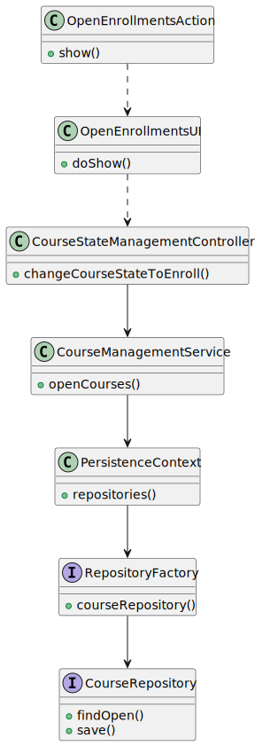

# US 1003

## 1. Context

* It is the first time the task is assigned to be developed
* As Manager, I want to open and close enrollments

## 2. Requirements

-> The admin should be able to open or close enrollments.

## 3. Analysis

-> To open the enrollments the course must have an open state and it will change to enroll, as stated in the client
workflow.
-> To close the enrollments the course must be in enroll state and it will change to inProgress, as stated in the client
workflow.

Acceptance Criteria :

- > Nothing was mentioned

### 3.1. Customer Specifications and Clarifications

Acceptance Criteria :

- > The usual workflow related to the course can be illustrated as follows:
  > event create (-> state close) -> event open (->state open) -> event open enrollments (-> state enroll) -> event
  close enrollments (-> state in progress) -> event close (-> state closed)

Questions:

- > No questions were asked

## 4. Design

Use the standard, layer-based application framework

Domain classes: Course (Course Aggregate)

Action: CloseEnrollmentsAction, OpenEnrollmentsAction
UI: CloseEnrollmentsUI, OpenEnrollmentsUI
Controller: ChangeCourseStateController
Service: CourseManagementService
Repository: CourseRepository

### 4.1. Realization (System Sequence Diagram)


### 4.2. Realization (Sequence Diagram)


### 4.3. Class Diagram




### 4.4. Domain Driven Design Excerpt


### 4.5. Use Case Diagram


### 4.7. Applied Patterns

-SOLID

-Low Coupling

-High Cohesion

-State Pattern

-Protected Variation

### 4.8. Tests

```
````

## 5. Implementation

### OpenEnrollmentsUI implementation:

    public class OpenEnrollmentsUI extends AbstractUI {

      private final CourseStateManagementController controller = new CourseStateManagementController();

      @Override
      protected boolean doShow() {

          final Iterable<Course> openCourses = this.controller.listOpenCourses();
          if (!openCourses.iterator().hasNext()) System.out.println("No registered courses!");
          else {
              final SelectWidget<Course> selector = new SelectWidget<>("Courses:", openCourses, new CoursePrinter());
              selector.show();
              final Course selectedCourse = selector.selectedElement();
              try {
                  if (selectedCourse != null) {
                      this.controller.changeCourseStateToEnroll(selectedCourse);
                  }
              } catch (final Exception e) {
                  System.out.println(e.getMessage());
              }
          }
          return true;
      }

      public String headline() {
          return "Open Enrollments";
      }
    }

### CloseEnrollmentsUI implementation:

    public class CloseEnrollmentsUI extends AbstractUI {

      private final CourseStateManagementController controller = new CourseStateManagementController();

      @Override
      protected boolean doShow() {

          final Iterable<Course> inEnrollStateCourses = this.controller.listEnrollStateCourses();
          if (!inEnrollStateCourses.iterator().hasNext()) System.out.println("No registered courses!");
          else {
              final SelectWidget<Course> selector = new SelectWidget<>("Courses:", inEnrollStateCourses, new CoursePrinter());
              selector.show();
              final Course selectedCourse = selector.selectedElement();
              try {
                  if(selectedCourse != null){
                      this.controller.changeCourseStateToInProgress(selectedCourse);
                  }
              }catch (final Exception e){
                  System.out.println(e.getMessage());
              }
          }

          return true;
      }

      public String headline() {
          return "Close Enrollments";
      }
    }

### ChangeCourseStateController implementation:

    public class ChangeCourseStateController {

      private final CourseManagementService service = new CourseManagementService();
      private final CourseRepository courseRepo = PersistenceContext.repositories().courseRepository();


      public Iterable<Course> listCourses() {
          return this.service.allCourses();
      }

      public void openCourse(Course selectedCourse){
          selectedCourse.openCourse();
          courseRepo.save(selectedCourse);
      }

      public void closeCourse(Course selectedCourse){
          selectedCourse.closeCourse();
          courseRepo.save(selectedCourse);
      }
    }

### CourseManagementService implementation:

    @ApplicationService
    public class CourseManagementService {

      private final CourseRepository courseRepository = PersistenceContext.repositories().courseRepository();

      public Iterable<Course> allCourses() {
          return courseRepository.findAll();
      }

      public Iterable<Course> openCourses(){return courseRepository.findOpen();}

      public Iterable<Course> enrollStateCourses(){return courseRepository.findEnrollStateCourses();}
    }


List of some Commits:

SD design - 1st draft #14
master
@FabioMCSilva
FabioMCSilva committed 2 weeks ago
1 parent c42d95e
commit a382353

Added ui, controller, service and printer for #14 - waiting for colle…
…agues commits to make more adjustments
master
@FabioMCSilva
FabioMCSilva committed 2 weeks ago
1 parent fa27cfd
commit d62f8c3

#14 Rethinked the way the us will work, changes to UI, Controller and…
… Persistence
master
@FabioMCSilva
FabioMCSilva committed last week
1 parent be165e3
commit d22d8f0

#14 Fixes to JPQL in persistence file
master
@FabioMCSilva
FabioMCSilva committed last week
1 parent f5d6cc9
commit 354b464

#14 SD design - 2nd draft and changes to UI and Controller to obey th…
…e sd design
master
@FabioMCSilva
FabioMCSilva committed 5 days ago
1 parent c8b5a4e
commit c589acc

#14 SD design - 3rd draft and changes to UI and Controller to represe…
…nt SD changes
master
@FabioMCSilva
FabioMCSilva committed 5 days ago
1 parent d8bea6c
commit d87bbd2

#14 Changes to Course printer
master
@FabioMCSilva
FabioMCSilva committed 4 days ago
1 parent b1250d5
commit bdbe77b

#14 Added Documentation
master
@FabioMCSilva
FabioMCSilva committed 16 hours ago
1 parent 4de9a4d
commit 13bd6bb

#14 #16 Added Documentation
master
@FabioMCSilva
FabioMCSilva committed 5 hours ago
1 parent 8f48576
commit cfba5bf

#14 #15 #16 Added documentation images
master
@FabioMCSilva
FabioMCSilva committed 11 minutes ago
1 parent ef6e81c
commit b2eb37f

## 6. Integration/Demonstration

*In this section the team should describe the efforts realized in order to integrate this functionality with the other
parts/components of the system*

*It is also important to explain any scripts or instructions required to execute an demonstrate this functionality*

## 7. Observations

