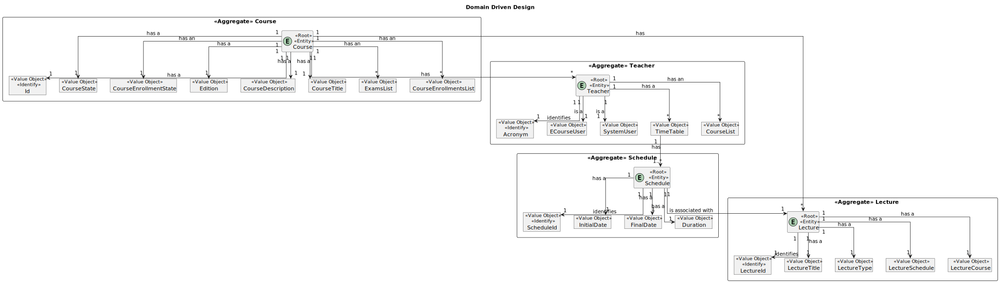

# US 1012

## 1. Context

* It is the first time the task is assigned to be developed
* As Teacher, I want to update the schedule of a class

## 2. Requirements

-> The teacher should be able to change the schedule of a lecture.

## 3. Analysis

-> The normal classes are created recurrently, the teacher should be able to change one occurence

Acceptance Criteria :

- > Nothing was mentioned

### 3.1. Customer Specifications and Clarifications

Acceptance Criteria :

- > Nothing was mentioned

Questions:

- > No questions were asked

## 4. Design

Use the standard, layer-based application framework

Domain classes: Course (Course Aggregate)
                Schedule (Schedule Aggregate)
                Teacher (Teacher Aggregate)
                Lecture (Lecture Aggregate)

Action: ChangeLectureScheduleAction
UI: ChangeLectureScheduleUI
Controller: ChangeLectureScheduleController
Service: ListLecturesService
Repository: TeacherRepository, LectureRepository, ScheduleRepository

### 4.1. Realization (System Sequence Diagram)


### 4.2. Realization (Sequence Diagram)


### 4.3. Class Diagram


### 4.4. Domain Driven Design Excerpt



### 4.5. Use Case Diagram


### 4.7. Applied Patterns

-SOLID

-Low Coupling

-High Cohesion

-State Pattern

-Protected Variation

### 4.8. Tests

```
````

## 5. Implementation

### ChangeLectureScheduleUI implementation:

    public class ChangeLectureScheduleUI extends AbstractUI {

     private final ChangeLectureScheduleController controller = new ChangeLectureScheduleController();

        @Override
        protected boolean doShow() {

            final Iterable<Lecture> myLectures = controller.myLectures();
            if (!myLectures.iterator().hasNext()) System.out.println("No registered lectures!");
            else {
                final SelectWidget<Lecture> selector = new SelectWidget<>("Lectures:", myLectures, new LecturePrinter());
                selector.show();
                final Lecture selectedLecture = selector.selectedElement();
                try {
                    if(selectedLecture != null){
                        String rawDate;
                        Date dateTime;
                        do {
                            rawDate = Console.readLine("Write the BirthDate");
                            dateTime = DateTimeUtil.toDateTime(rawDate);
                        } while (dateTime == null);

                        Calendar calendar = Calendar.getInstance();
                        calendar.setTime(dateTime);

                        final int rawDuration = Console.readInteger("Write the new duration");

                        this.controller.changeLectureSchedule(selectedLecture, calendar, rawDuration);
                    }
                }catch (final Exception e){
                    System.out.println(e.getMessage());
                }
            }
            return true;
        }

        public String headline() {
         return "Change Lecture Schedule";
        }
    }

### ChangeLectureScheduleController implementation:

    public class ChangeLectureScheduleController {

        private final ListLecturesService svc = new ListLecturesService();
        private final ScheduleRepository scheduleRepository = PersistenceContext.repositories().scheduleRepository();
        private final LecturesRepository lecturesRepository = PersistenceContext.repositories().lecturesRepository();
        private final AuthorizationService auth = AuthzRegistry.authorizationService();

        public Lecture changeLectureSchedule(final Lecture lecture, final Calendar dateTime, final int duration) {
            auth.ensureAuthenticatedUserHasAnyOf(BaseRoles.TEACHER);
            if (lecture == null | dateTime == null || duration < 0){
                throw new IllegalArgumentException();
            }
            Schedule schedule = lecture.getSchedule();
            schedule.changeInitialDate(dateTime);
            schedule.changeDuration(duration);
            scheduleRepository.save(schedule);
            return lecturesRepository.save(lecture);
        }

        public Iterable<Lecture> myLectures(){
            Teacher teacher = myDetails().iterator().next();

            if (teacher == null){
                return null;
            }
            return teacher.getTimeTable().getLecturesSchedules();
        }

        public Iterable<Teacher> myDetails() {

            SystemUser systemUser = auth.session().get().authenticatedUser();

            return this.svc.myDetails(systemUser);
        }
    }

### ListLecturesService implementation:

    @ApplicationService
    public class ListLecturesService {

        private final AuthorizationService auth = AuthzRegistry.authorizationService();
        private final TeacherRepository teacherRepository = PersistenceContext.repositories().teacherRepository();

        public Iterable<Teacher> myDetails(){
            SystemUser systemUser = auth.session().get().authenticatedUser();

            return teacherRepository.myDetails(systemUser);
        }
    }


List of some Commits:

SD design - 1st draft #15
master
@FabioMCSilva
FabioMCSilva committed 2 weeks ago
1 parent a382353
commit 9a22a5c

#15 changed class name to lecture to avoid issues in java, started wo…
…rking on the service and on the domain
master
@FabioMCSilva
FabioMCSilva committed 2 weeks ago
1 parent 51faba5
commit 750beff

#15 Further modifications on lecture class and worked on the controll…
…er and listing service
master
@FabioMCSilva
FabioMCSilva committed 2 weeks ago
1 parent 3978b22
commit ddec824

#15 Rethinked how the us will work, changes to controller, service, r…
…epository and persistence
master
@FabioMCSilva
FabioMCSilva committed last week
1 parent 557d816
commit f5d6cc9

#15 Added Action, UI and Printer to the app
master
@FabioMCSilva
FabioMCSilva committed last week
1 parent 354b464
commit 8ed58d6

#15 SD design - 2nd draft
master
@FabioMCSilva
FabioMCSilva committed 5 days ago
1 parent c589acc
commit d8bea6c

#15 Changes to UI and Controller and moved the DateUtil to the common…
… console so all apps can access it
master
@FabioMCSilva
FabioMCSilva committed 4 days ago
1 parent 2eb8902
commit 390b95a

#15 US documentation
master
@FabioMCSilva
FabioMCSilva committed 3 hours ago
1 parent 3e38f6b
commit a1031e7

#15 Changes to how the changes to schedule are made. Waiting for the …
…creation of the lectures to test
master
@FabioMCSilva
FabioMCSilva committed 2 hours ago
1 parent 63501a3
commit 806d7c3

#15 Changes to documentation
master
@FabioMCSilva
FabioMCSilva committed 51 minutes ago
1 parent c700ecb
commit 7feb97f

#14 #15 #16 Added documentation images
master
@FabioMCSilva
FabioMCSilva committed 14 minutes ago
1 parent ef6e81c
commit b2eb37f

## 6. Integration/Demonstration

*In this section the team should describe the efforts realized in order to integrate this functionality with the other
parts/components of the system*

*It is also important to explain any scripts or instructions required to execute an demonstrate this functionality*

## 7. Observations

