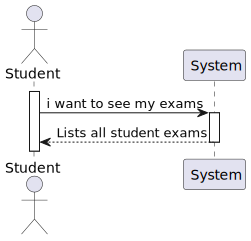
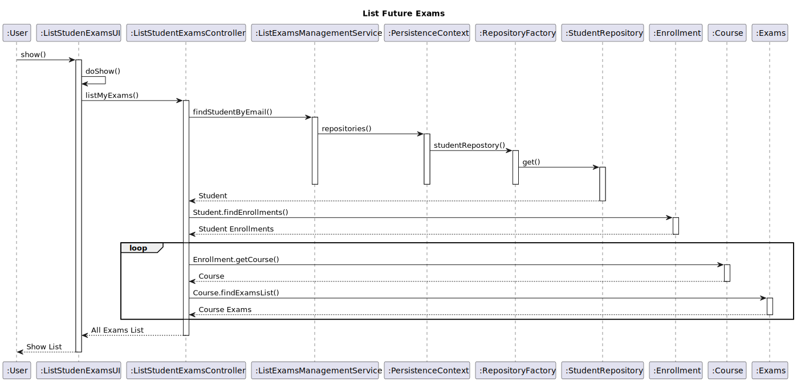
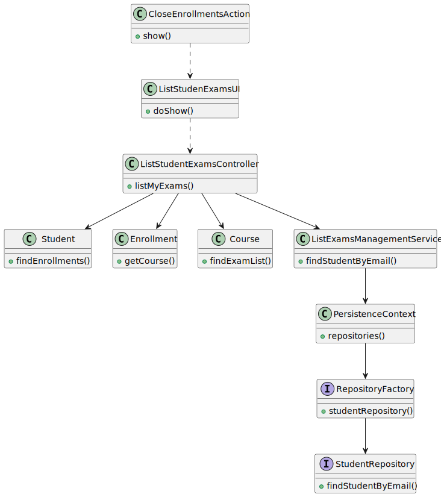
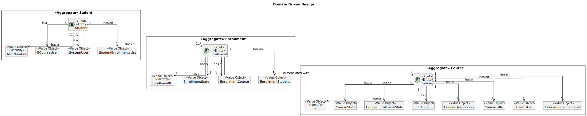
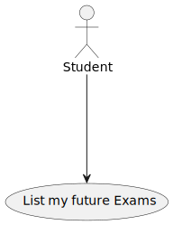

# US 2002

## 1. Context

* It is the first time the task is assigned to be developed
* As Student, I want to view a list of my future exams

## 2. Requirements

-> The student should be see a list of his future exams.

## 3. Analysis

-> To obtain all the exams list, we should obtain the student enrollments to access the course 
and after that access the exams list from that course.
-> The above should be done for all student enrollments.
-> At the end we compile all the exams in one list.

Acceptance Criteria :

- > Nothing was mentioned

### 3.1. Customer Specifications and Clarifications

Acceptance Criteria :

- > Nothing was mentioned

Questions:

- > No questions were asked

## 4. Design

Use the standard, layer-based application framework

Domain classes: Student (Student Aggregate)
                Exam (Exam Aggregate)
                Course (Course Aggregate)
                Enrollment (Enrollment Aggregate)

Action: ListStudenExamsAction
UI: ListStudenExamsUI
Controller: ListStudentExamsController
Service: ListExamsManagementService
Repository: StudentRepository

### 4.1. Realization (System Sequence Diagram)



### 4.2. Realization (Sequence Diagram)



### 4.3. Class Diagram



### 4.4. Domain Driven Design Excerpt



### 4.5. Use Case Diagram



### 4.7. Applied Patterns

-SOLID

-Low Coupling

-High Cohesion

-State Pattern

-Protected Variation

### 4.8. Tests

```
````

## 5. Implementation

### ListStudenExamsUI implementation:

    public class ListStudentExamsUI extends AbstractUI {

     ListStudentExamsController controller = new ListStudentExamsController();

      @Override
      protected boolean doShow() {


          final Iterable<Exam> examIterable = controller.listMyExams();

          if (examIterable == null) {
              System.out.println("You are not registered in any exams\n");
          }

          while (examIterable.iterator().hasNext()){
              System.out.println(examIterable.iterator().next().toString());
          }

          return true;
      }

      public String headline() {
          return "My exams list";
      }
    }

### ListStudentExamsController implementation:

    public class ListStudentExamsController {

      private final ListExamsManagementService service = new ListExamsManagementService();

      public Iterable<Exam> listMyExams(){


          List<Exam> examList = new ArrayList<>();
          Student s = service.findStudentByEmail();

         if (s == null){
              return null;
          }

          List<Enrollment> enrollmentList = s.findEnrollments();

          if (enrollmentList.isEmpty()){
              return null;
          }

          for (int i = 0; i < enrollmentList.size(); i++){
              Enrollment enrollment = enrollmentList.get(i);
              Course course = enrollment.getCourse();
              List<Exam> examListByCourse = course.findExamList();

              if (!examListByCourse.isEmpty()){
                  examList.addAll(examListByCourse);
              }
          }

          return examList;
      }

### ListExamsManagementService implementation:

    @ApplicationService
    public class ListExamsManagementService {

      public final StudentRepository studentRepository = PersistenceContext.repositories().studentRepository();
      private final AuthorizationService authz = AuthzRegistry.authorizationService();

      public Student findStudentByEmail(){
          EmailAddress email = authz.session().get().authenticatedUser().email();
         return studentRepository.findStudentByEmail(email);
     }

    }


List of some Commits:

SD design - 1st draft #16
master
@FabioMCSilva
FabioMCSilva committed 2 weeks ago
1 parent a6ef349
commit c42d95e

#16 Did the entireUS (untested)
master
@FabioMCSilva
FabioMCSilva committed 18 hours ago
1 parent 1e0d291
commit ad6b56b

#16 SD design and changes to the US to obey it's design
master
@FabioMCSilva
FabioMCSilva committed 17 hours ago
1 parent 7ceda7e
commit 4de9a4d

#16 Added Documentation
master
@FabioMCSilva
FabioMCSilva committed 16 hours ago
1 parent 13bd6bb
commit 3f9fa05

#14 #16 Added Documentation
master
@FabioMCSilva
FabioMCSilva committed 5 hours ago
1 parent 8f48576
commit cfba5bf

#14 #15 #16 Added documentation images
master
@FabioMCSilva
FabioMCSilva committed 15 minutes ago
1 parent ef6e81c
commit b2eb37f

## 6. Integration/Demonstration

*In this section the team should describe the efforts realized in order to integrate this functionality with the other
parts/components of the system*

*It is also important to explain any scripts or instructions required to execute an demonstrate this functionality*

## 7. Observations

