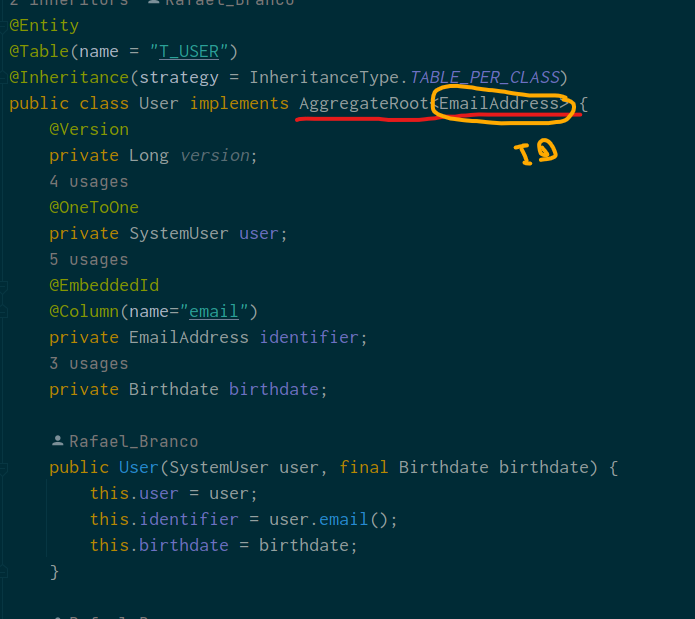
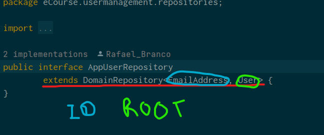
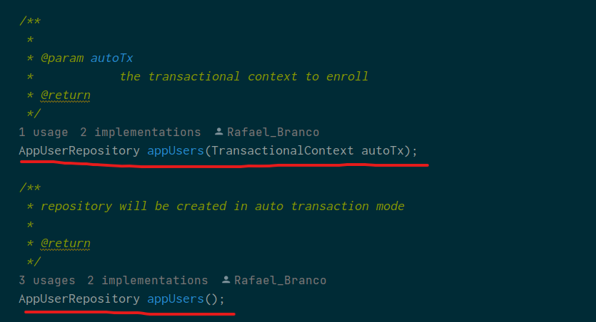
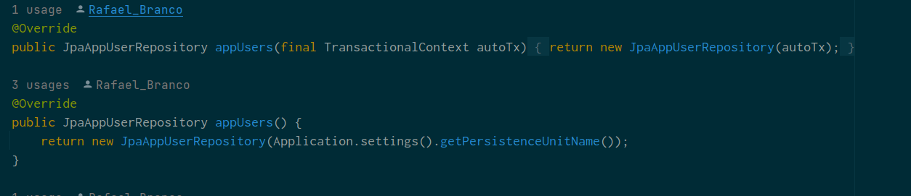
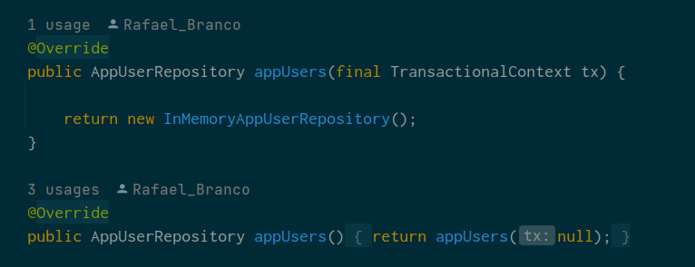
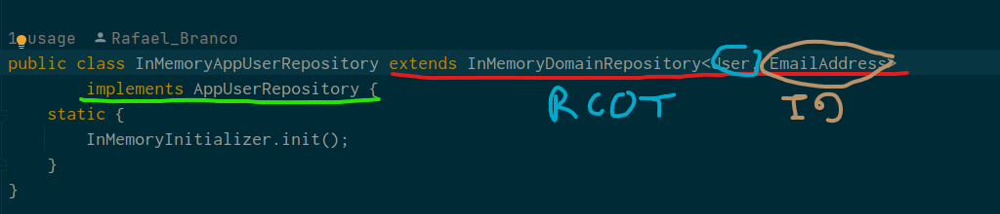
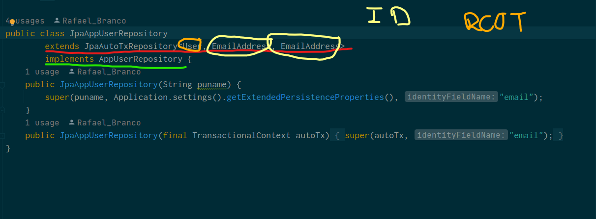
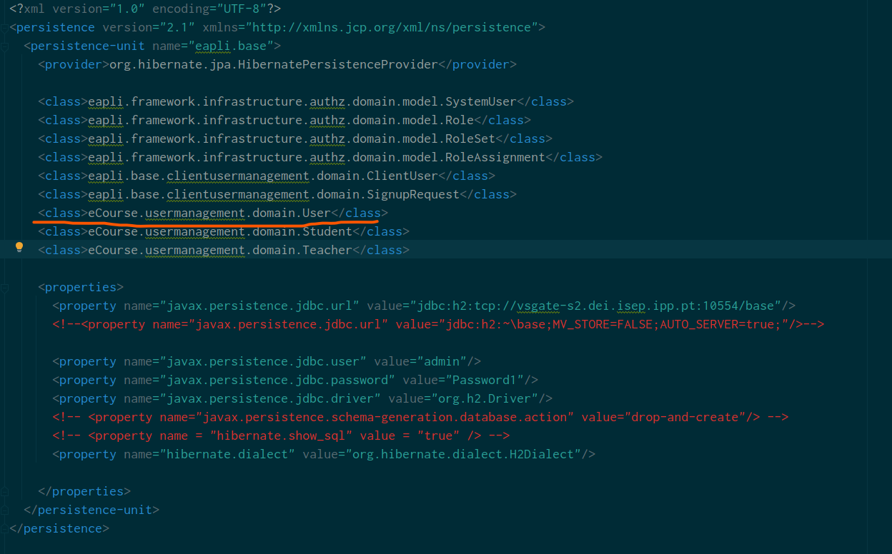

# Como crir um repositório para um agregado

## 1. Definir a classe que é centro do agregado

**Nota:** Geralmente a mesma fica colocada no *domain package* e tem de implementar a interface **AggregateRoot< ID >**

## 2. Criar a interface do repositório

**Nota:** A class *Domain Repository* não é nossa e sim do projeto base. É importante perceberem a sua implementação. A interface do repositório deve extender a class **DomainRepository<ID, Class>**. Nesta classe deve-se adicionar os métodos de procura específicos que têm de ser implementados posteriormente.

## 3. Adicionar o repositório às RepositoryFactoriy

Na interface RepositoryFactory que fica localizada no package eapli.base.infrastructure.persistence no módulo Core devem adicionar as seguintes linhas de código:

## 4. Fazer as suas implementações nas JPA e InMemory
### JPARepositoryFactory class

### InMemoryRepositoryFactory class

## 5. Criar as classes Repository InMemory e JPA e implementar a interface Repository criada antes

Nestas classes também se colocam as implementações dos métodos que sejam adicionados para querries específicas que tenham sido adicionados na interface Repository criada no ponto 2.
### InMemoryRepository

**Nota:** A class respository tem de extender a class **InMemoryDomainRepository< ID, AggregateRoot< ID > >**

### JPARepository

**Nota:** A class JPARepository tem de extender a class **JPAAutoTxRepository< Root, ID, ID >** e implementar a interface repositório igualmente.

## 6. Adicionar a classe ao Persistence.xml

Com isto fica feito o processo de criação de um repositório
