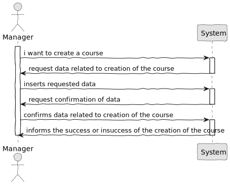
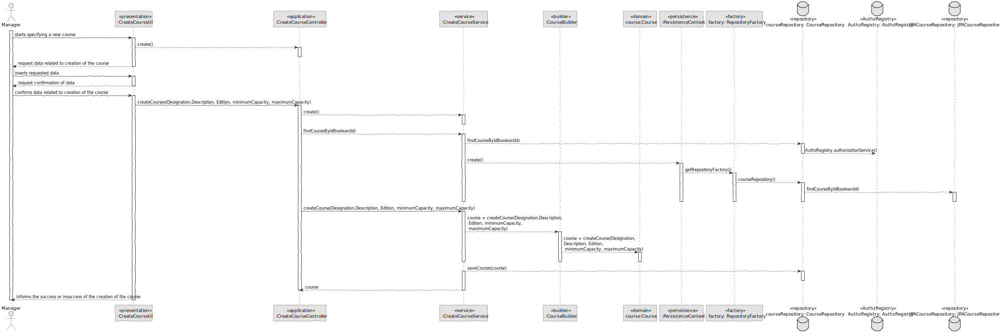
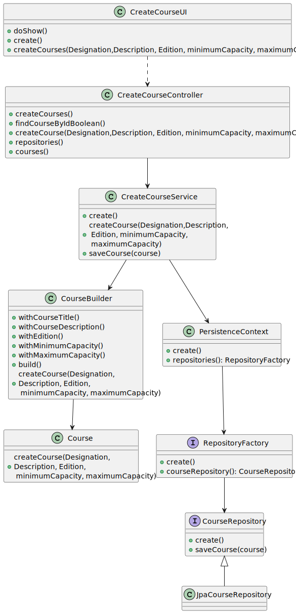
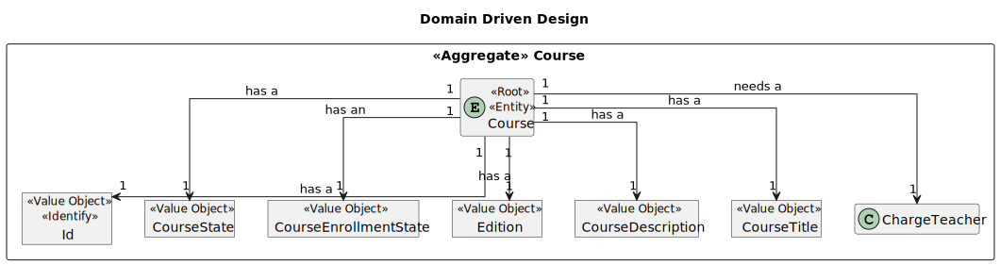
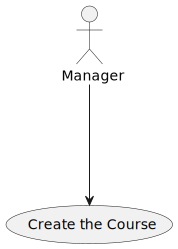
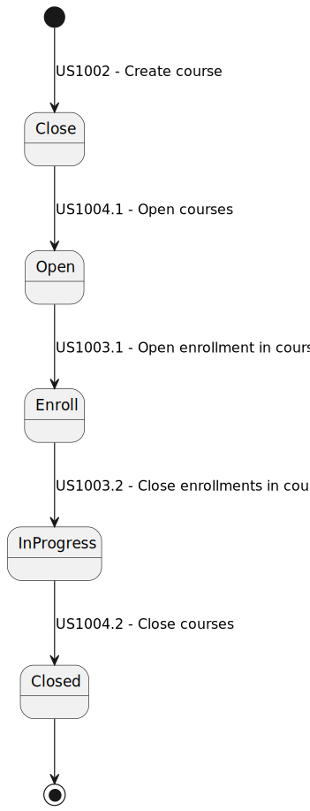

# US 1002

## 1. Context

* It is the first time the task is assigned to be developed
* I want to create courses as a manager

## 2. Requirements

> **US 1002** As Manager, I want to create courses

* Regarding this requirement we understand that it relates to create a course, which means, making a new course
  available *

## 3. Analysis

> Interpretar caso de uso: perceção dos objetivos. pre-requesitos, execuções, pos-requesitos

Acceptance Criteria :

- > Different editions of a course are to be considered different courses (e.g., Intro-Math-Sem01, Intro-Math-Sem02).
- > Only managers are able to execute this functionality.
 

### 3.1. Customer Specifications and Clarifications

Acceptance Criteria :

- > Different editions of a course are to be considered different courses (e.g., Intro-Math-Sem01, Intro-Math-Sem02).
- > Only managers are able to execute this functionality.

Questions:

- >

## 4. Design

*In this section, the team should present the solution design that was adopted to solve the requirement. This should
include, at least, a diagram of the realization of the functionality (e.g., sequence diagram), a class diagram (
presenting the classes that support the functionality), the identification and rational behind the applied design
patterns and the specification of the main tests used to validade the functionality.*

Use the standard, layer-based application framework

Domain classes: Course (Course Aggregate)

Controller: CreateCourseController
UI: CreateCourseUI
Service: CreateCourseService
Repository: CourseRepository, TeacherRepository,StudentRepository


### 4.1. Realization (System Sequence Diagram)



### 4.2. Realization (Sequence Diagram)



### 4.3. Class Diagram



### 4.4. Domain Driven Design Excerpt



### 4.5. Use Case Diagram



### 4.6. Course State Diagram



### 4.7. Applied Patterns

-Low Coupling

-High Cohesion

-State Pattern

-Protected Variation

### 4.8. Tests

**Test 1:** *Verifies that it is not possible to create an instance of the Example class with null values.*

```
@Test(expected = IllegalArgumentException.class)
public void ensureNullIsNotAllowed() {
	Example instance = new Example(null, null);
}
````

## 5. Implementation

*In this section the team should present, if necessary, some evidencies that the implementation is according to the
design. It should also describe and explain other important artifacts necessary to fully understand the implementation
like, for instance, configuration files.*
...
Info inside the Class CreateCourseService:

    private final AuthorizationService authorizationService;
    private final CourseRepository courseRepository;
    private final CourseBuilder createCourseBuilder;
    private Course course;

    public CreateCourseService() {
    }

    /**
     * Validate course boolean.
     *
     * @param ids the ids
     * @return the boolean
     */
    public boolean findCourseByIdBoolean(String ids) {
    }

    /**
     * Create  course.
     *
     * @param courseTitle       the course title
     * @param courseDescription the course description
     * @param code           the code
     * @param minimumCapacity   the minimum capacity
     * @param maximumCapacity   the maximum capacity
     * @return the course
     */
    public Course createCourse(Designation courseTitle, Description courseDescription, Edition code, int minimumCapacity, int maximumCapacity) {
    }

    /**
     * Save  course.
     *
     * @param course the course
     * @return the course
     */
    public Course saveCourse(Course course) {
    }


Info inside the Class CourseBuilder:


    private static final Logger LOGGER = LogManager.getLogger(CourseBuilder.class);

    private Designation courseTitle;
    private Description courseDescription;
    private Edition code;
    private int minimumCapacity;
    private int maximumCapacity;


    /**
     * With course title course builder.
     *
     * @param courseTitle the course title
     * @return the course builder
     */
    public CourseBuilder withCourseTitle(Designation courseTitle) {
    }

    /**
     * With course description course builder.
     *
     * @param courseDescription the course description
     * @return the course builder
     */
    public CourseBuilder withCourseDescription(Description courseDescription) {
    }

    /**
     * With code course builder.
     *
     * @param code the code
     * @return the course builder
     */
    public CourseBuilder withEdition(Edition code) {
    }

    /**
     * With course title course builder.
     *
     * @param courseTitle the course title
     * @return the course builder
     */
    public CourseBuilder withCourseTitle(String courseTitle) {
    }

    
    /**
     * With minimum capacity course builder.
     *
     * @param minimumCapacity the minimum capacity
     * @return the course builder
     */
    public CourseBuilder withMinimumCapacity(int minimumCapacity) {
    }

    /**
     * With maximum capacity course builder.
     *
     * @param maximumCapacity the maximum capacity
     * @return the course builder
     */
    public CourseBuilder withMaximumCapacity(int maximumCapacity) {
    }

    /**
     * Instantiates a new course builder.
     */
    public CourseBuilder() {
    }

    /**
     * Build course.
     *
     * @return the course
     */
    public Course build() {
        Course course = new Course(this.courseTitle,this.courseDescription,CourseState.CLOSE,this.code,this.minimumCapacity,this.maximumCapacity);

        if (LOGGER.isDebugEnabled()) {
            LOGGER.debug("Creating new Course {} {} {} {} {} {} with system info ", this.courseTitle,this.courseDescription,CourseState.CLOSE,this.code,this.minimumCapacity,this.maximumCapacity);
        }

        return course;
    }
}

List of some Commits:

51faba5
JorgeCunha07 added a commit that referenced this issue last week
@JorgeCunha07
Creation of Controller and Ui for Course and Also their factorys …


46f088d
JorgeCunha07 added a commit that referenced this issue last week
@JorgeCunha07
Creation of the Repositorys and factorys necessaries …

c2a114f
JorgeCunha07 added a commit that referenced this issue last week
@JorgeCunha07
Creation of Create Course Builder,creation o Create Course Service …

3db4991
@JorgeCunha07 JorgeCunha07 self-assigned this last week
JorgeCunha07 added a commit that referenced this issue 5 days ago
@JorgeCunha07
ssd …

1f253ee
JorgeCunha07 added a commit that referenced this issue 5 days ago
@JorgeCunha07
Corrections of the program. …

0fc4917
JorgeCunha07 added a commit that referenced this issue 5 days ago
@JorgeCunha07
Fixed issues …

a25495f
JorgeCunha07 added a commit that referenced this issue 4 days ago
@JorgeCunha07
US 10002 SSD,SD,UCD,DDD,CD Almost Done …

1038d85
JorgeCunha07 added a commit that referenced this issue 4 days ago
@JorgeCunha07
Implementation of US 1002 …

fe27136
JorgeCunha07 added a commit that referenced this issue 3 days ago
@JorgeCunha07
US-1002 -> Course Modifications …

ba2d262
JorgeCunha07 added a commit that referenced this issue 3 days ago
@JorgeCunha07
Finished SD US1002 …

9582b26
JorgeCunha07 added a commit that referenced this issue 2 days ago
@JorgeCunha07
Fixes …
38202ba

...

*It is also a best practice to include a listing (with a brief summary) of the major commits regarding this
requirement.*

## 6. Integration/Demonstration

*In this section the team should describe the efforts realized in order to integrate this functionality with the other
parts/components of the system*

*It is also important to explain any scripts or instructions required to execute an demonstrate this functionality*

## 7. Observations


This User Story holds great significance as it serves as a foundation for approaching other User Stories. 
Its impact is far-reaching, influencing the way other stories are approached and executed.