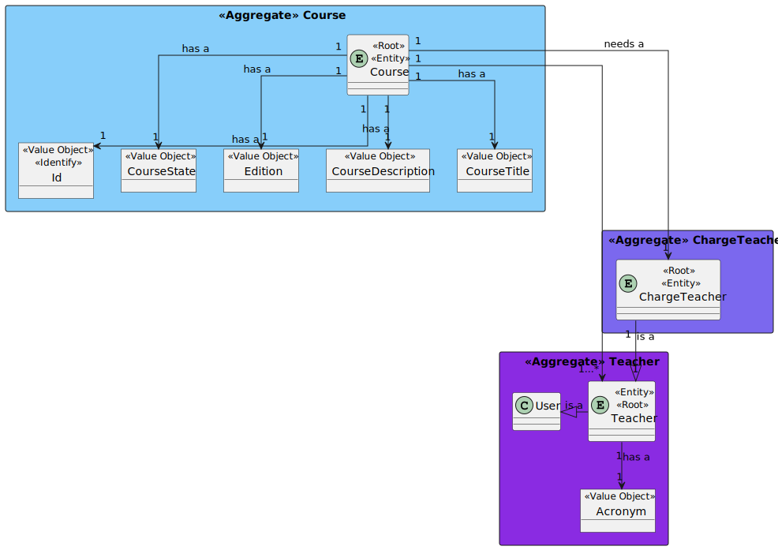
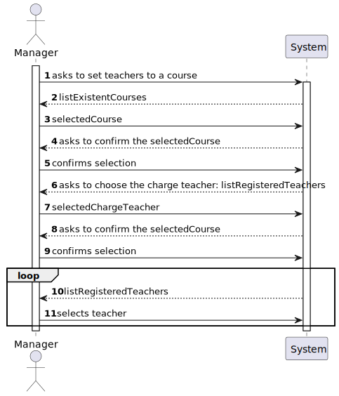
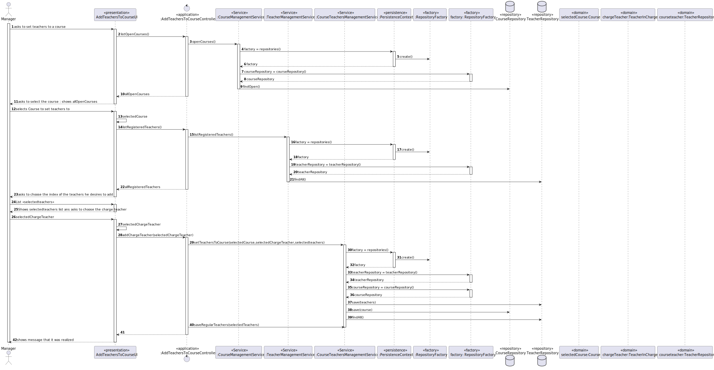

# US 1005

## 1. Context

* It is the first time the task is assigned to be developed

## 2. Requirements

> **US 1005** As Manager, I want to set the teachers of a course

* There is a dependency with US1002, which is responsible for creating the course.

* Regarding this requirement we understand that it relates to associate teachers with the course, which means,
  associating a charge teacher and all the other teachers also to the course *

> FRC04 - Set Course Teachers. Each course may have several teachers and must have
> only one Teacher in Charge. Only managers are able to execute this functionality.

## 3. Analysis

Decisions to take the best design decisions for the requirement. This section should also include supporting
diagrams/artifacts (such as domain model; use case diagrams, etc.),*

### 3.1. Use Case Diagram


### 3.2. Domain Model



### 3.3. System Sequence Diagram



## 4. Design

*In this section, the team should present the solution design that was adopted to solve the requirement. This should
include, at least, a diagram of the realization of the functionality (e.g., sequence diagram), a class diagram (
presenting the classes that support the functionality), the identification and rational behind the applied design
patterns and the specification of the main tests used to validade the functionality.*

### 4.1. Realization (Sequence Diagram)



### 4.2. Class Diagram


### 4.3. Applied Patterns

* Low Coupling
* High Cohesion

### 4.4. Tests

**Test 1:** *Verifies that it is possible to set Teachers to a course*

```
@Test(expected = IllegalArgumentException.class)
public void ensureNullIsNotAllowed() {
	Example instance = new Example(null, null);
}
````

**Test 2:** *Verifies that it is possible to set Teachers to a course*

## 5. Implementation

*In this section the team should present, if necessary, some evidencies that the implementation is according to the
design. It should also describe and explain other important artifacts necessary to fully understand the implementation
like, for instance, configuration files.*

*It is also a best practice to include a listing (with a brief summary) of the major commits regarding this
requirement.*

## 6. Integration/Demonstration

*In this section the team should describe the efforts realized in order to integrate this functionality with the other
parts/components of the system*

*It is also important to explain any scripts or instructions required to execute an demonstrate this functionality*

## 7. Observations

*This section should be used to include any content that does not fit any of the previous sections.*

*The team should present here, for instance, a critical prespective on the developed work including the analysis of
alternative solutioons or related works*

*The team should include in this section statements/references regarding third party works that were used in the
development this work.*