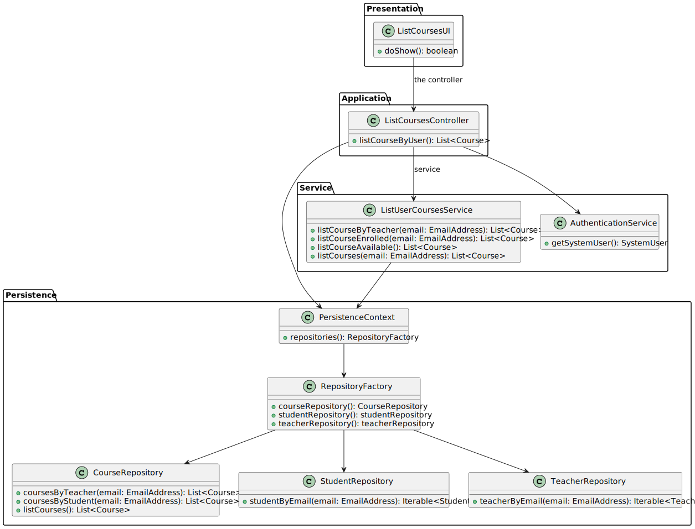
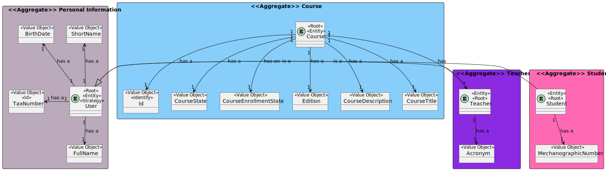
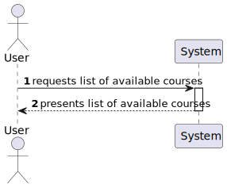
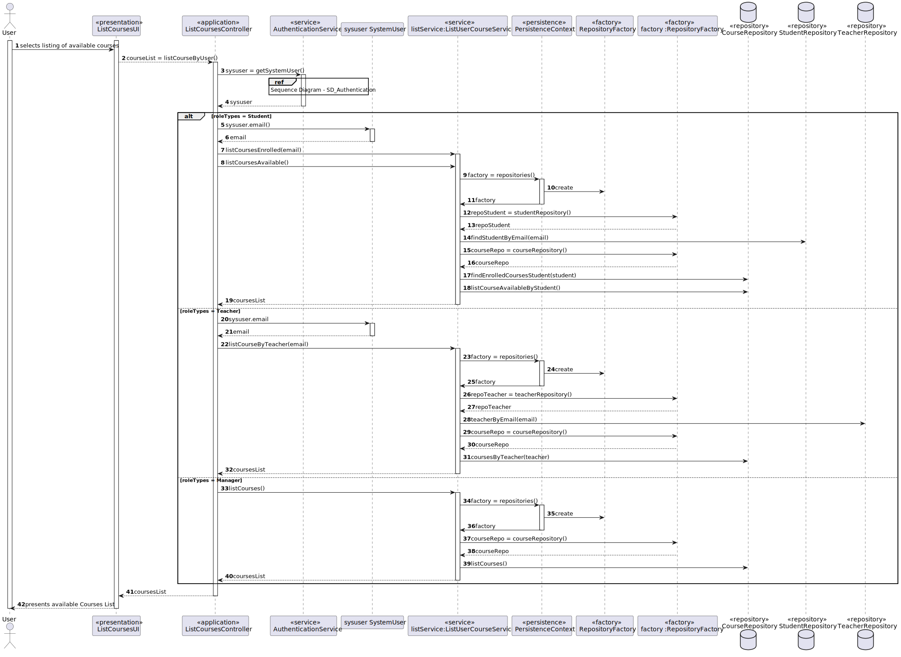
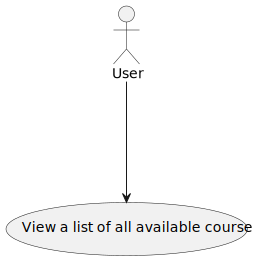

# US 1006 - As User, I want to list all the courses that are available to me

## 1. Context

*Is the first time this task is assigned to be developed should be done by the end of the Sprint B.*

## 2. Requirements

> **US 1006** As User, I want to list all the courses that are available to me

Related to...
> FRC05 - List Courses All users are able to execute this functionality.

### 2.1 Found Out Dependencies

* There is a dependency with US1001, which is responsible for registering the teachers, students and managers in the system.
* There is a dependency with US1002, which is responsible for creating the course.

## 3. Analysis

### 3.1 Use Case Diagram

### 3.2 Relevant Domain Model Excerpt

## 3.3 System Sequence Diagram (SSD)

## 4. Design

### 4.1. Realization (Sequence Diagram)

### 4.2. Class Diagram

### 4.3. Applied Patterns

* **Creator**
  > Provides a way to create objects without exposing the instantiation logic to the client code.
  > It separates the creation of objects from their use, and provides a way to easily extend the types of objects that
  can be created.

* **Repository**
  > To manage and store objects in a persistent data store.
  > It simplifies data access and decouples application components from data persistence technology.

* **Factory**
  > Provides an interface for creating objects, while hiding the implementation details from the client code.
  > It allows for flexibility and extensibility by delegating the responsibility of object creation to subclasses.

* DDD - Domain Driven Design.
  > The design of the project started right away with DDD in mind. The domain model was elaborated with the business
  rules and the DDD overlay for representing aggregates, entities and roots following the necessary rules.

* GRASP
  > With each representation of an actor or user story, GRASP was always taken into account, as it was a fundamental
  basis for the good development of the project.
  > Whether it's Information Expert, Low coupling/High cohesion or the controller concept, all these principles are very
  present in the minds of the group members.

* SOLID
  > The SOLID was mainly present with the Single Responsibility Principle, and the responsibilities that a class should
  have were always taken into account.
  > Already implemented with the base project of EAPLI, the Interface Seggregation Principle proved to be useful and
  enlightening, taking into account the different repositories that had to be created.

### 4.4. Tests

n/a

## 5. Implementation

    public class ListUserCourseService {
    private final CourseRepository courseRepo;
    private final TeacherRepository teacherRepo;
    private final StudentRepository studentRepo;

    public ListUserCourseService() {
        RepositoryFactory rep = PersistenceContext.repositories();
        courseRepo = rep.courseRepository();
        teacherRepo = rep.teacherRepository();
        studentRepo = rep.studentRepository();
    }

    /**
     * List course by teacher list.
     *
     * @param mail the EmailAdress
     * @return the list
     */
    public Iterable<Course> listCoursesByTeacher(EmailAddress mail) {
        Teacher teacher = teacherRepo.findTeacherByEmail(mail);
        return courseRepo.coursesByTeachers(teacher);
    }

    /**
     * List course by student list.
     *
     * @param mail the Emailadress
     * @return the list
     */
    public Iterable<Course> listCourseByStudent(EmailAddress mail) {
        Student student = studentRepo.findStudentByEmail(mail);
        return courseRepo.findEnrolledCoursesStudent(student);
    }
    
    /**
     * List course available.
     *
     * @return the list
     */
    public Iterable<Course> listCourseAvailableByStudent() {
        return courseRepo.findAvailableCoursesStudent();
    }

    /**
     * List course list.
     *
     * @return the list
     */
    public Iterable<Course> listCourses() {
        return courseRepo.findAll();
    }
}

## 6. Integration/Demonstration

n/a

## 7. Observations

n/a
