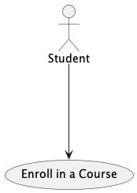
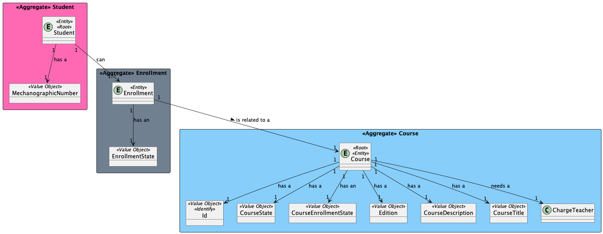
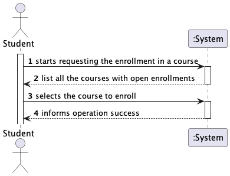
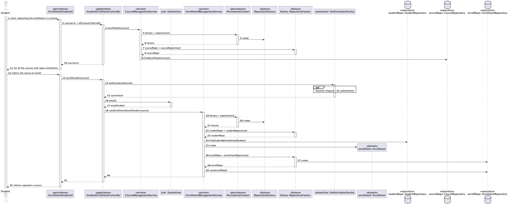
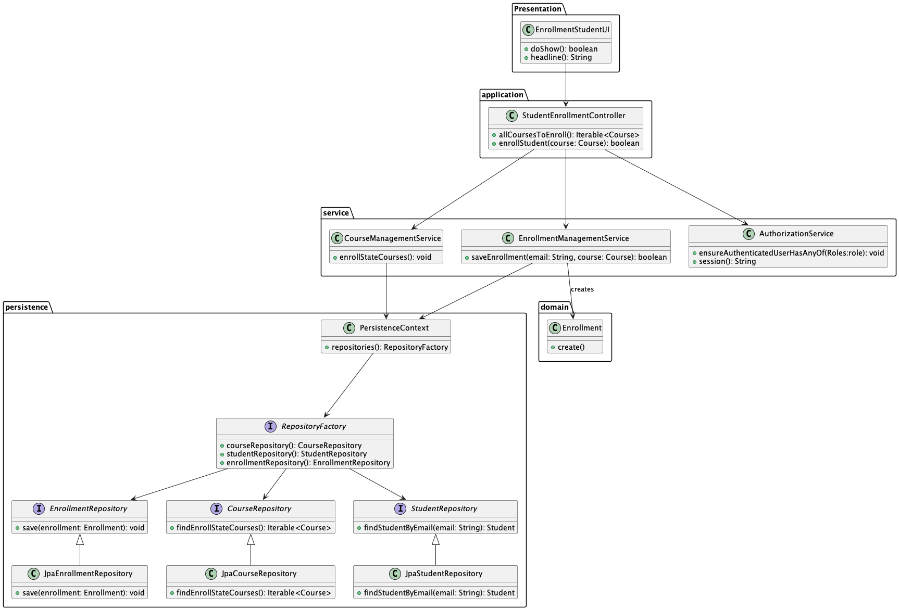

# US 1008 - As Student, I want to request my enrollment in a course

## 1. Context

*Is the first time this task is assigned to be developed should be done by the end of the Sprint B.*

## 2. Requirements

> **US 2003** As Student, I want to request my enrollment in a course

Related to...
> FRC07 - Request Enrollment in Course The student requests to be enrolled in a
course

### 2.1 Found Out Dependencies

* There is a dependency with US1001, which is responsible for registering the students in the system.
* There is a dependency with US1002, which is responsible for creating the course.
* 
### 2.2 Customer Specifications and Clarifications

**From the specifications document:**
> Students enroll in courses.
> The usual workflow related to the course can be illustrated as follows:
event create (-> state close) -> event open (->state open) -> event open enrollments (-> state
enroll) -> event close enrollments (-> state in progress) -> event close (-> state closed)

**From the client clarifications:**
> **Question:** "Can one student be enrolled in different courses?"
> 
> **Answer:** "Yes. I see no reason not to (section 5.1.3: "Students enroll in courses.")."
> 


## 3. Analysis

### 3.1 Use Case Diagram



### 3.2 Relevant Domain Model Excerpt



## 3.3 System Sequence Diagram (SSD)



## 4. Design

Use the standard, layer-based application framework

* Domain classes: Enrollment (Enrollment Aggregate)
* Controller: StudentEnrollmentController
* UI: EnrollmentStudentUI
* Service: CourseManagementService, EnrollmentManagementService
* Repository: CourseRepository, EnrollmentRepository,StudentRepository


### 4.1. Realization (Sequence Diagram)



### 4.2. Class Diagram



### 4.3. Applied Patterns

* **Creator**
  > Provides a way to create objects without exposing the instantiation logic to the client code.
  > It separates the creation of objects from their use, and provides a way to easily extend the types of objects that
  can be created.

* **Repository**
  > To manage and store objects in a persistent data store.
  > It simplifies data access and decouples application components from data persistence technology.

* **Factory**
  > Provides an interface for creating objects, while hiding the implementation details from the client code.
  > It allows for flexibility and extensibility by delegating the responsibility of object creation to subclasses.

* DDD - Domain Driven Design.
  > The design of the project started right away with DDD in mind. The domain model was elaborated with the business
  rules and the DDD overlay for representing aggregates, entities and roots following the necessary rules.

* GRASP
  > With each representation of an actor or user story, GRASP was always taken into account, as it was a fundamental
  basis for the good development of the project.
  > Whether it's Information Expert, Low coupling/High cohesion or the controller concept, all these principles are very
  present in the minds of the group members.

* SOLID
  > The SOLID was mainly present with the Single Responsibility Principle, and the responsibilities that a class should
  have were always taken into account.
  > Already implemented with the base project of EAPLI, the Interface Seggregation Principle proved to be useful and
  enlightening, taking into account the different repositories that had to be created.

### 4.4. Tests

**Test 1:** *Verifies if the Enrollment was created with success*

```
@BeforeEach
    void setUp() {
        // Create a student
        MecanographicNumber mecanographicNumber = new MecanographicNumber("121199");
        final SystemUserBuilder userBuilder = UserBuilderHelper.builder();
        userBuilder.withUsername("joe").withPassword("Password1").withName("joe", "power")
                .withEmail("joe@email.org").withRoles(BaseRoles.STUDENT);
        final SystemUser newUser = userBuilder.build();
        ECourseUser eCourseUser = new ECourseUser(newUser.email(),new ShortName("joe"),new FullName("joe","power"), Calendar.getInstance(),new TaxNumber("123456789"));
        student = new Student(mecanographicNumber, newUser, eCourseUser);

        course = new Course(Designation.valueOf("Java"), Description.valueOf("Java - avancado"), Edition.valueOf("Edicao 1"), 10, 20);

    }

    @Test
    void createEnrollment() {
        Enrollment enrollment = new Enrollment(student, course);
        assertNotNull(enrollment);
        assertEquals(EnrollmentState.WAITING, enrollment.getEnrollState());
        assertEquals(student, enrollment.getStudent());
        assertEquals(course, enrollment.getCourse());
    }
````

## 5. Implementation

*In this section the team should present, if necessary, some evidencies that the implementation is according to the
design. It should also describe and explain other important artifacts necessary to fully understand the implementation
like, for instance, configuration files.*
...
public class StudentEnrollmentController {

    private final AuthorizationService authorizationService;
    private final CourseManagementService listCoursesService;
    private final EnrollmentManagementService enrollmentManagementService;

    public StudentEnrollmentController() {
        authorizationService = AuthzRegistry.authorizationService();
        this.listCoursesService = new CourseManagementService();
        this.enrollmentManagementService = new EnrollmentManagementService();
    }
    public Iterable<Course> allCoursesToEnroll(){
        return listCoursesService.enrollStateCourses();
    }
    public boolean enrollStudent(Course course){
        EmailAddress emailStudent  = authorizationService.session().get().authenticatedUser().email();
        return enrollmentManagementService.saveEnrollment(emailStudent, course);
    }
}

public class CourseManagementService {

    private final CourseRepository courseRepository = PersistenceContext.repositories().courseRepository();

    public Iterable<Course> enrollStateCourses(){
      return courseRepository.findEnrollStateCourses();
    }
}

public class EnrollmentManagementService {

    private final StudentRepository studentRepository;
    private final EnrollmentRepository enrollmentRepository;

    public EnrollmentManagementService() {
        RepositoryFactory rep = PersistenceContext.repositories();
        studentRepository = rep.studentRepository();
        enrollmentRepository = rep.enrollmentRepository();
    }

    public boolean saveEnrollment(EmailAddress emailAddress, Course course) {
        try {
            Student student = this.studentRepository.findStudentByEmail(emailAddress);
            enrollmentRepository.save(new Enrollment(student, course));
            return true;
        } catch (Exception e) {
            System.out.println("Error finding Student " + emailAddress);
            System.out.println(e.getMessage());
            throw new UnsupportedOperationException("Something went wrong saving enrollment");
        }
    }
}

...
*It is also a best practice to include a listing (with a brief summary) of the major commits regarding this
requirement.*
List of some commits:
    
    US1008 - Requirements and analysis(UCD, MD, SSD)
    #24
    @aliceresende

    US1008 - Design(SD, CD) and applied patterns
    #24
    @aliceresende

    US1008 - Implementation, Tests and Observations(md)
    #24
    @aliceresende

    US1008 - implementation
    @aliceresende

## 6. Integration/Demonstration

To execute these US was needed US1001 to have students registered in the system and US1002 to have courses to enroll.


## 7. Observations

The User Story was fully developed, with success.