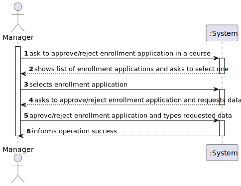
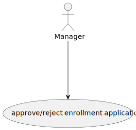
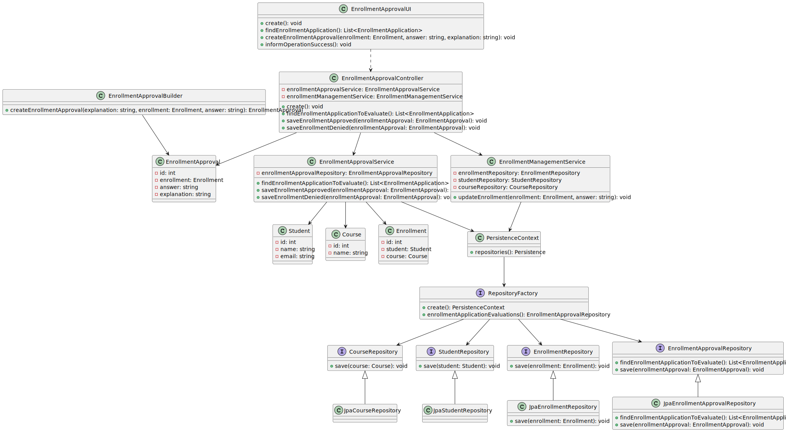
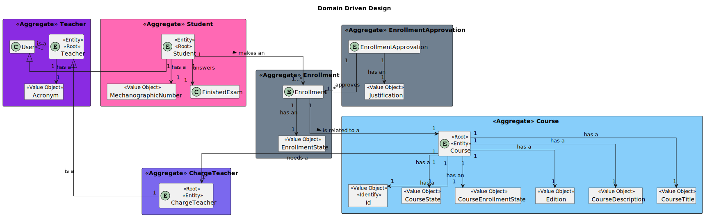

# US 1009

## 1. Context

* It is the first time the task is assigned to be developed

## 2. Requirements

> **US 1009** As Manager, I want to approve or reject students applications to courses

- US1003 - To approve or reject students applications to courses, we have to make sure that the course state is enroll.

- US1008 - To approve or reject students applications to courses, we have to make sure that an application has been
  requested.

- Only managers are able to execute this functionality.

* Regarding this requirement we understand that it relates to approve or reject students
  applications to the courses available.

## 3. Analysis

Decisions to take the best design decisions for the requirement.
This section should also include supporting diagrams/artifacts
(such as domain model; use case diagrams, etc.),*

### 3.1. Customer Specifications and Clarifications

Acceptance Criteria:

Questions:

# Question:

Dear Client,

The US1009 tells us that a manager can either approve or reject enrollmetnts requests. These enrollments are made during
a time where the course is in a enroll state.

However, if a manager decides to close the enrollments (change its state to in_progress) what happens to the enrollments
requests?
Can the manager still approve/reject them? Would they, for example, be automatically rejected.
Best regards,
Group 16

# Answer:

Still to be Responded


## 4. Design

*In this section, the team should present the solution
design that was adopted to solve the requirement.
This should include, at least, a diagram of the realization
of the functionality (e.g., sequence diagram),
a class diagram (presenting the classes that support the functionality),
the identification and rational behind the applied design patterns and
the specification of the main tests used to validade the functionality.*

Use the standard, layer-based application framework

Domain classes: EnrollmentApproval (EnrollmentApproval Aggregate)

Controller: EnrollmentApprovalController
UI: EnrollmentApprovalUI
Service: EnrollmentApprovalService
Repository: CourseRepository, EnrollmentApprovalRepository,StudentRepository

### 4.1. Realization (System Sequence Diagram)



### 4.2. Sequence Diagram


### 4.3. Use Case Diagram



### 4.4. Class Diagram



### 4.5. Domain Driven Diagram



### 4.6. Applied Patterns

-Low Coupling

-High Cohesion

-State Pattern

-Protected Variation

### 4.7. Tests

**Test 1:** *Verifies that it is not possible to create an instance of the Example class with null values.*

```
@Test(expected = IllegalArgumentException.class)
public void ensureNullIsNotAllowed() {
	Example instance = new Example(null, null);
}
````

## 5. Implementation

*In this section the team should present, if necessary, some evidencies that the implementation is according to the
design. It should also describe and explain other important artifacts necessary to fully understand the implementation
like, for instance, configuration files.*
...

public class EnrollmentApprovalBuilder {

    private static final Logger LOGGER = LogManager.getLogger(EnrollmentApprovalBuilder.class);
    private Description explanation;
    private Enrollment enrollment;
    private Decision decision;

   

    /**
     * With explanation enrollment approval builder.
     *
     * @param explanation the explanation
     * @return the enrollment approval builder
     */
    public EnrollmentApprovalBuilder withExplanation(Description explanation) {
    }

    /**
     * With enrollment enrollment approval builder.
     *
     * @param enrollment the enrollment
     * @return the enrollment approval builder
     */
    public EnrollmentApprovalBuilder withEnrollment(Enrollment enrollment) {
    }

    /**
     * With decision enrollment approval builder.
     *
     * @param decision the decision
     * @return the enrollment approval builder
     */
    public EnrollmentApprovalBuilder withDecision(Decision decision) {
    }

    /**
     * With explanation enrollment approval builder.
     *
     * @param explanation the explanation
     * @return the enrollment approval builder
     */
    public EnrollmentApprovalBuilder withExplanation(String explanation) {
    }


    /**
     * With decision enrollment approval builder.
     *
     * @param decision the decision
     * @return the enrollment approval builder
     */
    public EnrollmentApprovalBuilder withDecision(boolean decision) {
    }

    /**
     * Instantiates a new Enrollment approval builder.
     */
    public EnrollmentApprovalBuilder() {
    }


    /**
     * Build enrollment approval.
     *
     * @return the enrollment approval
     */
    public EnrollmentApproval build() {
     }
    }


  public class EnrollmentApprovalController {

       private EnrollmentRepository enrollmentRepository;
       private EnrollmentApprovalService enrollmentApprovalService;
       private EnrollmentManagementService enrollmentManagementService;
       private EnrollmentApprovalBuilder enrollmentApprovalBuilder;


    /**
     * Instantiates a new Enrollment approval controller.
     */
    public EnrollmentApprovalController() {
    }

    /**
     * Find enrollment application list.
     *
     * @return the list
     */
    public List<Enrollment> findEnrollmentApplication() {
    }


    /**
     * Create enrollment approval enrollment approval.
     *
     * @param enrollment  the enrollment
     * @param answer      the answer
     * @param explanation the explanation
     * @return the enrollment approval
     */
    public EnrollmentApproval createEnrollmentApproval(Enrollment enrollment, boolean answer, String explanation) {
        }
     }
    }
...
*It is also a best practice to include a listing (with a brief summary) of the major commits regarding this
requirement.*

List of some commits:

JorgeCunha07 added a commit that referenced this issue last week
@JorgeCunha07
Creation of Controller and Ui for Course and Also their factorys …
46f088d


JorgeCunha07 added a commit that referenced this issue last week
@JorgeCunha07
Creation of the Repositorys and factorys necessaries …
c2a114f


JorgeCunha07 added a commit that referenced this issue last week
@JorgeCunha07
Us 1009 Changes for having a decision easy to read.Rearranged Entries… …
6b6e816


JorgeCunha07 added a commit that referenced this issue last week
@JorgeCunha07
Modifications on US1009,created Ui,created Controller. …
e310224


JorgeCunha07 added a commit that referenced this issue last week
@JorgeCunha07
Minor modification to make the US1009 Almost done. …
3978b22


@JorgeCunha07 JorgeCunha07 self-assigned this last week
JorgeCunha07 added a commit that referenced this issue 5 days ago
@JorgeCunha07
ssd …
1f253ee


JorgeCunha07 added a commit that referenced this issue 5 days ago
@JorgeCunha07
Corrections of the program. …
0fc4917


JorgeCunha07 added a commit that referenced this issue 5 days ago
@JorgeCunha07
Fixed issues …
a25495f


JorgeCunha07 added a commit that referenced this issue 5 days ago
@JorgeCunha07
US1009:SSD,SD,CD,UCD …
484632d


JorgeCunha07 added a commit that referenced this issue 3 days ago
@JorgeCunha07
Us 1009:Changes to make the code Cleaner. …
74460aa


JorgeCunha07 added a commit that referenced this issue 3 days ago
@JorgeCunha07
Change For Output …
75ad528


JorgeCunha07 added a commit that referenced this issue 2 days ago
@JorgeCunha07
Fixes …
38202ba


JorgeCunha07 added a commit that referenced this issue 2 days ago
@JorgeCunha07
US1009 …
5efdb58


JorgeCunha07 added a commit that referenced this issue 2 days ago
@JorgeCunha07
Fixes# Error adding on the Table …
c322514


## 6. Integration/Demonstration

*In this section the team should describe the efforts realized in order to integrate this functionality with the other
parts/components of the system*

*It is also important to explain any scripts or instructions required to execute an demonstrate this functionality*

## 7. Observations

*This section should be used to include any content that does not fit any of the previous sections.*

The User Story references two other User Stories, "US1003" and "US1008," 
which provide additional context and conditions for the approval or rejection process. These conditions include ensuring that the course state is enroll (as stated in "US1003") and that an application has been requested (as stated in "US1008").

Furthermore, the User Story specifies that only managers 
should have the ability to execute this functionality, emphasizing the role-based access control for approving or rejecting student applications to courses.

By referencing "US 1009" and providing related User Stories, 
the development team can have a clear understanding of the feature's requirements, 
including the necessary conditions and user roles involved in the approval or rejection process.