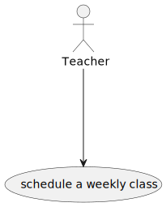
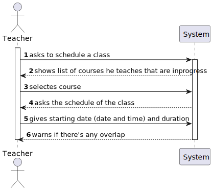

# US 1010

## 1. Context

It is the first time the task is assigned to be developed. 

## 2. Requirements

>**US 1010** As Teacher, I want to schedule a class
 
Related to...

 > FRC09 - Schedule of Class. A teacher schedule a class (always a recurring class, happens every week). System must check if the Teacher is available for the class period.

* There is a dependency with:
* US1002, which is responsible for creating the course.
* US1005, which is responsible to set teachers to a course.

### 2.1. Customer Specifications and Clarifications

>"Teachers are responsible for scheduling classes for their courses. A class is always a recurring
weekly event."

>"It should be impossible to schedule classes that are coincident with other classes of the same course.
> The system should also warn if one of the participants in the class (either a teacher or a student) 
> has other classes at the same time."

> Regarding this requirement we understand that it relates to schedule a class that happens every week while the course is opened,
and it shouldn't overlap with other classes that the teacher may have, and it can't overlap other classes of the same course
If the teacher or a student enrolled have other classes at the same time*

## 3. Analysis

*In this section, the team should report the study/analysis/comparison that was done in order to take the best design
decisions for the requirement. This section should also include supporting diagrams/artifacts (such as domain model; use
case diagrams, etc.),*

### 3.1. Use Case Diagram


### 3.2. Domain Model


### 3.3. System Sequence Diagram


## 4. Design

*In this section, the team should present the solution design that was adopted to solve the requirement. This should include, at least, a diagram of the realization of the functionality (e.g., sequence diagram), a class diagram (presenting the classes that support the functionality), the identification and rational behind the applied design patterns and the specification of the main tests used to validade the functionality.*

### 4.1. Realization (Sequence Diagram)


### 4.2. Class Diagram


### 4.3. Applied Patterns

* Low Coupling
* High Cohesion
* State Pattern
* Protected Variation

### 4.4. Tests

**Test 1:** *Verifies that it is not possible to create an instance of the Example class with null values.*

```
@Test(expected = IllegalArgumentException.class)
public void ensureNullIsNotAllowed() {
	Example instance = new Example(null, null);
}
````

## 5. Implementation

*In this section the team should present, if necessary, some evidencies that the implementation is according to the
design. It should also describe and explain other important artifacts necessary to fully understand the implementation
like, for instance, configuration files.*

*It is also a best practice to include a listing (with a brief summary) of the major commits regarding this
requirement.*

## 6. Integration/Demonstration

*In this section the team should describe the efforts realized in order to integrate this functionality with the other
parts/components of the system*

*It is also important to explain any scripts or instructions required to execute an demonstrate this functionality*

## 7. Observations

*This section should be used to include any content that does not fit any of the previous sections.*

*The team should present here, for instance, a critical perspective on the developed work including the analysis of
alternative solutions or related works*

*The team should include in this section statements/references regarding third party works that were used in the
development this work.*