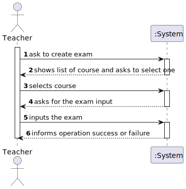
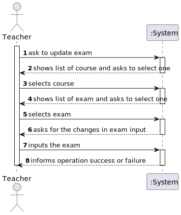
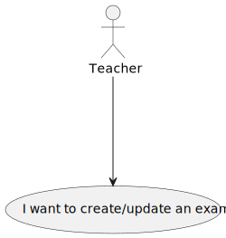
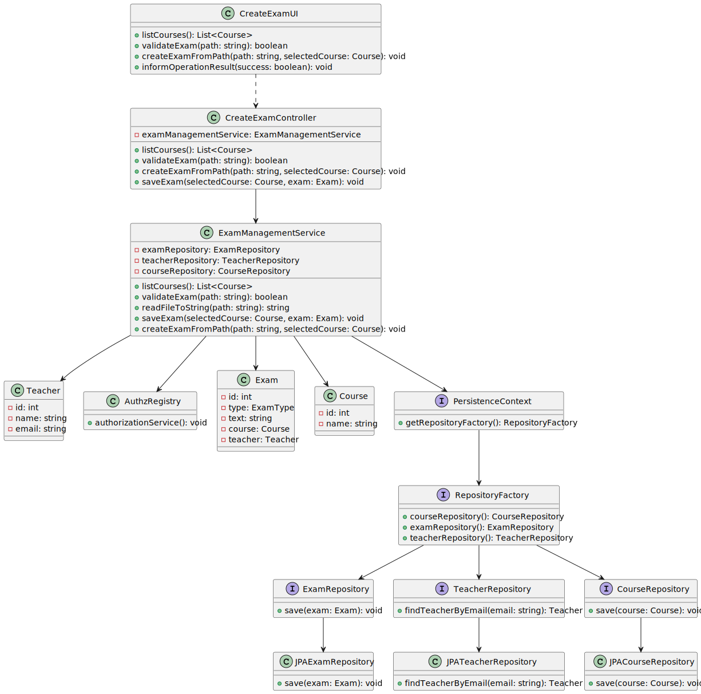
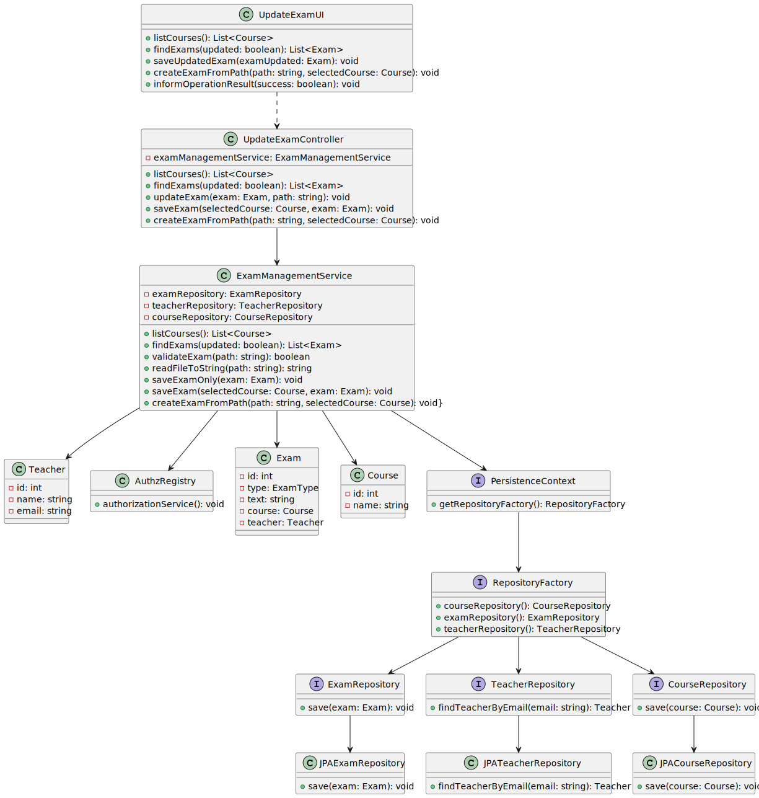

# US 2001

## 1. Context

* It is the first time the task is assigned to be developed

## 2. Requirements

> **US 2001** As Teacher, I want to create/update an exam

- Only Teachers are able to execute this functionality.

* Regarding this requirement we understand that it relates to approve or reject students
  applications to the courses available.

## 3. Analysis

Decisions to take the best design decisions for the requirement.
This section should also include supporting diagrams/artifacts
(such as domain model; use case diagrams, etc.),*

### 3.1. Customer Specifications and Clarifications


Acceptance Criteria:
This includes the specification of the exam (i.e., its structure, in accordance with a grammar for exams that is used to validate the specification of the exam).
The support for exams (its design, feedback and grading) must follow specific technical requirements, specified in LPROG.
The ANTLR tool should be used (https://www.antlr.org/).

Questions:

# Question:
Dear client,
Regarding the questions within the exam, should every type of question have a feedback?
For example, a multiple choice question has 1 solution and 1 solution only. So, if the student's solution is right, he gets maximum grading on a question, and, if so, the feedback would be equal to the solution, for example:
Solution : C
Feedback: C -- 100%
Best regards,
Group 8

# Answer:
Hello.
The feedback is a text (regarding a question/answer) that may appear to the student when he/she finishes the exam. The teacher can use this text to "justify/explain" why the answer given by the student is wrong (if the student gave the a wrong answer) and what should be the right answer. But, basically, it is only "text". Every possible "wrong answer" may have a feedback. It may also be possible to specify the feedback for the right answer.
Taken from the Moodle documentation "...If you wish, add general feedback. This is text that appears to the student after he/she has answered the question..."
Regards.


# Question:
Dear client,
Regarding the exam's section, our group had thought about 2 viable options in case of a missing student:
-His grade would be considered a 0;
-His grade would be considered N/A and a message/email would be sent to him regarding the missing exam
If neither the options are the intended solution, it would be great to be provided with the best solution for you.
Best regards,
Group 8


# Answer:
Hello.
I think only FRE06 - List Course Grades is related to your question. I think that the system should not display the grade of a student that dit not take the exam, it should display, for instance, N/A.
I also do not see any mention in the specification related to the notification of students when they miss an exam.
Regards.


## 4. Design
*In this section, the team should present the solution
design that was adopted to solve the requirement.
This should include, at least, a diagram of the realization
of the functionality (e.g., sequence diagram),
a class diagram (presenting the classes that support the functionality),
the identification and rational behind the applied design patterns and
the specification of the main tests used to validade the functionality.*

Use the standard, layer-based application framework

Domain classes: EnrollmentApproval (EnrollmentApproval Aggregate)

Controller: CreateExamController UpdateExamController
UI: CreateExamlUI  UpdateExamlUI
Service: ExamManagemantService
Repository: CourseRepository, ExamRepository,TeacherRepository

### 4.1. Realization (System Sequence Diagram)
## Create

## Update


### 4.2. Sequence Diagram
## Create

## Update


### 4.3. Use Case Diagram



### 4.4. Class Diagram
## Create

## Update



### 4.6. Applied Patterns

-Low Coupling

-High Cohesion

-State Pattern

-Protected Variation

### 4.7. Tests

**Test 1:** *Verifies that it is not possible to create an instance of the Example class with null values.*

```
@Test(expected = IllegalArgumentException.class)
public void ensureNullIsNotAllowed() {
	Example instance = new Example(null, null);
}
````

## 5. Implementation

*In this section the team should present, if necessary, some evidencies that the implementation is according to the
design. It should also describe and explain other important artifacts necessary to fully understand the implementation
like, for instance, configuration files.*
...

public class QuestionManagementService {

    private final AuthorizationService authorizationService;
    private final CourseRepository courseRepository;
    private final QuestionRepository questionRepository;
    private final TeacherRepository teacherRepository;

    /**
     * Instantiates a new Question management service.
     */
    public QuestionManagementService() {
        this.authorizationService = AuthzRegistry.authorizationService();
        this.courseRepository = PersistenceContext.repositories().courseRepository();
        this.questionRepository = PersistenceContext.repositories().questionRepository();
        this.teacherRepository = PersistenceContext.repositories().teacherRepository();
    }


    /**
     * List courses iterable.
     *
     * @return the iterable
     */
    public Iterable<Course> listCourses() {
        SystemUser systemUser = authorizationService.session().get().authenticatedUser();
        Teacher teacher = teacherRepository.findTeacherByEmail(systemUser.email());
        return courseRepository.coursesByTeachers(teacher);
    }

    /**
     * Validate question.
     *
     * @param path the path
     * @throws IOException the io exception
     */
    public void validateQuestion(String path) throws IOException {
        QuestionGrammarLexer lexer = new QuestionGrammarLexer(CharStreams.fromFileName(path));
        CommonTokenStream tokens = new CommonTokenStream(lexer);
        QuestionGrammarParser parser = new QuestionGrammarParser(tokens);
        parser.start();
    }

    /**
     * Create question question.
     *
     * @param path           the path
     * @param selectedCourse the selected course
     * @return the question
     */
    public Question createQuestion(String path, Course selectedCourse) {
        List<String> question = readFileToString(path);

        return new Question(QuestionType.valueOf(question.get(0)),question.get(1),selectedCourse);
    }

    /**
     * Save question.
     *
     * @param question the question
     */
    public void saveQuestion(Question question) {
        questionRepository.save(question);
    }


    /**
     * Read file to string list.
     *
     * @param filePath the file path
     * @return the list
     */
    public List<String> readFileToString(String filePath) {
        List<String> lines = new ArrayList<String>();
        try (BufferedReader br = new BufferedReader(new FileReader(filePath))) {
            String title = br.readLine(); // Read the first line as the title
            StringBuilder content = new StringBuilder();

            String line;
            while ((line = br.readLine()) != null) {
                content.append(line).append(System.lineSeparator());
            }

            String restOfFile = content.toString();
            lines.add(title);
            lines.add(restOfFile);
        } catch (IOException e) {
            e.printStackTrace();
        }
        return lines;

    }

    /**
     * List questions iterable.
     *
     * @param course the course
     * @return the iterable
     */
    public Iterable<Question> listQuestions(Course course) {
        return  questionRepository.listQuestions(course);
    }

    /**
     * Update question question.
     *
     * @param question the question
     * @param path     the path
     * @return the question
     */
    public Question updateQuestion(Question question, String path) {
        List<String> list = readFileToString(path);
        question.setQuestion(list.get(1));
        question.setQuestionType(QuestionType.valueOf(list.get(0)));
        return question;
    }
}

...
*It is also a best practice to include a listing (with a brief summary) of the major commits regarding this
requirement.*

List of some commits:

FabioMCSilva added a commit that referenced this issue 4 days ago
@FabioMCSilva
#19 Exam Grammar - 1st draft (missing matching questions definition)
fc57745

FabioMCSilva added a commit that referenced this issue 3 days ago
@FabioMCSilva
#19 Exam Grammar - 2nd draft and a Test file to show how it works (un… …
b1250d5

FabioMCSilva added a commit that referenced this issue yesterday
@FabioMCSilva
#19 Changes to grammar Co-authored-by: Jorge Cunha <1200618@isep.ipp.pt>
cbe4263

FabioMCSilva added a commit that referenced this issue yesterday
@FabioMCSilva
#18 #19 Exam grammar update and created the question grammarCo-author… …
e70352a

FabioMCSilva added a commit that referenced this issue yesterday
@FabioMCSilva
Exam grammar update #19 and created question grammar #18 …
56797a3

FabioMCSilva added a commit that referenced this issue 20 hours ago
@FabioMCSilva
Generated antlr files #18 #19
721c666

JorgeCunha07 added a commit that referenced this issue 9 hours ago
@JorgeCunha07
@FabioMCSilva
US 2001 …
aeeb480

FabioMCSilva added a commit that referenced this issue 9 hours ago
@FabioMCSilva
#19 Testing grammar
ced1ff4

JorgeCunha07 added a commit that referenced this issue 8 hours ago
@JorgeCunha07
For Update Exam: …
ba550c4

JorgeCunha07 added a commit that referenced this issue 8 hours ago
@JorgeCunha07
Small Fixes …
5f4ca55

FabioMCSilva added a commit that referenced this issue 5 hours ago
@FabioMCSilva
Updates to exam grammar #19 and questions grammar exam #18. Added tes… …
9c1f506

JorgeCunha07 added a commit that referenced this issue 5 hours ago
@JorgeCunha07
Questions …
5a2fc29

JorgeCunha07 added a commit that referenced this issue 1 hour ago
@JorgeCunha07
@FabioMCSilva

41bd981

## 6. Integration/Demonstration

*In this section the team should describe the efforts realized in order to integrate this functionality with the other
parts/components of the system*

*It is also important to explain any scripts or instructions required to execute an demonstrate this functionality*

## 7. Observations

*This section should be used to include any content that does not fit any of the previous sections.*

