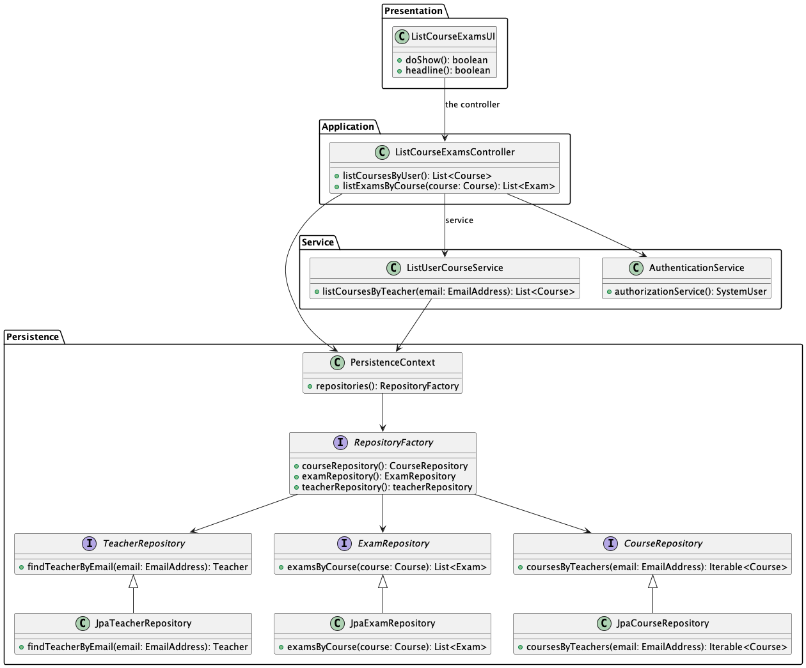

# US 2003 - As Teacher, I want to view a list of all exams in a course

## 1. Context

*Is the first time this task is assigned to be developed should be done by the end of the Sprint B.*

## 2. Requirements

> **US 2003** As Teacher, I want to view a list of all exams in a course

Related to...
> FRE03 - List Course Exams - The system displays to a teacher of a course all the exams of the course

### 2.1 Found Out Dependencies

* There is a dependency with US1001, which is responsible for registering the teachers in the system.
* There is a dependency with US1002, which is responsible for creating the course.
* There is a dependency with US1005, which is responsible for setting the teacher of a course.
* There is a dependency with US1006, which is responsible for listing  all the courses that are available to a User.
* There is a dependency with US2001, which is responsible for creating the exams.


## 3. Analysis

### 3.1 Use Case Diagram


### 3.2 Relevant Domain Model Excerpt


## 3.3 System Sequence Diagram (SSD)


## 4. Design

Use the standard, layer-based application framework

* Domain classes:Teacher, Course and Exams(Teacher, Course and Exams Aggregates)
* Controller: ListCourse
* UI: CreateSharedBoardUI
* Builder: SharedBoardBuilder
* Repository: SharedBoardRepository, CellRepository

### 4.1. Realization (Sequence Diagram)


### 4.2. Class Diagram



### 4.3. Applied Patterns

* **Creator**
  > Provides a way to create objects without exposing the instantiation logic to the client code.
  > It separates the creation of objects from their use, and provides a way to easily extend the types of objects that
  can be created.

* **Repository**
  > To manage and store objects in a persistent data store.
  > It simplifies data access and decouples application components from data persistence technology.

* **Factory**
  > Provides an interface for creating objects, while hiding the implementation details from the client code.
  > It allows for flexibility and extensibility by delegating the responsibility of object creation to subclasses.

* DDD - Domain Driven Design.
  > The design of the project started right away with DDD in mind. The domain model was elaborated with the business
  rules and the DDD overlay for representing aggregates, entities and roots following the necessary rules.

* GRASP
  > With each representation of an actor or user story, GRASP was always taken into account, as it was a fundamental
  basis for the good development of the project.
  > Whether it's Information Expert, Low coupling/High cohesion or the controller concept, all these principles are very
  present in the minds of the group members.

* SOLID
  > The SOLID was mainly present with the Single Responsibility Principle, and the responsibilities that a class should
  have were always taken into account.
  > Already implemented with the base project of EAPLI, the Interface Seggregation Principle proved to be useful and
  enlightening, taking into account the different repositories that had to be created.

### 4.4. Tests

**Test 1:** *Verifies that a Course object is correctly created and initialized with the expected values for its properties.*

```
@BeforeEach
    void setUp() throws Exception {
        c1 = new Course(Designation.valueOf("Java"), Description.valueOf("Java - avancado"), Edition.valueOf("Edicao 1"), 10, 20);
        c2_open = new Course(Designation.valueOf("Javadoc"), Description.valueOf("Javadoc - intermedio"), Edition.valueOf("Edicao 1"), 10, 20);
        c2_open.openCourse();
    }
    @Test
    void testCreateCourse() {
        // Assert
        Assertions.assertNotNull(c1);
        Assertions.assertEquals(Designation.valueOf("Java"), c1.getCourseTitle());
        Assertions.assertEquals(Description.valueOf("Java - avancado"), c1.getCourseDescription());
        Assertions.assertEquals(10, c1.getMinimumCapacity());
        Assertions.assertEquals(20, c1.getMaximumCapacity());
        Assertions.assertNotNull(c1.getTeachersSet());
        Assertions.assertNotNull(c1.getStudentSet());
        Assertions.assertNotNull(c1.findExamList());
        Assertions.assertTrue(c1.findExamList().isEmpty());
    }
````
**Test 2:** *Verifies that the method returns the correct set of courses associated with the teacher.
```
 @Test
    void testGetCourses() {
        Set<Course> courses = new HashSet<>();
        courses.add(new Course(Designation.valueOf("Java"), Description.valueOf("Java - avancado"), Edition.valueOf("Edicao 1"), 10, 20));
        teacher.setCourses(courses);
        assertEquals(courses, teacher.getCourses());
    }
```

## 5. Implementation

*In this section the team should present, if necessary, some evidencies that the implementation is according to the
design. It should also describe and explain other important artifacts necessary to fully understand the implementation
like, for instance, configuration files.*

public class ListCourseExamsController {
    
    private final ExamRepository examRepo;
    private final ListUserCourseService teacherCourseService;
    private final AuthorizationService authorizationService;

    public ListCourseExamsController() {
        this.teacherCourseService = new ListUserCourseService();
        this.examRepo = PersistenceContext.repositories().examRepository();
        authorizationService = AuthzRegistry.authorizationService();
        authorizationService.ensureAuthenticatedUserHasAnyOf(BaseRoles.TEACHER);
    }
    public Iterable<Course> listCoursesByUser() {
        EmailAddress email  = authorizationService.session().get().authenticatedUser().email();
        return teacherCourseService.listCoursesByTeacher(email);
    }

    public Iterable<Exam> listExamsByCourse(Course course){
        return examRepo.examsByCourse(course);
    }
}
public class ListUserCourseService {
        
    private final CourseRepository courseRepo;
    private final TeacherRepository teacherRepo;
    private final StudentRepository studentRepo;

    public ListUserCourseService() {
        RepositoryFactory rep = PersistenceContext.repositories();
        courseRepo = rep.courseRepository();
        teacherRepo = rep.teacherRepository();
        studentRepo = rep.studentRepository();
    }

    public Iterable<Course> listCoursesByTeacher(EmailAddress mail) {
        Teacher teacher = teacherRepo.findTeacherByEmail(mail);
        return courseRepo.coursesByTeachers(teacher);
    }
}


*It is also a best practice to include a listing (with a brief summary) of the major commits regarding this
requirement.*
List of some commits:

    US2003 - Analysis and Design (SSD,SD,MD,UCD,CD)
    #12
    @aliceresende

    US2003 - MD and SD development
    #12
    @aliceresende

    US2003 - corrections in the code implementation
    #12
    @aliceresende


## 6. Integration/Demonstration

To execute these US was needed US1006 to list all the courses that are available to an User and US2001 that is responsible for creating the exams.


## 7. Observations

The User Story was fully developed, with success.