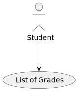

# US 2005 - As Student, I want to view a list of my grades

## 1. Context

*Is the first time this task is assigned to be developed should be done by the end of the Sprint C.*

## 2. Requirements

> **US 2005** - As Student, I want to view a list of my grades

Related to...
> **FRE05** - **List Grades** The system displays to a students his/her grades

### 2.1 Found Out Dependencies

* There is a dependency with US2001, where the Teacher creates an exam.
* There is a dependency with US2004, which the Student does an exam.

## 3. Analysis

### 3.1 Use Case Diagram

### 3.2 Relevant Domain Model Excerpt

## 3.3 System Sequence Diagram (SSD)

## 4. Design

### 4.1. Realization (Sequence Diagram)

### 4.2. Class Diagram

### 4.3. Applied Patterns

* **Creator**
  > Provides a way to create objects without exposing the instantiation logic to the client code.
  > It separates the creation of objects from their use, and provides a way to easily extend the types of objects that
  can be created.

* **Repository**
  > To manage and store objects in a persistent data store.
  > It simplifies data access and decouples application components from data persistence technology.

* **Factory**
  > Provides an interface for creating objects, while hiding the implementation details from the client code.
  > It allows for flexibility and extensibility by delegating the responsibility of object creation to subclasses.

* DDD - Domain Driven Design.
  > The design of the project started right away with DDD in mind. The domain model was elaborated with the business
  rules and the DDD overlay for representing aggregates, entities and roots following the necessary rules.

* GRASP
  > With each representation of an actor or user story, GRASP was always taken into account, as it was a fundamental
  basis for the good development of the project.
  > Whether it's Information Expert, Low coupling/High cohesion or the controller concept, all these principles are very
  present in the minds of the group members.

* SOLID
  > The SOLID was mainly present with the Single Responsibility Principle, and the responsibilities that a class should
  have were always taken into account.
  > Already implemented with the base project of EAPLI, the Interface Seggregation Principle proved to be useful and
  enlightening, taking into account the different repositories that had to be created.

### 4.4. Tests

    @Test
    void testGetGrades() {
    List<Grade> grades = new ArrayList<>();
    Grade grade = new Grade();
    grades.add(grade);
    student.addGrade(grade);
    assertEquals(grades, student.getGradeList());
    }

## 5. Implementation

    public class StudentGradeController {
      private final GradeManagementService gradesService = new GradeManagementService();
      private final AuthorizationService authz = AuthzRegistry.authorizationService();
  
      public List<Grade> listStudentGrades(){
          SystemUser systemUser = authz.session().get().authenticatedUser();
          return gradesService.listStudentGrades(systemUser.email());
      }

    }

    //GradeManagementService
    public List<Grade> listStudentGrades(EmailAddress email){
      Student std = studentRepository.findStudentByEmail(email);
      return std.getGradeList();

    }

    //StudentGradeUI
    protected boolean doShow() {

        List<Grade> gradeList = listGrades.listStudentGrades();

        if (gradeList.isEmpty()) {
            System.out.println("Doesn't exists grades!");
            return false;
        }
        for (Grade g: gradeList){
            System.out.printf(g.toString());
        }

        return true;
    }
    

## 6. Integration/Demonstration

n/a

## 7. Observations

n/a
