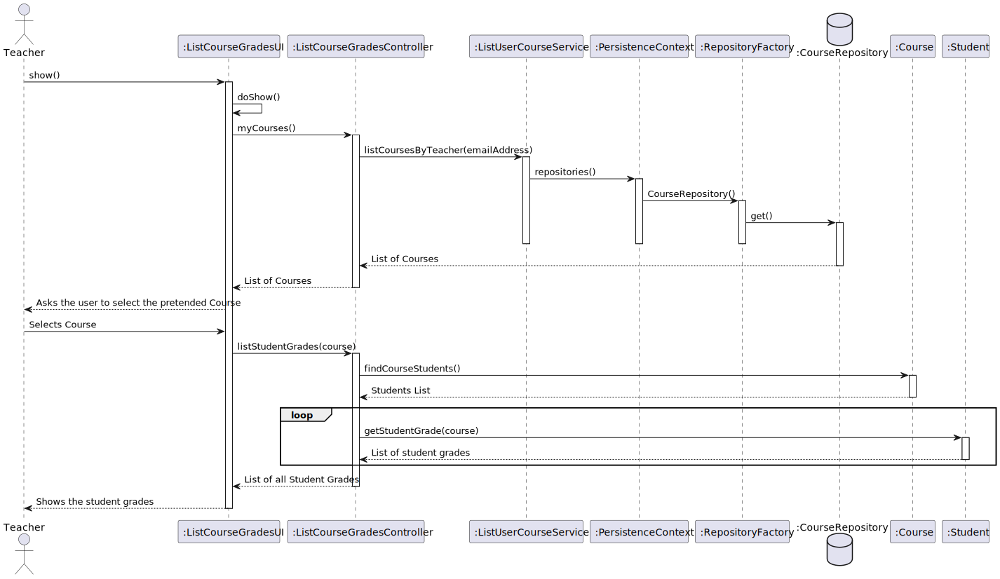
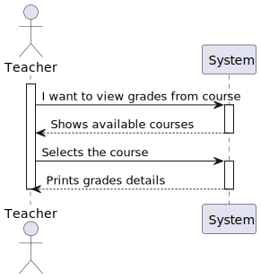
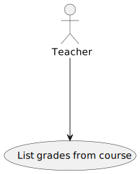
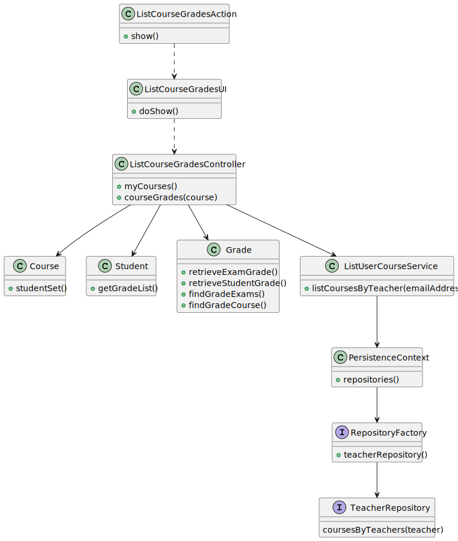
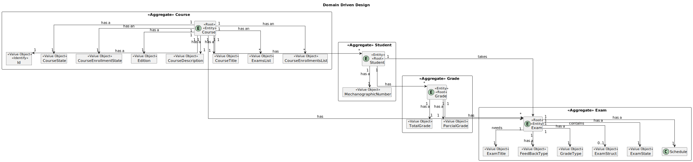

# US 2006 - As Teacher, I want to view a list of the grades of exams of my courses

## 1. Context

*Is the first time this task is assigned to be developed should be done by the end of the Sprint C.*

## 2. Requirements

> **US 2006** As Teacher, I want to view a list of the grades of exams of my courses

Related to...


> FRE04 - **

### 2.1 Found Out Dependencies

* There is a dependency with US2001, As Teacher, I want to create/update an exam
* There is a dependency with US2004, As Student, I want to take an exam
* There is a dependency with US1005, As Manager, I want to set the teachers of a course
* There is a dependency with US1008, As Student, I want to request my enrollment in a course
* There is a dependency with US1009, As Manager, I want to approve or reject students applications to courses

### 2.2 Customer Specifications and Clarifications

**From the specifications document:**


**From the client clarifications:**

> **Question:**
Good afternoon,
Our group has a following question: when a student finished taking exam, will he want at some point review the exam and see his answers? Do we need to save the exam with the answers of a certain student to be able to show it later (if needed), or should we just calculate the final grade and show feedback for each question (if applicable)?
Another question is about types of feedback: on-submission means on submission of a question or the whole exam?
Best regards,
Group 33


> **Answer:**
Hello.
when a student finished taking exam, will he want at some point review the exam and see his answers?
This is not required.
Do we need to save the exam with the answers of a certain student to be able to show it later (if needed), or should we just calculate the final grade and show feedback for each question (if applicable)?
Just calculate the final grade and show feedback for each question. Unless saving of the answers is required as a technical solution for some other aspect of your solution you do not need to save the answers.
Another question is about types of feedback: on-submission means on submission of a question or the whole exam?
On submission of the whole exam.
Regards.
> 


> > **Question:**
Bom dia,
As notas dos exames formativos tambem deveriam ser listadas? Ou apenas seriam listadas as notas dos exames "normais"
Cumprimentos,


> **Answer:**
Boa noite.
Os exames formativos são gerados automaticamente e, não existindo um registo das perguntas e respostas desses exames, não penso que faça sentido armazenar os resultados dessas notas.
No entanto, o sistema deve apresentar para estes exames o feedback e a nota no final.
Cumprimentos.


Jose Diogo Rente
## 4. Design

*In this section, the team should present the solution
design that was adopted to solve the requirement.
This should include, at least, a diagram of the realization
of the functionality (e.g., sequence diagram),
a class diagram (presenting the classes that support the functionality),
the identification and rationale behind the applied design patterns and
the specification of the main tests used to validate the functionality.*

Use the standard, layer-based application framework

Domain classes: Grade(Grade Aggregate),Exam (Exam Aggregate),Course(Course Aggregate),Teacher(Teacher Aggregate)

Controller: ListCourseGradesController

UI: ListCourseGradesUI

Service: ListUserCourseService

Repository: TeacherRepository,CourseRepository


### 4.1. Realization (Sequence Diagram)



### 4.2. System Sequence Diagram (Sequence Diagram)



### 4.3. Use Case Diagram



### 4.4. Class Diagram



### 4.5. Domain Model Excert



### 4.6. Applied Patterns

Low Coupling:

    Low Coupling is a design principle in software 
    engineering that aims to reduce the dependencies 
    between software components or modules. 
    It suggests that modules should have minimal knowledge about each other and should be loosely coupled. 
    In other words, changes in one module should have minimal impact on other modules.
    This promotes modularity, flexibility, and ease of maintenance in software systems. 
    By reducing coupling, it becomes easier to understand, modify, and test individual components without affecting the entire system.

High Cohesion:

    High Cohesion is a design principle that emphasizes organizing related functionality together within a software module or component. 
    It suggests that a module should have a single, well-defined responsibility or purpose. 
    Modules with high cohesion are focused and perform a specific set of related tasks, making them more maintainable and reusable. 
    High cohesion allows for better code organization, readability, and the ability to easily modify or extend the functionality of a 
    particular module without affecting unrelated parts of the system.

State Pattern:

    The State Pattern is a behavioral design pattern that allows an object to alter its behavior when its internal state changes. 
    It is useful when an object's behavior needs to change dynamically based on its internal state, without resorting to large conditional statements. 
    The pattern involves defining separate classes for each possible state of an object and encapsulating the behavior associated with each state within 
    its respective class. The object maintains a reference to the current state, and when the state changes, 
    it delegates the behavior to the appropriate state class. 
    This pattern promotes extensibility, maintainability, and flexibility in managing complex state-dependent behaviors.

Protected Variation:

    Protected Variation is a design principle that aims to isolate or decouple the parts of a system that are most likely to change due to external factors. 
    It suggests designing interfaces or abstractions that protect the core components of a system from being affected 
    by variations in other parts of the system or external dependencies. By encapsulating the volatile or varying aspects, 
    such as specific implementation details or external integrations, the core components become less dependent on them. 
    This principle helps to manage change and mitigate the impact of modifications, promoting system stability and maintainability.

Creator:

    Provides a way to create objects without exposing the instantiation logic to the client code.
    It separates the creation of objects from their use, and provides a way to easily extend the types of objects that
    can be created.

Repository:
      
    To manage and store objects in a persistent data store.
    It simplifies data access and decouples application components from data persistence technology.

Factory:
    
    Provides an interface for creating objects, while hiding the implementation details from the client code.
    It allows for flexibility and extensibility by delegating the responsibility of object creation to subclasses.

DDD - Domain Driven Design:

    The design of the project started right away with DDD in mind. The domain model was elaborated with the business
    rules and the DDD overlay for representing aggregates, entities and roots following the necessary rules.

GRASP:

    With each representation of an actor or user story, GRASP was always taken into account, as it was a fundamental
    basis for the good development of the project.
    Whether it's Information Expert, Low coupling/High cohesion or the controller concept, all these principles are very
    present in the minds of the group members.

SOLID:

    The SOLID was mainly present with the Single Responsibility Principle, and the responsibilities that a class should
    have were always taken into account.
    Already implemented with the base project of EAPLI, the Interface Seggregation Principle proved to be useful and
    enlightening, taking into account the different repositories that had to be created.


### 4.5. Tests


```

public class ExamTest {

    private Exam exam;

    @BeforeEach
    public void setup() {
        // Create a sample course and teacher
        Course c1 = new Course(Designation.valueOf("Java"), Description.valueOf("Java - avancado"),null, Code.valueOf("Edicao 1"), 10, 20,null);
        Acronym acronym = new Acronym("ABC");
        final SystemUserBuilder userBuilder = UserBuilderHelper.builder();
        userBuilder.withUsername("joe").withPassword("Password1").withName("joe", "power")
                .withEmail("joe@email.org").withRoles(BaseRoles.STUDENT);
        final SystemUser newUser = userBuilder.build();
        ECourseUser eCourseUser = new ECourseUser(newUser.email(),new ShortName("joe"),new FullName("joe","power"), Calendar.getInstance(),new TaxNumber("123456789"),null);
        Teacher teacher = new Teacher(acronym, newUser, eCourseUser);

        // Create a sample exam
        Calendar initialDate = Calendar.getInstance();
        int duration = 120; // 2 hours
        ExamState examState = ExamState.DRAFT;
        String examStruct = "Sample Exam Structure";
        FeedbackType feedbackType = FeedbackType.NONE;
        GradeType gradeType = GradeType.NONE;

        exam = new Exam(ExamState.DRAFT,"titulo",examStruct,c1,teacher,FeedbackType.ON_SUBMISSION,GradeType.ON_SUBMISSION);
    }

    @Test
    public void testChangeExamState() {
        // Change the exam state
        exam.changeExamState(ExamState.DRAFT);

        // Verify that the exam state has been changed
        assertEquals(ExamState.DRAFT, exam.examState());
    }

    @Test
    public void testChangeExamStruct() {
        // Change the exam structor
        String newExamStruct = "New Exam Structure";
        exam.changeExamStruct(newExamStruct);

        // Verify that the exam structor has been changed
        assertEquals(newExamStruct, exam.examStruct());
    }

    @Test
    public void testChangeCourse() {
        // Create a new course
        Course newCourse = new Course(Designation.valueOf("Java"), Description.valueOf("Java - new"),null, Code.valueOf("Edicao 2"), 10, 20,null);

        // Change the course of the exam
        exam.changeCourse(newCourse);

        // Verify that the course has been changed
        assertEquals(newCourse, exam.course());
    }

    @Test
    public void testChangeTeacher() {
        // Create a new teacher
        Acronym acronym = new Acronym("ABC");
        final SystemUserBuilder userBuilder = UserBuilderHelper.builder();
        userBuilder.withUsername("joana").withPassword("Password1").withName("joana", "power")
                .withEmail("joana@email.org").withRoles(BaseRoles.STUDENT);
        final SystemUser newUser = userBuilder.build();
        ECourseUser eCourseUser = new ECourseUser(newUser.email(),new ShortName("joana"),new FullName("joana","power"), Calendar.getInstance(),new TaxNumber("123456789"),null);
        Teacher newTeacher = new Teacher(acronym, newUser, eCourseUser);

        // Change the teacher of the exam
        exam.changeTeacher(newTeacher);

        // Verify that the teacher has been changed
        assertEquals(newTeacher, exam.teacher());
    }
    
}


    
````

## 5. Implementation

*In this section the team should present, if necessary, some evidencies that the implementation is according to the
design. It should also describe and explain other important artifacts necessary to fully understand the implementation
like, for instance, configuration files.*
...


    public class ListCourseExamsController {
    private final ExamRepository examRepo;
    private final StudentRepository studentRepository;
    private final ListUserCourseService teacherCourseService;
    private final AuthorizationService authorizationService;

    /**
     * Instantiates a new List course exams controller.
     */
    public ListCourseExamsController() {
        this.teacherCourseService = new ListUserCourseService();
        this.examRepo = PersistenceContext.repositories().examRepository();
        this.studentRepository = PersistenceContext.repositories().studentRepository();
        authorizationService = AuthzRegistry.authorizationService();
        authorizationService.ensureAuthenticatedUserHasAnyOf(BaseRoles.TEACHER);
    }

    /**
     * List courses by user list.
     *
     * @return the list
     */
    public Iterable<Course> listCoursesByUser() {
        EmailAddress email  = authorizationService.session().get().authenticatedUser().email();
        return teacherCourseService.listCoursesByTeacher(email);
    }

    /**
     * Exams by course iterable.
     *
     * @param course the course
     * @return the iterable
     */
    public Iterable<Exam> listExamsByCourse(Course course){
        return examRepo.examsByCourse(course);
    }

}


...
*It is also a best practice to include a listing (with a brief summary) of the major commits regarding this
requirement.*
List of some commits:

@FabioMCSilva FabioMCSilva self-assigned this 4 days ago
@FabioMCSilva FabioMCSilva added this to sem4pi-22-23-4 4 days ago
@FabioMCSilva FabioMCSilva moved this to 🏗 In progress in sem4pi-22-23-4 4 days ago
FabioMCSilva added a commit that referenced this issue 3 days ago
@FabioMCSilva
Documentation …
c7fb232


FabioMCSilva added a commit that referenced this issue 3 days ago
@FabioMCSilva
Implementation …
15fa28f


@FabioMCSilva FabioMCSilva moved this from 🏗 In progress to 👀 In Testing in sem4pi-22-23-4 3 days ago
FabioMCSilva added a commit that referenced this issue 3 days ago
@FabioMCSilva
Added the List course grades to the menu #38
4369c5b


FabioMCSilva added a commit that referenced this issue 2 days ago
@FabioMCSilva
Added documentation #38
2270ad8


JorgeCunha07 added a commit that referenced this issue yesterday
@JorgeCunha07
Fixes On UI …
70364a3
#38 #39


## 6. Integration/Demonstration


## 7. Observations

The User Story was fully developed and tested.