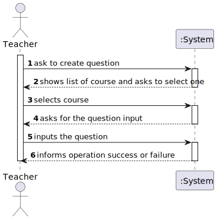
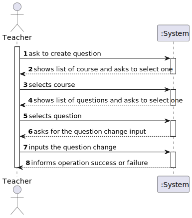
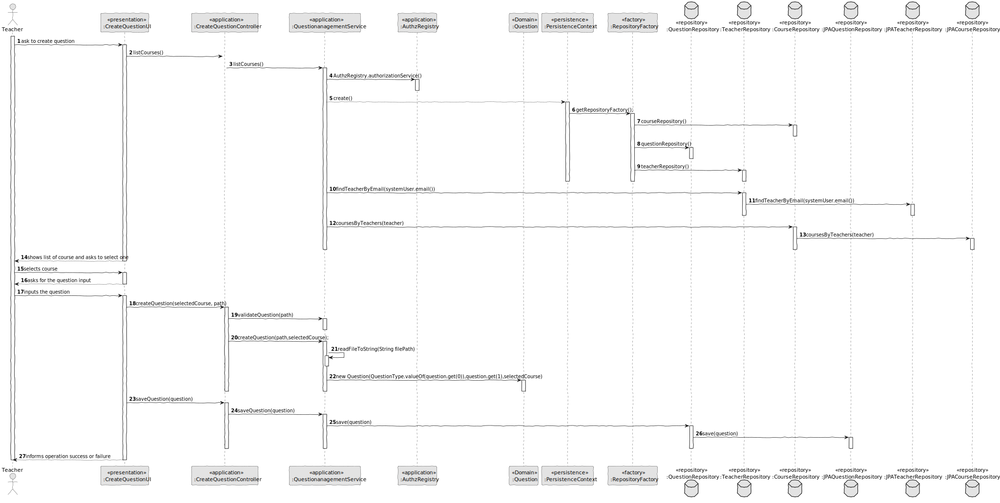
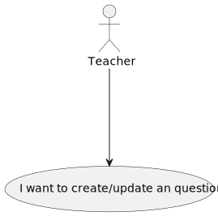
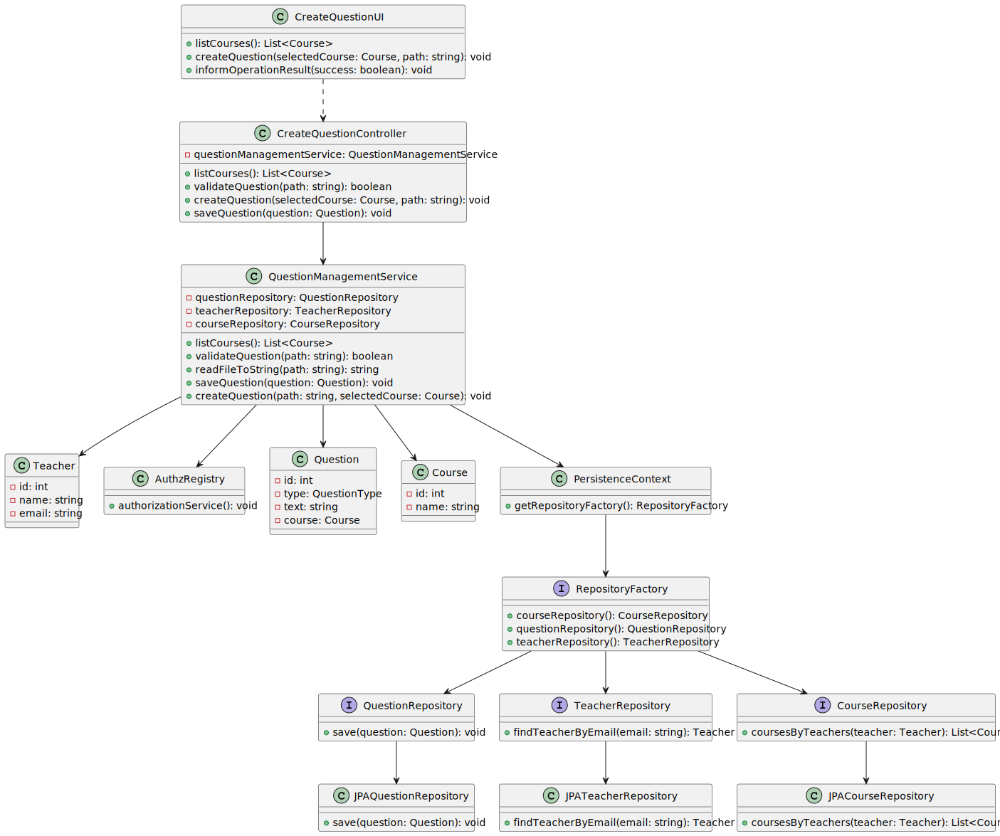
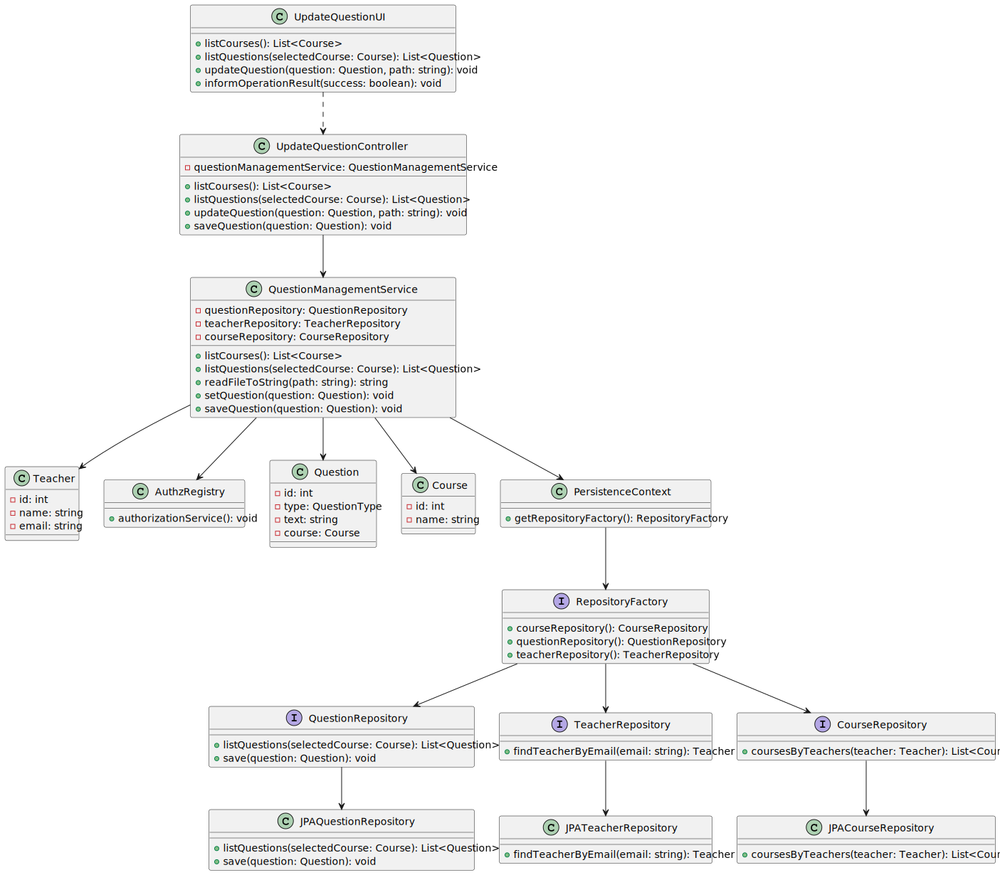

# US 2007

## 1. Context

* It is the first time the task is assigned to be developed
  As Teacher I want to add/update exam questions to a repository of exam questions to be used in automatic formative exams
* 
## 2. Requirements

> **US 2007** As Teacher I want to add/update exam questions to a repository of exam questions to be used in automatic formative exams


- Only Teachers are able to execute this functionality.

* Regarding this requirement we understand that it relates to theadd/update exam questions 
to a repository of exam questions to be used in automatic formative exams

## 3. Analysis

Decisions to take the best design decisions for the requirement.
This section should also include supporting diagrams/artifacts
(such as domain model; use case diagrams, etc.),*

### 3.1. Customer Specifications and Clarifications

Acceptance Criteria:
This includes only the specification of single questions to be used only in automatic formative exams, not on regular exams.
The support for exams (its design, feedback and grading) must follow specific technical requirements, specified in LPROG.
The ANTLR tool should be used (https://www.antlr.org/).

Questions:

# Question:
No Questions
# Answer:
No Questions


## 4. Design

*In this section, the team should present the solution
design that was adopted to solve the requirement.
This should include, at least, a diagram of the realization
of the functionality (e.g., sequence diagram),
a class diagram (presenting the classes that support the functionality),
the identification and rational behind the applied design patterns and
the specification of the main tests used to validade the functionality.*

Use the standard, layer-based application framework

Domain classes: Question Course Teacher (Question Aggregate)(Course Aggregate)(Teacher Aggregate)

Controller: CreateQuestionController UpdateQuestionController
UI: CreateQuestionlUI UpdateQuestionUI
Service: QuestionManagementService
Repository: CourseRepository, QuestionRepository,TeacherRepository

### 4.1. Realization (System Sequence Diagram)




### 4.2. Sequence Diagram




### 4.3. Use Case Diagram



### 4.4. Class Diagram





### 4.5. Applied Patterns

-Low Coupling

-High Cohesion

-State Pattern

-Protected Variation

### 4.7. Tests

**Test 1:** *Verifies that it is not possible to create an instance of the Example class with null values.*

```
@Test(expected = IllegalArgumentException.class)
public void ensureNullIsNotAllowed() {
	Example instance = new Example(null, null);
}
````

## 5. Implementation

*In this section the team should present, if necessary, some evidencies that the implementation is according to the
design. It should also describe and explain other important artifacts necessary to fully understand the implementation
like, for instance, configuration files.*
...

public class QuestionManagementService {

    private final AuthorizationService authorizationService;
    private final CourseRepository courseRepository;
    private final QuestionRepository questionRepository;
    private final TeacherRepository teacherRepository;

    /**
     * Instantiates a new Question management service.
     */
    public QuestionManagementService() {
        this.authorizationService = AuthzRegistry.authorizationService();
        this.courseRepository = PersistenceContext.repositories().courseRepository();
        this.questionRepository = PersistenceContext.repositories().questionRepository();
        this.teacherRepository = PersistenceContext.repositories().teacherRepository();
    }


    /**
     * List courses iterable.
     *
     * @return the iterable
     */
    public Iterable<Course> listCourses() {
        SystemUser systemUser = authorizationService.session().get().authenticatedUser();
        Teacher teacher = teacherRepository.findTeacherByEmail(systemUser.email());
        return courseRepository.coursesByTeachers(teacher);
    }

    /**
     * Validate question.
     *
     * @param path the path
     * @throws IOException the io exception
     */
    public void validateQuestion(String path) throws IOException {
        QuestionGrammarLexer lexer = new QuestionGrammarLexer(CharStreams.fromFileName(path));
        CommonTokenStream tokens = new CommonTokenStream(lexer);
        QuestionGrammarParser parser = new QuestionGrammarParser(tokens);
        parser.start();
    }

    /**
     * Create question question.
     *
     * @param path           the path
     * @param selectedCourse the selected course
     * @return the question
     */
    public Question createQuestion(String path, Course selectedCourse) {
        List<String> question = readFileToString(path);

        return new Question(QuestionType.valueOf(question.get(0)),question.get(1),selectedCourse);
    }

    /**
     * Save question.
     *
     * @param question the question
     */
    public void saveQuestion(Question question) {
        questionRepository.save(question);
    }


    /**
     * Read file to string list.
     *
     * @param filePath the file path
     * @return the list
     */
    public List<String> readFileToString(String filePath) {
        List<String> lines = new ArrayList<String>();
        try (BufferedReader br = new BufferedReader(new FileReader(filePath))) {
            String title = br.readLine(); // Read the first line as the title
            StringBuilder content = new StringBuilder();

            String line;
            while ((line = br.readLine()) != null) {
                content.append(line).append(System.lineSeparator());
            }

            String restOfFile = content.toString();
            lines.add(title);
            lines.add(restOfFile);
        } catch (IOException e) {
            e.printStackTrace();
        }
        return lines;

    }

    /**
     * List questions iterable.
     *
     * @param course the course
     * @return the iterable
     */
    public Iterable<Question> listQuestions(Course course) {
        return  questionRepository.listQuestions(course);
    }

    /**
     * Update question question.
     *
     * @param question the question
     * @param path     the path
     * @return the question
     */
    public Question updateQuestion(Question question, String path) {
        List<String> list = readFileToString(path);
        question.setQuestion(list.get(1));
        question.setQuestionType(QuestionType.valueOf(list.get(0)));
        return question;
    }
}


...
*It is also a best practice to include a listing (with a brief summary) of the major commits regarding this
requirement.*

List of some commits:

FabioMCSilva added a commit that referenced this issue yesterday
@FabioMCSilva
#18 #19 Exam grammar update and created the question grammarCo-author… …
e70352a

FabioMCSilva added a commit that referenced this issue yesterday
@FabioMCSilva
Exam grammar update #19 and created question grammar #18 …
56797a3

FabioMCSilva added a commit that referenced this issue yesterday
@FabioMCSilva
Generated antlr files #18 #19
721c666

JorgeCunha07 added a commit that referenced this issue 12 hours ago
@JorgeCunha07
@FabioMCSilva
US 2001 …
aeeb480

JorgeCunha07 added a commit that referenced this issue 10 hours ago
@JorgeCunha07
For Update Exam: …
ba550c4


FabioMCSilva added a commit that referenced this issue 8 hours ago
@FabioMCSilva
Updates to exam grammar #19 and questions grammar exam #18. Added tes… …
9c1f506

FabioMCSilva added a commit that referenced this issue 7 hours ago
@FabioMCSilva
Updates to questions grammar exam #18 Co-authored-by: <1200618@isep.i… …
e58a46e

JorgeCunha07 added a commit that referenced this issue 7 hours ago
@JorgeCunha07
@FabioMCSilva
For Create and Update Questions …
7b4fb3e

@JorgeCunha07 JorgeCunha07 reopened this 7 hours ago
JorgeCunha07 added a commit that referenced this issue 4 hours ago
@JorgeCunha07
@FabioMCSilva
LPROG …
41bd981

JorgeCunha07 added a commit that referenced this issue 3 hours ago
@JorgeCunha07
Fix to the Packages …
dafc257

FabioMCSilva added a commit that referenced this issue 2 hours ago
@FabioMCSilva
#18 Added the options to the teacher menu
09c45fd


## 6. Integration/Demonstration

*In this section the team should describe the efforts realized in order to integrate this functionality with the other
parts/components of the system*

*It is also important to explain any scripts or instructions required to execute an demonstrate this functionality*

## 7. Observations

*This section should be used to include any content that does not fit any of the previous sections.*

