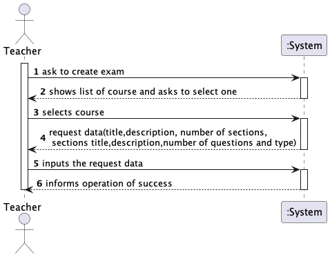

# US 2008 - As Teacher, I want to create/update automatic formative exams

## 1. Context

* It is the first time the task is assigned to be developed

## 2. Requirements

> **US 2008** As Teacher, I want to create/update automatic formative exams

- Only Teachers are able to execute this functionality.

* Regarding this requirement we understand that it relates to approve or reject students
  applications to the courses available.

### 2.1. Customer Specifications and Clarifications

**Acceptance Criteria:**
> This includes the specification of the exam (i.e., its structure, in accordance with a grammar for exams that is used to validate the specification of the exam).
The support for exams (its design, feedback and grading) must follow specific technical requirements, specified in LPROG.
The ANTLR tool should be used (https://www.antlr.org/).

**From the client clarifications:**

> **Question:**
Dear client,
Regarding the questions within the exam, should every type of question have a feedback?
For example, a multiple choice question has 1 solution and 1 solution only. So, if the student's solution is right, he gets maximum grading on a question, and, if so, the feedback would be equal to the solution, for example:
Solution : C
Feedback: C -- 100%
Best regards,
Group 8
> 
> **Answer:** Hello.
The feedback is a text (regarding a question/answer) that may appear to the student when he/she finishes the exam. The teacher can use this text to "justify/explain" why the answer given by the student is wrong (if the student gave the a wrong answer) and what should be the right answer. But, basically, it is only "text". Every possible "wrong answer" may have a feedback. It may also be possible to specify the feedback for the right answer.
Taken from the Moodle documentation "...If you wish, add general feedback. This is text that appears to the student after he/she has answered the question..."
Regards.
> 
> **Question:** Dear client,
Regarding the exam's section, our group had thought about 2 viable options in case of a missing student:
-His grade would be considered a 0;
-His grade would be considered N/A and a message/email would be sent to him regarding the missing exam
If neither the options are the intended solution, it would be great to be provided with the best solution for you.
Best regards,
Group 8
> 
> **Answer:** Hello.
I think only FRE06 - List Course Grades is related to your question. I think that the system should not display the grade of a student that dit not take the exam, it should display, for instance, N/A.
I also do not see any mention in the specification related to the notification of students when they miss an exam.
Regards.


## 3. Analysis

### 3.1. Use Case Diagram


### 3.2 Realization (System Sequence Diagram)
## Create

## Update


## 4. Design

Use the standard, layer-based application framework

Domain classes: FormativeExam, Question,Course, Teacher

Controller: CreateFormativeExamController UpdateFormativeExamController
UI: CreateFormativeExamUI  UpdateFormativeExamUI
Service: FormativeExamManagemantService
Repository: CourseRepository, ExamFormativeRepository,TeacherRepository

### 4.1. Sequence Diagram
## Create

## Update


### 4.2. Class Diagram
## Create

## Update


### 4.3. Applied Patterns

* GRASP
  > With each representation of an actor or user story, GRASP was always taken into account, as it was a fundamental
  basis for the good development of the project.
  > Whether it's Information Expert, Low coupling/High cohesion or the controller concept, all these principles are very
  present in the minds of the group members.

* SOLID
  > The SOLID was mainly present with the Single Responsibility Principle, and the responsibilities that a class should
  have were always taken into account.
  > Already implemented with the base project of EAPLI, the Interface Seggregation Principle proved to be useful and
  enlightening, taking into account the different repositories that had to be created.


### 4.4. Tests

```
@Test
    public void testChangeExamStruct() {
        // Change the exam structor
        String newExamStruct = "New Exam Structure";
        exam.changeExamStruct(newExamStruct);

        // Verify that the exam structor has been changed
        assertEquals(newExamStruct, exam.examStruct());
    }

    @Test
    public void testChangeCourse() {
        // Create a new course
        Course newCourse = new Course(Designation.valueOf("Java"), Description.valueOf("Java - new"),null, Code.valueOf("Edicao 2"), 10, 20,null);

        // Change the course of the exam
        exam.changeCourse(newCourse);

        // Verify that the course has been changed
        assertEquals(newCourse, exam.course());
    }
````

## 5. Implementation

*In this section the team should present, if necessary, some evidencies that the implementation is according to the
design. It should also describe and explain other important artifacts necessary to fully understand the implementation
like, for instance, configuration files.*
...

public class FormativeExamManagemantService {

    private final AuthorizationService authorizationService;
    private final CourseRepository courseRepository;
    private final ExamFormativeRepository examFormativeRepository;
    private final TeacherRepository teacherRepository;
    private final QuestionRepository questionRepository;

    /**
     * Instantiates a new Exam managemant service.
     */
    public FormativeExamManagemantService() {
        this.authorizationService = AuthzRegistry.authorizationService();
        this.courseRepository = PersistenceContext.repositories().courseRepository();
        this.examFormativeRepository = PersistenceContext.repositories().examFormativeRepository();
        this.teacherRepository = PersistenceContext.repositories().teacherRepository();
        this.questionRepository = PersistenceContext.repositories().questionRepository();
    }
    /**
     * List courses iterable.
     *
     * @return the iterable
     */
    public Iterable<Course> listCourses() {
        SystemUser systemUser = authorizationService.session().get().authenticatedUser();
        Teacher teacher = teacherRepository.findTeacherByEmail(systemUser.email());
        return courseRepository.coursesByTeachers(teacher);

    }
    public Question getRandomQuestionByType(QuestionType questionType, Set<Question> selectedQuestions) {
        List<Question> availableQuestions = new ArrayList<>();

        // Filter out questions that have already been selected
        for (Question question : questionRepository.listQuestionsByType(questionType)) {
            if (!selectedQuestions.contains(question)) {
                availableQuestions.add(question);
            }
        }

        if (availableQuestions.isEmpty()) {
            return null; // No more available questions of the given type
        }

        Random random = new Random();
        int index = random.nextInt(availableQuestions.size());
        Question randomQuestion = availableQuestions.get(index);
        return randomQuestion;
    }

    /**
     * Validate exam.
     *
     * @param path the path
     * @throws IOException the io exception
     */
    public void validateExam(String path) throws IOException {
        FormativeExamGrammarLexer lexer = new FormativeExamGrammarLexer(CharStreams.fromFileName(path));
        CommonTokenStream tokens = new CommonTokenStream(lexer);
        FormativeExamGrammarParser parser = new FormativeExamGrammarParser(tokens);
        parser.start();
    }


    private ExamFormative createFormativeExam(String examTitle, String examStructure, Course selectedCourse) {
        SystemUser systemUser = authorizationService.session().get().authenticatedUser();
        Teacher teacher = teacherRepository.findTeacherByEmail(systemUser.email());
        return new ExamFormative(examTitle,examStructure,selectedCourse,teacher);
    }

    /**
     * Save exam.
     *
     * @param selectedCourse the selected course
     */
    public ExamFormative saveExamFormative(String examTitle, String examStructure, Course selectedCourse) {
        ExamFormative createdExam = createFormativeExam(examTitle,examStructure,selectedCourse);
        ExamFormative savedExam = examFormativeRepository.save(createdExam);
        courseRepository.save(selectedCourse);
        return savedExam;
    }

    public List<ExamFormative> findFormativeExams(Course course){
        return examFormativeRepository.examsByCourse(course);
    }

    public void saveUpdatedExam(String filePath, ExamFormative exam){
        String struct = readFileToString(filePath);
        exam.updateExamStruct(struct);
        this.examFormativeRepository.save(exam);
    }

    public String readFileToString(String filepath){
        StringBuilder content = new StringBuilder();
        if (!filepath.isEmpty()) {
            try {
                FileReader fileReader = new FileReader(filepath);
                BufferedReader bufferedReader = new BufferedReader(fileReader);
                String line;

                while ((line = bufferedReader.readLine()) != null) {
                    content.append(line);
                }

                bufferedReader.close();
            } catch (IOException e) {
                throw new RuntimeException(e);
            }
        }

        return content.toString();
    }

    public void updateSection(String filePath, String section, String newTitle, String newDescription) throws IOException {

        Path path = Paths.get(filePath);

        List<String> fileLines = Files.readAllLines(path);
        int lineIndex = 0;

        while (lineIndex < fileLines.size()) {
            String line = fileLines.get(lineIndex);
            if (line.startsWith("//")) {
                if(line.contains(section)){
                    // Update the section title and description
                    String updatedSection = "//" + newTitle + ";";
                    fileLines.set(lineIndex, updatedSection);
                    lineIndex+=2;
                    String updateDescription = "//" + newDescription + ";";
                    fileLines.set(lineIndex,updateDescription);
                }
            }
            lineIndex++;
        }
        // Write the updated lines back to the file
        Files.write(path, fileLines);
    }

}