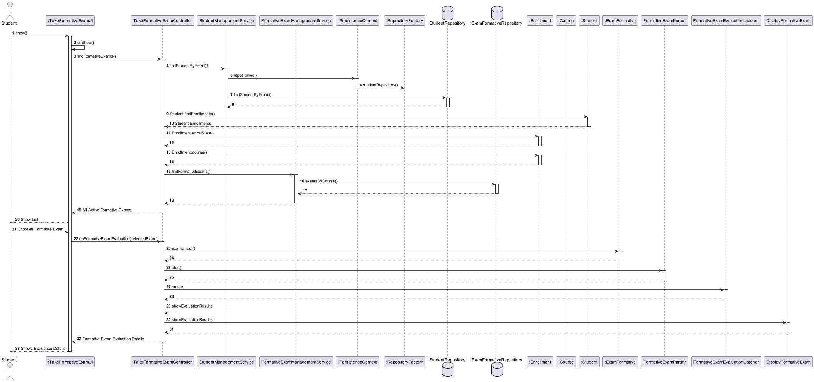
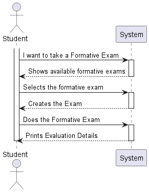
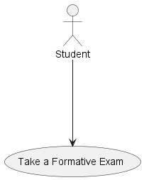
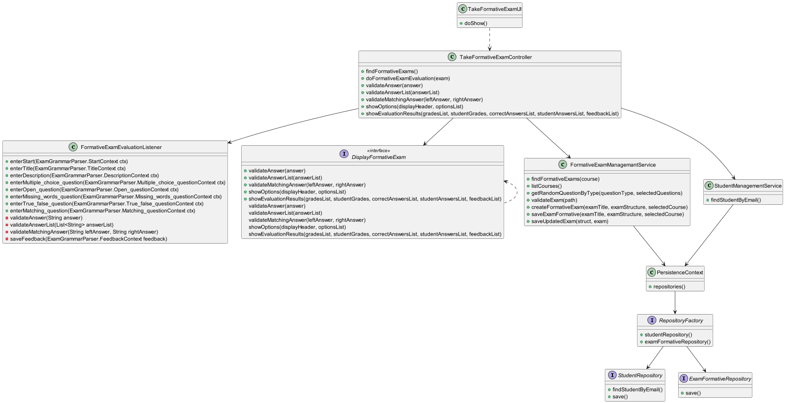
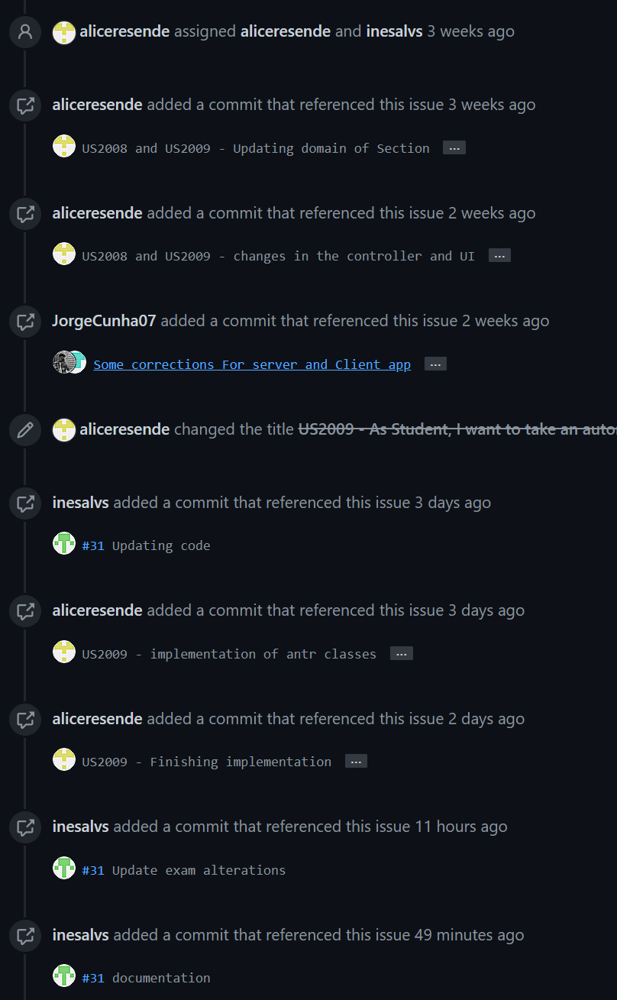
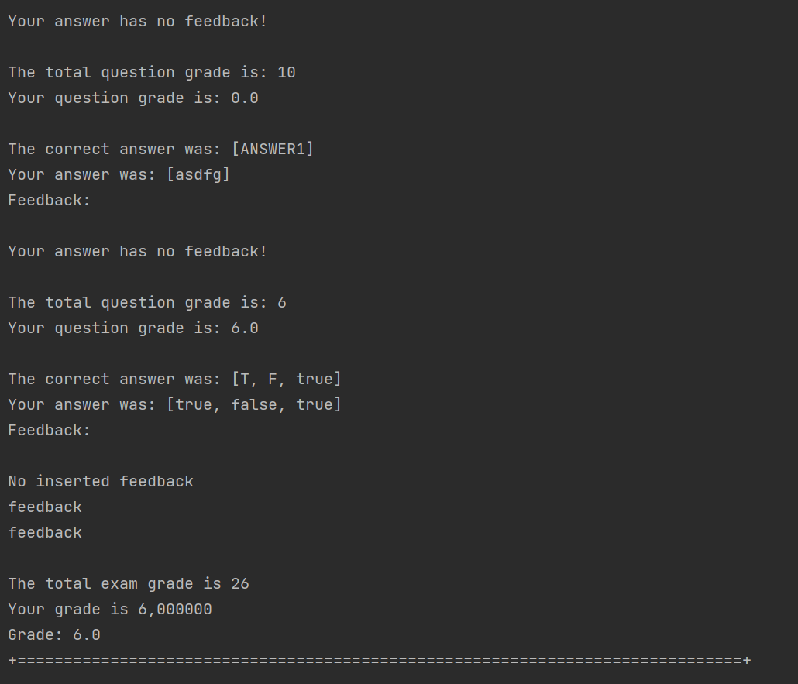

# US 2009 - As Student, I want to take an automatic formative exam

## 1. Context

*Is the first time this task is assigned to be developed should be done by the end of the Sprint C.*

## 2. Requirements

> **US 2009** As Student, I want to take an automatic formative exam

### 2.1 Found Out Dependencies

* There is a dependency with US2008,As Teacher, I want to create/update an automatic formative exam
* There is a dependency with US1005,As Manager, I want to set the teachers of a course
* There is a dependency with US1008,As Student, I want to request my enrollment in a course
* There is a dependency with US1009,As Manager, I want to approve or reject students applications to courses

### 2.2 Customer Specifications and Clarifications

**From the specifications document:**
> A Student takes an exam and answer its questions.
At the end of the exam, the system should display the feedback and result (i.e., grade) of the exam.
The feedback and grade of the exam should be automatically 
calculated by a parser based on the grammar defined for exams structure.


## 4. Design

*In this section, the team should present the solution
design that was adopted to solve the requirement.
This should include, at least, a diagram of the realization
of the functionality (e.g., sequence diagram),
a class diagram (presenting the classes that support the functionality),
the identification and rationale behind the applied design patterns and
the specification of the main tests used to validate the functionality.*

Use the standard, layer-based application framework

Domain classes: Student(Student Aggregate),Course (Course Aggregate), ExamFormative(ExamFormativeAggregate)

Controller: TakeExamController

UI: TakeExamUI

Service: ListExamsManagementService,GradeManagementService

Repository: StudentRepository,GradeRepository

application: DisplayExamImpl,ExamEvaluationListener

### 4.1. Realization (Sequence Diagram)



### 4.2. System Sequence Diagram (Sequence Diagram)



### 4.3. Use Case Diagram



### 4.4. Class Diagram



### 4.5. Domain Model Excert


### 4.6. Applied Patterns

Low Coupling:

    Low Coupling is a design principle in software 
    engineering that aims to reduce the dependencies 
    between software components or modules. 
    It suggests that modules should have minimal knowledge about each other and should be loosely coupled. 
    In other words, changes in one module should have minimal impact on other modules.
    This promotes modularity, flexibility, and ease of maintenance in software systems. 
    By reducing coupling, it becomes easier to understand, modify, and test individual components without affecting the entire system.

High Cohesion:

    High Cohesion is a design principle that emphasizes organizing related functionality together within a software module or component. 
    It suggests that a module should have a single, well-defined responsibility or purpose. 
    Modules with high cohesion are focused and perform a specific set of related tasks, making them more maintainable and reusable. 
    High cohesion allows for better code organization, readability, and the ability to easily modify or extend the functionality of a 
    particular module without affecting unrelated parts of the system.

State Pattern:

    The State Pattern is a behavioral design pattern that allows an object to alter its behavior when its internal state changes. 
    It is useful when an object's behavior needs to change dynamically based on its internal state, without resorting to large conditional statements. 
    The pattern involves defining separate classes for each possible state of an object and encapsulating the behavior associated with each state within 
    its respective class. The object maintains a reference to the current state, and when the state changes, 
    it delegates the behavior to the appropriate state class. 
    This pattern promotes extensibility, maintainability, and flexibility in managing complex state-dependent behaviors.

Protected Variation:

    Protected Variation is a design principle that aims to isolate or decouple the parts of a system that are most likely to change due to external factors. 
    It suggests designing interfaces or abstractions that protect the core components of a system from being affected 
    by variations in other parts of the system or external dependencies. By encapsulating the volatile or varying aspects, 
    such as specific implementation details or external integrations, the core components become less dependent on them. 
    This principle helps to manage change and mitigate the impact of modifications, promoting system stability and maintainability.

Creator:

    Provides a way to create objects without exposing the instantiation logic to the client code.
    It separates the creation of objects from their use, and provides a way to easily extend the types of objects that
    can be created.

Repository:
      
    To manage and store objects in a persistent data store.
    It simplifies data access and decouples application components from data persistence technology.

Factory:
    
    Provides an interface for creating objects, while hiding the implementation details from the client code.
    It allows for flexibility and extensibility by delegating the responsibility of object creation to subclasses.

DDD - Domain Driven Design:

    The design of the project started right away with DDD in mind. The domain model was elaborated with the business
    rules and the DDD overlay for representing aggregates, entities and roots following the necessary rules.

GRASP:

    With each representation of an actor or user story, GRASP was always taken into account, as it was a fundamental
    basis for the good development of the project.
    Whether it's Information Expert, Low coupling/High cohesion or the controller concept, all these principles are very
    present in the minds of the group members.

SOLID:

    The SOLID was mainly present with the Single Responsibility Principle, and the responsibilities that a class should
    have were always taken into account.
    Already implemented with the base project of EAPLI, the Interface Seggregation Principle proved to be useful and
    enlightening, taking into account the different repositories that had to be created.


### 4.5. Tests


```

public class ExamTest {

    private Exam exam;

    @BeforeEach
    public void setup() {
        // Create a sample course and teacher
        Course c1 = new Course(Designation.valueOf("Java"), Description.valueOf("Java - avancado"),null, Code.valueOf("Edicao 1"), 10, 20,null);
        Acronym acronym = new Acronym("ABC");
        final SystemUserBuilder userBuilder = UserBuilderHelper.builder();
        userBuilder.withUsername("joe").withPassword("Password1").withName("joe", "power")
                .withEmail("joe@email.org").withRoles(BaseRoles.STUDENT);
        final SystemUser newUser = userBuilder.build();
        ECourseUser eCourseUser = new ECourseUser(newUser.email(),new ShortName("joe"),new FullName("joe","power"), Calendar.getInstance(),new TaxNumber("123456789"),null);
        Teacher teacher = new Teacher(acronym, newUser, eCourseUser);

        // Create a sample exam
        Calendar initialDate = Calendar.getInstance();
        int duration = 120; // 2 hours
        ExamState examState = ExamState.DRAFT;
        String examStruct = "Sample Exam Structure";
        FeedbackType feedbackType = FeedbackType.NONE;
        GradeType gradeType = GradeType.NONE;

        exam = new Exam(ExamState.DRAFT,"titulo",examStruct,c1,teacher,FeedbackType.ON_SUBMISSION,GradeType.ON_SUBMISSION);
    }

    @Test
    public void testChangeExamState() {
        // Change the exam state
        exam.changeExamState(ExamState.DRAFT);

        // Verify that the exam state has been changed
        assertEquals(ExamState.DRAFT, exam.examState());
    }

    @Test
    public void testChangeExamStruct() {
        // Change the exam structor
        String newExamStruct = "New Exam Structure";
        exam.changeExamStruct(newExamStruct);

        // Verify that the exam structor has been changed
        assertEquals(newExamStruct, exam.examStruct());
    }

    @Test
    public void testChangeCourse() {
        // Create a new course
        Course newCourse = new Course(Designation.valueOf("Java"), Description.valueOf("Java - new"),null, Code.valueOf("Edicao 2"), 10, 20,null);

        // Change the course of the exam
        exam.changeCourse(newCourse);

        // Verify that the course has been changed
        assertEquals(newCourse, exam.course());
    }

    @Test
    public void testChangeTeacher() {
        // Create a new teacher
        Acronym acronym = new Acronym("ABC");
        final SystemUserBuilder userBuilder = UserBuilderHelper.builder();
        userBuilder.withUsername("joana").withPassword("Password1").withName("joana", "power")
                .withEmail("joana@email.org").withRoles(BaseRoles.STUDENT);
        final SystemUser newUser = userBuilder.build();
        ECourseUser eCourseUser = new ECourseUser(newUser.email(),new ShortName("joana"),new FullName("joana","power"), Calendar.getInstance(),new TaxNumber("123456789"),null);
        Teacher newTeacher = new Teacher(acronym, newUser, eCourseUser);

        // Change the teacher of the exam
        exam.changeTeacher(newTeacher);

        // Verify that the teacher has been changed
        assertEquals(newTeacher, exam.teacher());
    }
    
}


    
````

## 5. Implementation

*In this section the team should present, if necessary, some evidencies that the implementation is according to the
design. It should also describe and explain other important artifacts necessary to fully understand the implementation
like, for instance, configuration files.*
...


public class TakeFormativeExamController {

    private DisplayFormativeExam displayExam;
    private final StudentManagementService studentManagementService = new StudentManagementService();
    private final FormativeExamManagemantService formativeExamService= new FormativeExamManagemantService();

    @Autowired
    public void setDisplayExam(DisplayFormativeExam displayExam) {
        this.displayExam = displayExam;
    }

    public Iterable<ExamFormative> findFormativeExams() {
        Student student = studentManagementService.findStudentByEmail();

        List<Enrollment> enrollmentList = student.findEnrollments();
        if (enrollmentList.isEmpty()) return null;

        List<ExamFormative> examsList= new ArrayList<>();
        for (Enrollment enrollment : enrollmentList) {
            if (enrollment.enrollState().equals(EnrollmentState.ACCEPTED)) {
                Course course = enrollment.course();
                examsList = formativeExamService.findFormativeExams(course);
            }
        }

        if (examsList.isEmpty()){ return null;}

        return examsList;
    }


    public void doFormativeExamEvaluation(ExamFormative exam) {
        FormativeExamGrammarParser parser;

        CharStream input = CharStreams.fromString(exam.examStruct());
        FormativeExamGrammarLexer lexer = new FormativeExamGrammarLexer(input);
        CommonTokenStream tokens = new CommonTokenStream(lexer);
        parser = new FormativeExamGrammarParser(tokens);

        ParseTree tree = parser.start();
        FormativeExamEvaluationListener eval = new FormativeExamEvaluationListener(this);
        ParseTreeWalker.DEFAULT.walk(eval, tree);

        showEvaluationResults(eval.gradesList, eval.studentGrades, eval.correctAnswersList,
                eval.studentAnswersList, eval.feedbackList);

        int examGrade = 0;
        for (int grade : eval.gradesList) {
            examGrade += grade;
        }
        float myGrade = 0;
        for (Float grade : eval.studentGrades) {
            myGrade += grade;
        }

        System.out.println("Grade: "+myGrade);
    }


    public boolean validateAnswer(String answer) {
        return displayExam.validateAnswer(answer);
    }

    public boolean validateAnswerList(List<String> answerList) {
        return displayExam.validateAnswerList(answerList);
    }

    public boolean validateMatchingAnswer(String leftAnswer, String rightAnswer) {
        return displayExam.validateMatchingAnswer(leftAnswer, rightAnswer);
    }

    public String showOptions(String displayHeader, Collection<String> optionsList) {
        return displayExam.showOptions(displayHeader, optionsList);
    }

    public void showEvaluationResults(List<Integer> gradesList, List<Float> studentGrades,
                                      List<List<String>> correctAnswersList, List<List<String>> studentAnswersList,
                                      List<List<String>> feedbackList) {
        displayExam.showEvaluationResults(gradesList, studentGrades, correctAnswersList, studentAnswersList, feedbackList);
    }

}

public class FormativeExamManagemantService {
private final AuthorizationService authorizationService;
private final CourseRepository courseRepository;
private final ExamFormativeRepository examFormativeRepository;
private final TeacherRepository teacherRepository;
private final QuestionRepository questionRepository;

    /**
     * Instantiates a new Exam managemant service.
     */
    public FormativeExamManagemantService() {
        this.authorizationService = AuthzRegistry.authorizationService();
        this.courseRepository = PersistenceContext.repositories().courseRepository();
        this.examFormativeRepository = PersistenceContext.repositories().examFormativeRepository();
        this.teacherRepository = PersistenceContext.repositories().teacherRepository();
        this.questionRepository = PersistenceContext.repositories().questionRepository();
    }
    /**
     * List courses iterable.
     *
     * @return the iterable
     */
    public Iterable<Course> listCourses() {
        SystemUser systemUser = authorizationService.session().get().authenticatedUser();
        Teacher teacher = teacherRepository.findTeacherByEmail(systemUser.email());
        return courseRepository.coursesByTeachers(teacher);

    }
    public Question getRandomQuestionByType(QuestionType questionType, Set<Question> selectedQuestions) {
        List<Question> availableQuestions = new ArrayList<>();

        // Filter out questions that have already been selected
        for (Question question : questionRepository.listQuestionsByType(questionType)) {
            if (!selectedQuestions.contains(question)) {
                availableQuestions.add(question);
            }
        }

        if (availableQuestions.isEmpty()) {
            return null; // No more available questions of the given type
        }

        Random random = new Random();
        int index = random.nextInt(availableQuestions.size());
        Question randomQuestion = availableQuestions.get(index);
        return randomQuestion;
    }

    /**
     * Validate exam.
     *
     * @param path the path
     * @throws IOException the io exception
     */
    public void validateExam(String path) throws IOException {
        FormativeExamGrammarLexer lexer = new FormativeExamGrammarLexer(CharStreams.fromFileName(path));
        CommonTokenStream tokens = new CommonTokenStream(lexer);
        FormativeExamGrammarParser parser = new FormativeExamGrammarParser(tokens);
        parser.start();
    }


    private ExamFormative createFormativeExam(String examTitle, String examStructure, Course selectedCourse) {
        SystemUser systemUser = authorizationService.session().get().authenticatedUser();
        Teacher teacher = teacherRepository.findTeacherByEmail(systemUser.email());
        return new ExamFormative(examTitle,examStructure,selectedCourse,teacher);
    }

    /**
     * Save exam.
     *
     * @param selectedCourse the selected course
     */
    public ExamFormative saveExamFormative(String examTitle, String examStructure, Course selectedCourse) {
        ExamFormative createdExam = createFormativeExam(examTitle,examStructure,selectedCourse);
        ExamFormative savedExam = examFormativeRepository.save(createdExam);
        courseRepository.save(selectedCourse);
        return savedExam;
    }

    public List<ExamFormative> findFormativeExams(Course course){
        return examFormativeRepository.examsByCourse(course);
    }

    public void saveUpdatedExam(String struct, ExamFormative exam){
        exam.updateExamStruct(struct);
        this.examFormativeRepository.save(exam);
    }

}

public class FormativeExamEvaluationListener extends FormativeExamGrammarBaseListener {
private TakeFormativeExamController controller;
public List<Integer> gradesList;
public List<Float> studentGrades;
public List<List<String>> feedbackList;
public List<List<String>> studentAnswersList;
public List<List<String>> correctAnswersList;
public List<String> auxFeedbackList;

    public FormativeExamEvaluationListener(TakeFormativeExamController controller) {
        this.controller = controller;
    }

    @Override
    public void enterStart(FormativeExamGrammarParser.StartContext ctx) {
        gradesList = new ArrayList<>();
        studentGrades = new ArrayList<>();
        feedbackList = new ArrayList<>();
        studentAnswersList = new ArrayList<>();
        correctAnswersList = new ArrayList<>();
    }

    @Override
    public void enterTitle(FormativeExamGrammarParser.TitleContext ctx) {
        System.out.println(ctx.SENTENCE().getText().trim());
    }

    @Override
    public void enterDescription(FormativeExamGrammarParser.DescriptionContext ctx) {
        System.out.println();
        for (TerminalNode sentence : ctx.SENTENCE()) {
            System.out.println(sentence.getText().trim());
        }
        System.out.println();
    }

    @Override
    public void enterMultiple_choice_question(FormativeExamGrammarParser.Multiple_choice_questionContext ctx) {
        System.out.println(ctx.question_header().getChild(0).getText());
        int grade = Integer.parseInt(ctx.question_grade().getChild(1).getText());
        List<String> correctAnswers = new ArrayList<>();
        List<String> answersList;
        auxFeedbackList = new ArrayList<>();
        float studentGrade;

        List<String> questionList = new ArrayList<>();

        for (FormativeExamGrammarParser.Correct_answerContext question : ctx.answer_list().correct_answer()) {
            questionList.add(question.SENTENCE().getText().trim());
        }
        for (FormativeExamGrammarParser.Wrong_answerContext question : ctx.answer_list().wrong_answer()) {
            questionList.add(question.SENTENCE().getText().trim());
        }

        boolean flag;
        if (ctx.answer_list().correct_answer().size() == 1) {
            String selectedAnswer;
            do {
                selectedAnswer = controller.showOptions("Multiple choice question:", questionList);
                flag = validateAnswer(selectedAnswer);
            } while (!flag);

            String correctAnswer = ctx.answer_list().correct_answer().get(0).SENTENCE().getText();

            if (selectedAnswer == null) {
                studentGrade = 0;
                auxFeedbackList.add("You didn't answer the question!");
                selectedAnswer = "No answer!";
            } else {
                if (correctAnswer.equalsIgnoreCase(selectedAnswer)) {
                    FormativeExamGrammarParser.FeedbackContext feedback = ctx.answer_list().correct_answer().get(0).feedback();
                    saveFeedback(feedback);
                    studentGrade = grade;
                } else {
                    for (FormativeExamGrammarParser.Wrong_answerContext wrongAnswer : ctx.answer_list().wrong_answer()) {
                        if (selectedAnswer.equalsIgnoreCase(wrongAnswer.SENTENCE().getText())) {
                            FormativeExamGrammarParser.FeedbackContext feedback = wrongAnswer.feedback();
                            saveFeedback(feedback);
                        }
                    }
                    studentGrade = 0;
                }
            }
            answersList = new ArrayList<>();
            answersList.add(selectedAnswer);
            correctAnswers.add(correctAnswer);
        } else {
            System.out.println("Select all the correct options");
            Set<String> auxQuestionList = new HashSet<>();
            do {
                auxQuestionList.addAll(questionList);
                answersList = new ArrayList<>();
                String selectedAnswer;
                do {
                    selectedAnswer = controller.showOptions("Options:", auxQuestionList);
                    if (selectedAnswer != null) {
                        answersList.add(selectedAnswer);
                        auxQuestionList.remove(selectedAnswer);
                    }
                } while (selectedAnswer != null && auxQuestionList.size() > 0);
                flag = validateAnswerList(answersList);
            } while (!flag);

            for (FormativeExamGrammarParser.Correct_answerContext correctAnswer : ctx.answer_list().correct_answer()) {
                correctAnswers.add(correctAnswer.SENTENCE().getText().trim());
            }

            int nCorrectAnswers = 0;
            for (String answer : answersList) {
                if (correctAnswers.contains(answer)) {
                    nCorrectAnswers++;
                } else nCorrectAnswers--; // One wrong answer discounts one correct answer
            }

            if (nCorrectAnswers <= 0) {
                studentGrade = 0;
            } else if (ctx.answer_list().correct_answer().size() == nCorrectAnswers) {
                studentGrade = grade;
            } else {
                studentGrade = grade * ((float) nCorrectAnswers / ctx.answer_list().correct_answer().size());
            }

            if (answersList.isEmpty()) auxFeedbackList.add("You didn't answer the question!");
            else {
                for (String answer : answersList) {
                    for (FormativeExamGrammarParser.Wrong_answerContext wrongAnswer : ctx.answer_list().wrong_answer()) {
                        if (wrongAnswer.SENTENCE().getText().equalsIgnoreCase(answer)) {
                            FormativeExamGrammarParser.FeedbackContext feedback = wrongAnswer.feedback();
                            saveFeedback(feedback);
                        }
                    }
                    for (FormativeExamGrammarParser.Correct_answerContext correctAnswer : ctx.answer_list().correct_answer()) {
                        if (correctAnswer.SENTENCE().getText().equalsIgnoreCase(answer)) {
                            FormativeExamGrammarParser.FeedbackContext feedback = correctAnswer.feedback();
                            saveFeedback(feedback);
                        }
                    }
                }
            }
        }
        studentGrades.add(studentGrade);
        gradesList.add(grade);
        feedbackList.add(auxFeedbackList);
        studentAnswersList.add(answersList);
        correctAnswersList.add(correctAnswers);
    }

    @Override
    public void enterOpen_question(FormativeExamGrammarParser.Open_questionContext ctx) {
        System.out.println(ctx.question_header().getChild(0).getText());
        int grade = Integer.parseInt(ctx.question_grade().getChild(1).getText());
        float studentGrade = 0;

        List<FormativeExamGrammarParser.Open_questions_answerContext> correctAnswers = ctx.open_questions_answer_list().open_questions_answer();
        auxFeedbackList = new ArrayList<>();
        List<String> auxCorrectAnswers = new ArrayList<>();

        boolean flag;
        String answer;
        do {
            answer = Console.readLine("Please write your answer");
            flag = validateAnswer(answer);
        } while (!flag);

        if (answer.isEmpty()) {
            answer = "No answer";
            auxFeedbackList.add("You didn't answer the question!");
        } else {
            for (FormativeExamGrammarParser.Open_questions_answerContext correctAnswer : correctAnswers) {
                int gradePercentage = Integer.parseInt(correctAnswer.INT().getText());

                if (gradePercentage == 100) {
                    auxCorrectAnswers.add(correctAnswer.SENTENCE().getText().trim());
                }

                if (correctAnswer.SENTENCE().getText().trim().equalsIgnoreCase(answer)) {
                    studentGrade = (float) gradePercentage / 100 * grade;

                    FormativeExamGrammarParser.FeedbackContext feedback = correctAnswer.feedback();
                    saveFeedback(feedback);
                }
            }
        }

        if (auxFeedbackList.isEmpty()) auxFeedbackList.add("Your answer has no feedback!");

        studentGrades.add(studentGrade);
        gradesList.add(grade);
        feedbackList.add(auxFeedbackList);
        correctAnswersList.add(auxCorrectAnswers);
        studentAnswersList.add(Arrays.asList(answer.trim()));
    }

    @Override
    public void enterMissing_words_question(FormativeExamGrammarParser.Missing_words_questionContext ctx) {
        System.out.println(ctx.question_header().getChild(0).getText());
        int grade = Integer.parseInt(ctx.question_grade().getChild(1).getText());
        float studentGrade;
        List<String> allCorrectAnswers = new ArrayList<>();
        List<String> allStudentAnswers = new ArrayList<>();
        auxFeedbackList = new ArrayList<>();
        String selectedAnswer;
        boolean flag;

        for (int i = 0; i < ctx.subquestion().size(); i++) {
            System.out.println(ctx.subquestion(i).getText());
            Set<String> answersList = new HashSet<>();
            FormativeExamGrammarParser.Answer_listContext allAnswers = ctx.answer_list(i);

            for (FormativeExamGrammarParser.Correct_answerContext correctAnswer : allAnswers.correct_answer()) {
                answersList.add(correctAnswer.SENTENCE().getText());
                allCorrectAnswers.add(correctAnswer.SENTENCE().getText());
            }
            for (FormativeExamGrammarParser.Wrong_answerContext wrongAnswer : allAnswers.wrong_answer()) {
                answersList.add(wrongAnswer.SENTENCE().getText());
            }
            do {
                selectedAnswer = controller.showOptions("Options:", answersList);
                flag = validateAnswer(selectedAnswer);
            } while (!flag);
            allStudentAnswers.add(selectedAnswer);
        }

        int nCorrectAnswers = 0;
        for (int i = 0; i < allCorrectAnswers.size(); i++) {
            if (allCorrectAnswers.get(i).equals(allStudentAnswers.get(i))) nCorrectAnswers++;
        }

        if (nCorrectAnswers == 0) studentGrade = 0;
        else studentGrade = ((float) nCorrectAnswers / allCorrectAnswers.size()) * grade;

        for (int i = 0; i < ctx.answer_list().size(); i++) {
            String answer = allStudentAnswers.get(i);
            for (FormativeExamGrammarParser.Wrong_answerContext wrongAnswer : ctx.answer_list().get(i).wrong_answer()) {
                if (wrongAnswer.SENTENCE().getText().equalsIgnoreCase(answer)) {
                   FormativeExamGrammarParser.FeedbackContext feedback = wrongAnswer.feedback();
                   saveFeedback(feedback);
                }
            }
            for (FormativeExamGrammarParser.Correct_answerContext correctAnswer : ctx.answer_list().get(i).correct_answer()) {
                if (correctAnswer.SENTENCE().getText().equalsIgnoreCase(answer)) {
                   FormativeExamGrammarParser.FeedbackContext feedback = correctAnswer.feedback();
                   saveFeedback(feedback);
                }
            }
        }

        studentGrades.add(studentGrade);
        gradesList.add(grade);
        feedbackList.add(auxFeedbackList);
        correctAnswersList.add(allCorrectAnswers);
        studentAnswersList.add(allStudentAnswers);
    }

    @Override
    public void enterTrue_false_question(FormativeExamGrammarParser.True_false_questionContext ctx) {
        System.out.println(ctx.question_header().getChild(0).getText());
        int grade = Integer.parseInt(ctx.question_grade().getChild(1).getText());
        List<String> allCorrectAnswers = new ArrayList<>();
        List<String> allStudentAnswers = new ArrayList<>();
        String selectedAnswer;
        boolean flag;

        for (int i = 0; i < ctx.subquestion().size(); i++) {
            allCorrectAnswers.add(ctx.true_false_answer(i).true_false().getText().replaceAll("[;=]", "").trim());
            System.out.println(ctx.subquestion(i).getText());
            do {
                selectedAnswer = controller.showOptions("Options:", new ArrayList<>(Arrays.asList("true", "false")));
                flag = validateAnswer(selectedAnswer);
            } while (!flag);
            allStudentAnswers.add(selectedAnswer);
        }

        int nCorrectAnswers = 0;
        for (int i = 0; i < allCorrectAnswers.size(); i++) {
            if (allCorrectAnswers.get(i).equalsIgnoreCase("t") || allCorrectAnswers.get(i).equalsIgnoreCase("true")) {
                String correctAnswer = "true";
                if (correctAnswer.equalsIgnoreCase(allStudentAnswers.get(i))) {
                    nCorrectAnswers++;
                }
            } else if (allCorrectAnswers.get(i).equalsIgnoreCase("f") || allCorrectAnswers.get(i).equalsIgnoreCase("false")) {
                String correctAnswer = "false";
                if (correctAnswer.equalsIgnoreCase(allStudentAnswers.get(i))) {
                    nCorrectAnswers++;
                }
            }
        }

        auxFeedbackList = new ArrayList<>();
        for (FormativeExamGrammarParser.True_false_answerContext answer : ctx.true_false_answer()) {
            FormativeExamGrammarParser.FeedbackContext feedback = answer.feedback();
            saveFeedback(feedback);
        }
        float studentGrade = ((float) nCorrectAnswers / allCorrectAnswers.size()) * grade;

        studentGrades.add(studentGrade);
        gradesList.add(grade);
        feedbackList.add(auxFeedbackList);
        correctAnswersList.add(allCorrectAnswers);
        studentAnswersList.add(allStudentAnswers);
    }

    @Override
    public void enterMatching_question(FormativeExamGrammarParser.Matching_questionContext ctx) {
        System.out.println(ctx.question_header().getChild(0).getText());
        int grade = Integer.parseInt(ctx.question_grade().getChild(1).getText());
        float studentGrade;
        Map<String, String> correctAnswers = new HashMap<>();
        Map<String, String> studentAnswers = new HashMap<>();
        List<String> allCorrectAnswers = new ArrayList<>();
        List<String> allStudentAnswers = new ArrayList<>();
        List<String> leftOptions = new ArrayList<>();
        List<String> rightOptions = new ArrayList<>();


        for (int i = 0; i < ctx.matching_answers().SENTENCE().size(); i += 2) {
            correctAnswers.put(ctx.matching_answers().SENTENCE(i).getText(), ctx.matching_answers().SENTENCE(i + 1).getText());
            leftOptions.add(ctx.matching_answers().SENTENCE(i).getText());
            rightOptions.add(ctx.matching_answers().SENTENCE(i + 1).getText());
        }

        Collections.shuffle(leftOptions);
        Collections.shuffle(rightOptions);

        System.out.println("Please match the following sentences");
        for (int i = 0; i < leftOptions.size(); i++) {
            System.out.printf("%-50s%-50s\n", leftOptions.get(i), rightOptions.get(i));
        }

        boolean flag;
        String selectedLeftAnswer, selectedRightAnswer;
        do {
            do {
                selectedLeftAnswer = controller.showOptions("Left Options:", leftOptions);
                selectedRightAnswer = controller.showOptions("Right Options:", rightOptions);
                flag = validateMatchingAnswer(selectedLeftAnswer, selectedRightAnswer);
            } while (!flag);

            if (selectedLeftAnswer != null && selectedRightAnswer != null) {
                leftOptions.remove(selectedLeftAnswer);
                rightOptions.remove(selectedRightAnswer);
                studentAnswers.put(selectedLeftAnswer, selectedRightAnswer);
            } else break;
        } while (leftOptions.size() > 0);

        for (Map.Entry<String, String> entry : correctAnswers.entrySet()) {
            allCorrectAnswers.add(String.format("%s -> %s", entry.getKey(), entry.getValue()));
        }

        if (selectedLeftAnswer == null || selectedRightAnswer == null) {
            studentGrade = 0;
            allStudentAnswers.add("No answer");
            auxFeedbackList.add("You didn't answer the question!");
        } else {
            int nCorrentAnswers = 0;
            for (Map.Entry<String, String> studentMapEntry : studentAnswers.entrySet()) {
                allStudentAnswers.add(String.format("%s -> %s", studentMapEntry.getKey(), studentMapEntry.getValue()));
                for (Map.Entry<String, String> entry : correctAnswers.entrySet()) {
                    if (studentMapEntry.getKey().equals(entry.getKey()) && studentMapEntry.getValue().equals(entry.getValue()))
                        nCorrentAnswers++;
                }
            }
            studentGrade = ((float) nCorrentAnswers / correctAnswers.size()) * grade;

            auxFeedbackList = new ArrayList<>();
            List<FormativeExamGrammarParser.FeedbackContext> allFeedbackList = ctx.matching_answers().feedback();
            if (feedbackList != null) {
                for (FormativeExamGrammarParser.FeedbackContext feedback : allFeedbackList) {
                    saveFeedback(feedback);
                }
            }
        }

        if (auxFeedbackList.isEmpty()) auxFeedbackList.add("No feedback by the teacher!");
        studentGrades.add(studentGrade);
        gradesList.add(grade);
        feedbackList.add(auxFeedbackList);
        correctAnswersList.add(allCorrectAnswers);
        studentAnswersList.add(allStudentAnswers);
    }

    private boolean validateAnswer(String answer) {
        return controller.validateAnswer(answer);
    }

    private boolean validateAnswerList(List<String> answerList) {
        return controller.validateAnswerList(answerList);
    }

    private boolean validateMatchingAnswer(String leftAnswer, String rightAnswer) {
        return controller.validateMatchingAnswer(leftAnswer, rightAnswer);
    }

    private void saveFeedback(FormativeExamGrammarParser.FeedbackContext feedback) {
        StringBuilder fullFeedback = new StringBuilder();
        if (feedback != null) {
            List<TerminalNode> questionFeedback = feedback.SENTENCE();
            if (!questionFeedback.isEmpty()) {
                for (int j = 0; j < questionFeedback.size(); j++) {
                    if (j == 0) fullFeedback.append(questionFeedback.get(j).getText());
                    else fullFeedback.append(" ").append(questionFeedback.get(j).getText());
                }
                auxFeedbackList.add(fullFeedback.toString().trim());
            }
        } else auxFeedbackList.add("No inserted feedback");
    }

}


...
*It is also a best practice to include a listing (with a brief summary) of the major commits regarding this
requirement.*
Some commits:



## 6. Integration/Demonstration


## 7. Observations

The User Story was fully developed