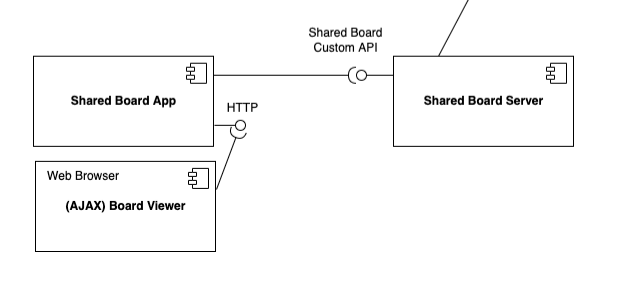

# US 3001 - As Project Manager, I want the team to prepare the communication infrastructure for the Shared Boards and the deployment of the solution

## 1. Context

*Is the first time this task is assigned to be developed should be done by the end of the Sprint B.*

## 2. Requirements

> **US 3001** As Project Manager, I want the team to prepare the communication infrastructure for the Shared Boards and the deployment of the solution

Related to...
> NFR10 - Shared Board Architecture This functional part of the system has very
specific technical requirements. It must follow a client-server architecture, where a
client application is used to access the shared boards that should be implemented in
a server. Communications between these two components must follow specific protocol 
described in a document from RCOMP ("Application Protocol"). Also, the client application 
can not access the relational database, it can only access the server application. The
client app should implement an HTTP server to be able to generate the "views" of the
boards. This should be done automatically, without the intervention of the users (i.e.,
without reload of the web page) by using AJAX.

> NFR14 - Deployment The solution should be deployed using several network nodes.
It is expected that, at least, the relational database server and the shared board server be
deployed in nodes different from localhost, preferably in the cloud

### 2.1 Found Out Dependencies

* There aren't dependencies

### 2.2 Customer Specifications and Clarifications

**From the specifications document:**
 
> Shared boards follow a specific design (as described in NFR07). There is a separation between
> a frontend (Shared Board App) and a backend (Shared Board Server). The server implements
> the shared boards and receives updates from the clients. 
> As updates are executed in the server, the server notifies the clients of these updates. 
> As such, all clients are able to maintain a "realtime" clone of the shared boards. 
> The Shared Board App implements a "small" HTTP server that serves a page that displays a board view.

**From the client clarifications:**
> **Question:** "As stated in the system specifications document, "Columns and rows may have titles. They may also be
> identified by an integer number from 1 to the maximum number", we wanted to clarify if it should be possible to have a
> column with no title and no identifier. Also, can the identifier of a column/row change once it's assigned?"
>
> **Answer:** In order for user to post content into a cell they must identify the cell. Therefore, I think at least, ir
> should be possible to identify the cell by the number of its column and the number of its row. If the cells have titles,
> these titles can be used to identify the cells. However, it should always be possible to identify a cell by the column
> number and row number. Regarding changing the title of the columns and rows after creating the board, there is nothing
> explicit about that. Therefore, I would accept the solution that does not support that possibility.

## 3. Analysis



## 4. Design

### 4.1. Realization (Sequence Diagram)


### 4.3. Applied Patterns

* **TCP**

### 4.4. Tests

**Test 1:** *Verifies that it is not possible to create an instance of the Example class with null values.*

```
@Test(expected = IllegalArgumentException.class)
public void ensureNullIsNotAllowed() {
	Example instance = new Example(null, null);
}
````

## 5. Implementation

*In this section the team should present, if necessary, some evidencies that the implementation is according to the
design. It should also describe and explain other important artifacts necessary to fully understand the implementation
like, for instance, configuration files.*

*It is also a best practice to include a listing (with a brief summary) of the major commits regarding this
requirement.*

## 6. Integration/Demonstration

*In this section the team should describe the efforts realized in order to integrate this functionality with the other
parts/components of the system*

*It is also important to explain any scripts or instructions required to execute an demonstrate this functionality*

## 7. Observations

*This section should be used to include any content that does not fit any of the previous sections.*

*The team should present here, for instance, a critical prespective on the developed work including the analysis of
alternative solutioons or related works*

*The team should include in this section statements/references regarding third party works that were used in the
development this work.*