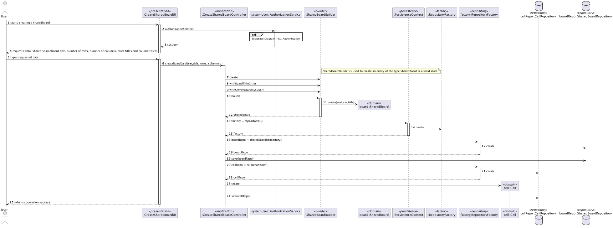

# US 3002 - As User, I want to create a board

## 1. Context

*Is the first time this task is assigned to be developed should be done by the end of the Sprint B.*

## 2. Requirements

> **US 3002** As User, I want to create a board

Related to...
> FRB01 - Create Board A user creates a board

### 2.1 Found Out Dependencies

* There is a dependency with US1001, which is responsible for registering the teachers in the system.

### 2.2 Customer Specifications and Clarifications

**From the specifications document:**
> A shared board is a digital implementation of a post-it board. It has a unique
> title. It is divided into a certain number of columns and rows. Therefore it has a certain numberof cells. For the
> moment it makes sense to dene the maximum number of rows to 20 and of
> columns to 10. But this should be a setting in a property file. Columns and rows may have
> titles. They may also be identified by an integer number from 1 to the maximum number.
> The user that creates the board is its owner. The owner can share the board with other users.
> Users may have read or write access to the board.
> Users with write permission may post content to a cell in the board. The content can be a
> text or an image. When the server commits a post it also should notify all clients with access
> to the board of the update

**From the client clarifications:**
> **Question:** "As stated in the system specifications document, "Columns and rows may have titles. They may also be
> identified by an integer number from 1 to the maximum number", we wanted to clarify if it should be possible to have a
> column with no title and no identifier. Also, can the identifier of a column/row change once it's assigned?"
>
> **Answer:** In order for user to post content into a cell they must identify the cell. Therefore, I think at least, ir
> should be possible to identify the cell by the number of its column and the number of its row. If the cells have titles,
> these titles can be used to identify the cells. However, it should always be possible to identify a cell by the column
> number and row number. Regarding changing the title of the columns and rows after creating the board, there is nothing
> explicit about that. Therefore, I would accept the solution that does not support that possibility.
>
> **Question:** "Can a user own more than one board?"
>
> **Answer:** Yes.

## 3. Analysis

### 3.1 Use Case Diagram


### 3.2 Relevant Domain Model Excerpt


## 3.3 System Sequence Diagram (SSD)


## 4. Design

### 4.1. Realization (Sequence Diagram)



### 4.2. Class Diagram


### 4.3. Applied Patterns

* **Builder**
  > Separates the construction of a complex object from its representation. It allows for the creation of different
  object configurations using the same construction process.

* **Creator**
  > Provides a way to create objects without exposing the instantiation logic to the client code.
  > It separates the creation of objects from their use, and provides a way to easily extend the types of objects that
  can be created.

* **Repository**
  > To manage and store objects in a persistent data store.
  > It simplifies data access and decouples application components from data persistence technology.

* **Factory**
  > Provides an interface for creating objects, while hiding the implementation details from the client code.
  > It allows for flexibility and extensibility by delegating the responsibility of object creation to subclasses.

* DDD - Domain Driven Design.
  > The design of the project started right away with DDD in mind. The domain model was elaborated with the business
  rules and the DDD overlay for representing aggregates, entities and roots following the necessary rules.

* GRASP
  > With each representation of an actor or user story, GRASP was always taken into account, as it was a fundamental
  basis for the good development of the project.
  > Whether it's Information Expert, Low coupling/High cohesion or the controller concept, all these principles are very
  present in the minds of the group members.

* SOLID
  > The SOLID was mainly present with the Single Responsibility Principle, and the responsibilities that a class should
  have were always taken into account.
  > Already implemented with the base project of EAPLI, the Interface Seggregation Principle proved to be useful and
  enlightening, taking into account the different repositories that had to be created.

### 4.4. Tests

**Test 1:** *Verifies that it is not possible to create an instance of the Example class with null values.*

```
@Test(expected = IllegalArgumentException.class)
public void ensureNullIsNotAllowed() {
	Example instance = new Example(null, null);
}
````

## 5. Implementation

*In this section the team should present, if necessary, some evidencies that the implementation is according to the
design. It should also describe and explain other important artifacts necessary to fully understand the implementation
like, for instance, configuration files.*

*It is also a best practice to include a listing (with a brief summary) of the major commits regarding this
requirement.*

## 6. Integration/Demonstration

*In this section the team should describe the efforts realized in order to integrate this functionality with the other
parts/components of the system*

*It is also important to explain any scripts or instructions required to execute an demonstrate this functionality*

## 7. Observations

*This section should be used to include any content that does not fit any of the previous sections.*

*The team should present here, for instance, a critical prespective on the developed work including the analysis of
alternative solutioons or related works*

*The team should include in this section statements/references regarding third party works that were used in the
development this work.*