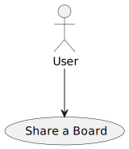

# US 3004 - As User, I want to share a board

## 1. Context

*Is the first time this task is assigned to be developed should be done by the end of the Sprint C.*

## 2. Requirements

> **US 3004** - As User, I want to share a board

Related to...
> **FRB02** - **Share Board** A user shares a board it owns with other users

### 2.1 Found Out Dependencies

* There is a dependency with US3002, which is responsible for creating a shared board.

### 2.2 Customer Specifications and Clarifications

**From the specifications document:**
> The user that creates the board is its owner. The owner can share the board with other users.
Users may have read or write access to the board.
Users with write permission may post content to a cell in the board. The content can be a
text or an image. When the server commits a post it also should notify all clients with access
to the board of the update.

**From the client clarifications:**

> **Question:** "
Dear Client, when a user shares a board with multiples users are the permissions (read or write) defined per user ?
Or are they the same for every user it is shared with ? Best regards,"
>
> **Answer:** "Hello Francisco.
The owner of the board should be able to specify the access that each user has to the board (read or write). 
Regards."

## 3. Analysis

### 3.1 Use Case Diagram

### 3.2 Relevant Domain Model Excerpt

## 3.3 System Sequence Diagram (SSD)

## 4. Design

### 4.1. Realization (Sequence Diagram)

### 4.2. Class Diagram

### 4.3. Applied Patterns

* **Low Coupling**

   > Low Coupling is a design principle in software 
    engineering that aims to reduce the dependencies 
    between software components or modules. 
    It suggests that modules should have minimal knowledge about each other and should be loosely coupled. 
    In other words, changes in one module should have minimal impact on other modules.
    This promotes modularity, flexibility, and ease of maintenance in software systems. 
    By reducing coupling, it becomes easier to understand, modify, and test individual components without affecting the entire system.

* **High Cohesion**

   > High Cohesion is a design principle that emphasizes organizing related functionality together within a software module or component. 
    It suggests that a module should have a single, well-defined responsibility or purpose. 
    Modules with high cohesion are focused and perform a specific set of related tasks, making them more maintainable and reusable. 
    High cohesion allows for better code organization, readability, and the ability to easily modify or extend the functionality of a 
    particular module without affecting unrelated parts of the system.

* **State Pattern**

   > The State Pattern is a behavioral design pattern that allows an object to alter its behavior when its internal state changes. 
    It is useful when an object's behavior needs to change dynamically based on its internal state, without resorting to large conditional statements. 
    The pattern involves defining separate classes for each possible state of an object and encapsulating the behavior associated with each state within 
    its respective class. The object maintains a reference to the current state, and when the state changes, 
    it delegates the behavior to the appropriate state class. 
    This pattern promotes extensibility, maintainability, and flexibility in managing complex state-dependent behaviors.

* **Protected Variation**

   > Protected Variation is a design principle that aims to isolate or decouple the parts of a system that are most likely to change due to external factors. 
    It suggests designing interfaces or abstractions that protect the core components of a system from being affected 
    by variations in other parts of the system or external dependencies. By encapsulating the volatile or varying aspects, 
    such as specific implementation details or external integrations, the core components become less dependent on them. 
    This principle helps to manage change and mitigate the impact of modifications, promoting system stability and maintainability.

* **Creator**
  > Provides a way to create objects without exposing the instantiation logic to the client code.
   It separates the creation of objects from their use, and provides a way to easily extend the types of objects that
  can be created.

* **Repository**
  > To manage and store objects in a persistent data store.
   It simplifies data access and decouples application components from data persistence technology.

* **Factory**
  > Provides an interface for creating objects, while hiding the implementation details from the client code.
   It allows for flexibility and extensibility by delegating the responsibility of object creation to subclasses.

* DDD - Domain Driven Design.
  > The design of the project started right away with DDD in mind. The domain model was elaborated with the business
  rules and the DDD overlay for representing aggregates, entities and roots following the necessary rules.

* GRASP
  > With each representation of an actor or user story, GRASP was always taken into account, as it was a fundamental
  basis for the good development of the project.
   Whether it's Information Expert, Low coupling/High cohesion or the controller concept, all these principles are very
  present in the minds of the group members.

* SOLID
  > The SOLID was mainly present with the Single Responsibility Principle, and the responsibilities that a class should
  have were always taken into account.
   Already implemented with the base project of EAPLI, the Interface Seggregation Principle proved to be useful and
  enlightening, taking into account the different repositories that had to be created.

### 4.4. Tests

n/a

## 5. Implementation

    public static void shareBoardUI(Socket socket, DataInputStream inputStream, DataOutputStream outputStream, BufferedReader bufferedReader) throws IOException {
        rcompService.sendMessage(socket, new FormatMessage(1, SB_SHAREBOARD, ""), outputStream);
        FormatMessage ans = rcompService.readData(socket, inputStream);

        List<String> boards = List.of(ans.message().split(","));

        if (boards.isEmpty()) System.out.println("user doesn't own any boards!");
        else {
            for (String b : boards) {
                System.out.println(b);
            }
            String selectedboard = Console.readLine("Choose a board:");

            String email = Console.readLine("Insert the email of the user you want to share this board with: ");

            int option;
            System.out.println("1.Read Permission");
            System.out.println("2.Write Permission");

            option = Console.readInteger("Choose the option correspondent to the action you desire to do (0 to exit)");

            String data = selectedboard + "\0" + email + "\0" + option;

            rcompService.sendMessage(socket, new FormatMessage(1, 404, data), outputStream);
            ans = rcompService.readData(socket, inputStream);

            if (ans.code() == ACK) {
                System.out.println("User permission granted!");
            } else {
                System.out.println(ans.message());
            }

        }

    }

    public void shareBoard(FormatMessage message) throws IOException {

        ShareBoardController sbController = new ShareBoardController();

        String sharedBoardList = String.join(",", sbController.listOwnedBoards());

        rcompService.sendMessage(socket, new FormatMessage(1, SharedBoardUtils.SB_SHAREBOARD, sharedBoardList), dataOutputStream);
        message = rcompService.readData(socket, dataInputStream);

        String[] data = message.message().split("\0");

        String selectedBoard = data[0];
        String email = data[1];
        int option = Integer.parseInt(data[2]);
        boolean flag = false;

        if (option == 1) {
            flag = sbController.readPermission(selectedBoard, email);
        } else if (option == 2) {
            flag = sbController.writePermission(selectedBoard, email);
        }

        if (flag) {
            rcompService.sendMessage(socket, new FormatMessage(1, SharedBoardUtils.ACK, "SHARED"), dataOutputStream);
        } else {
            rcompService.sendMessage(socket, new FormatMessage(1, SharedBoardUtils.ERR, "ERROR - NOT SHARED"), dataOutputStream);
        }

    }

    public boolean readPermission(String boardName, EmailAddress email){
    boolean flag;
    SharedBoard board = null;
    try{
    board =  boardRepo.findSharedBoardByTitle(Designation.valueOf(boardName));
    flag = true;
    }catch (Exception e){
    flag = false;
    }

        if (flag){
            ECourseUser eUser = eCourseUserRepo.eCourseUserByEmail(email);
            SystemUser user = validateUser(eUser);
            if(user == null){
                return false;
            }

            //pela board
            Permission hasPerm = permRepo.hasPermissionByEmail(email);

            if(hasPerm != null){
                if (hasPerm.AccessLevel() == AccessLevel.WRITE && board != null){
                    hasPerm.readPermission();
                    permRepo.save(hasPerm);
                }else{
                    System.out.println("User already has READ permission for that board OR Board NULL");
                }
            }else{
                Permission perm = new Permission(board, user);
                perm.readPermission();
                permRepo.save(perm);
            }

            return true;
        }
        return false;
    }

    private SystemUser validateUser(ECourseUser eUser){

        SystemUser user = null;

        Teacher teacher = teacherRepository.findTeacherByEmail(eUser.email());
        if (teacher != null) {
            user = teacher.systemUser();
        }else{
            Student student = studentRepository.findStudentByEmail(eUser.email());
            if (student != null){
                user = student.systemUser();
            }
        }

        return user;
    }
    public boolean writePermission(String boardName, EmailAddress email){
        boolean flag;
        SharedBoard board = null;
        try{
            board =  boardRepo.findSharedBoardByTitle(Designation.valueOf(boardName));
            flag = true;
        }catch (Exception e){
            flag = false;
        }

        if (flag){
            ECourseUser eUser = eCourseUserRepo.eCourseUserByEmail(email);
            SystemUser user = validateUser(eUser);
            if(user == null){
                return false;
            }

            //pela board
            Permission hasPerm = permRepo.hasBoardPermissionByEmail(email, board.identity());

            if(hasPerm != null){
                if (hasPerm.AccessLevel() == AccessLevel.WRITE && board != null){
                    hasPerm.writePermission();
                    permRepo.save(hasPerm);
                }else{
                    System.out.println("User already has READ permission for that board OR Board NULL");
                }
            }else{
                Permission perm = new Permission(board, user);
                perm.writePermission();
                permRepo.save(perm);
            }

            return true;
        }
        return false;
    }

## 6. Integration/Demonstration

n/a

## 7. Observations

n/a
