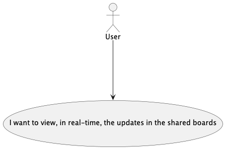
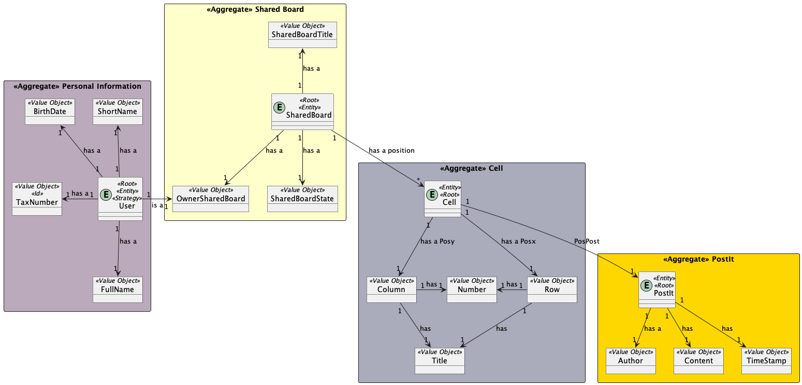
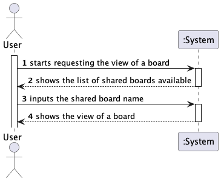
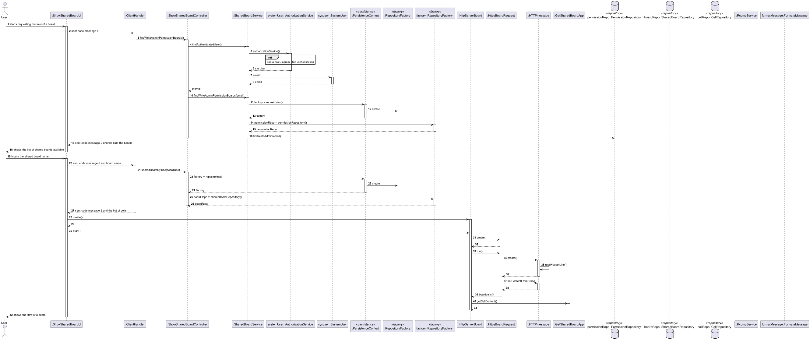
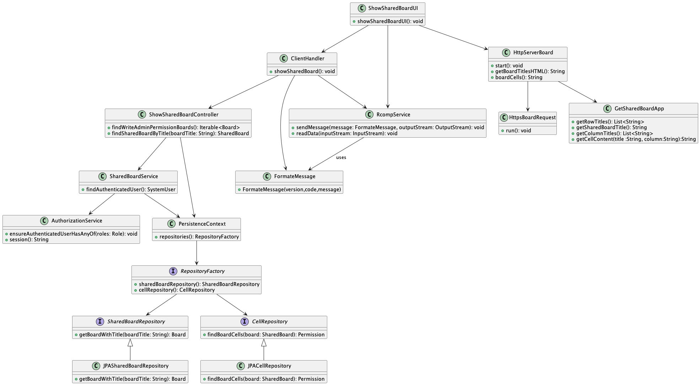
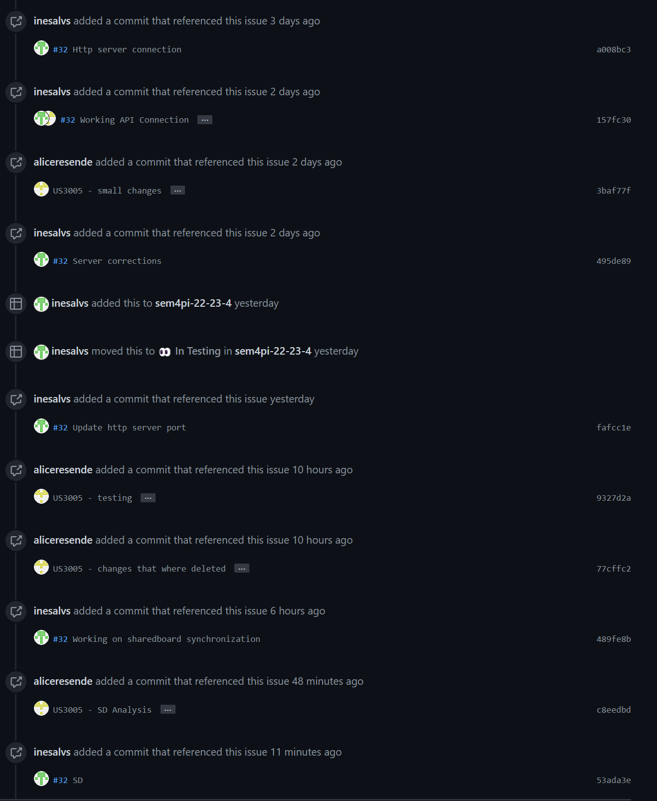

# US 3005 - As User, I want to view, in real-time, the updates in the shared boards

## 1. Context

*Is the first time this task is assigned to be developed should be done by the end of the Sprint C.*

## 2. Requirements

> **US 3005**  As User, I want to view, in real-time, the updates in the shared boards

Related to...
> FRB03 - **View Board** The system should display, in "real-time", the shared boards available to the user in a HTML page
> 
> NFR13 - **Design and Implement Shared Board Synchronization** This functional
part of the system has very specific technical requirements, particularly some concerns
about synchronization problems. In fact, several clients will try to concurrently update
boards. As such, the solution design and implementation must be based on threads,
condition variables and mutexes. Specic requirements will be provided in SCOMP.
>
> NFR14 - **Deployment** The solution should be deployed using several network nodes.
It is expected that, at least, the relational database server and the shared board server be
deployed in nodes dierent from localhost, preferably in the cloud.

### 2.1 Found Out Dependencies

* There is a dependency with US3001, which is responsible for preparing the communication infrastructure for the Shared Boards and the deployment of the solution.
* There is a dependency with US3002, which is responsible for the creation of a shared board.
* There is a dependency with US3006, which is responsible for the creation of a board post-it.
* There is a dependency with US3007, which is responsible for changing the post-it.
* There is a dependency with US3008, which is responsible for undoing the last post-it changes.


### 2.2 Customer Specifications and Clarifications

**From the specifications document:**
> This functional part of the system has very
specic technical requirements. It must follow a client-server architecture, where a
client application is used to access the shared boards that should be implemented in
a server. Communications between these two components must follow specic protocol described in a document from RCOMP ("Application Protocol"). Also, the client application can not access the relational database, it can only access the server application. The
client app should implement an HTTP server to be able to generate the "views" of the
boards. This should be done automatically, without the intervention of the users (i.e.,
without reload of the web page) by using AJAX.

**From the client clarifications:**
> **Question:** "The client wants only a web page to be developed for viewing the boards and authentication in the command line (cli), as shown on page 11 of the project specification, or else, he would also accept an application fully developed on a web page (with authentication executed in it)"
> 
> **Answer:** "As a customer, and if I understood correctly, the first option will be what I want. In other words, all the functionalities of the Shared Board App are carried out in the "console" type application in java, with the exception of the part related to the real-time visualization of the boards."
> 
> **Question:** "Regarding the board history of FRB07, which information should be stored? For example: change date, change made, user?"
> 
> **Answer:** "I would say all the information that is needed for a possible "restore operation" in the future (so that it can be used again with "total" functionality)."
> 


## 3. Analysis

### 3.1 Use Case Diagram



### 3.2 Relevant Domain Model Excerpt



## 3.3 System Sequence Diagram (SSD)



## 4. Design

### 4.1. Realization (Sequence Diagram)



### 4.2. Class Diagram



### 4.3. Applied Patterns

* **Creator**
  > Provides a way to create objects without exposing the instantiation logic to the client code.
  > It separates the creation of objects from their use, and provides a way to easily extend the types of objects that
  can be created.

* **Repository**
  > To manage and store objects in a persistent data store.
  > It simplifies data access and decouples application components from data persistence technology.

* **Factory**
  > Provides an interface for creating objects, while hiding the implementation details from the client code.
  > It allows for flexibility and extensibility by delegating the responsibility of object creation to subclasses.

* DDD - Domain Driven Design.
  > The design of the project started right away with DDD in mind. The domain model was elaborated with the business
  rules and the DDD overlay for representing aggregates, entities and roots following the necessary rules.

* GRASP
  > With each representation of an actor or user story, GRASP was always taken into account, as it was a fundamental
  basis for the good development of the project.
  > Whether it's Information Expert, Low coupling/High cohesion or the controller concept, all these principles are very
  present in the minds of the group members.

* SOLID
  > The SOLID was mainly present with the Single Responsibility Principle, and the responsibilities that a class should
  have were always taken into account.
  > Already implemented with the base project of EAPLI, the Interface Seggregation Principle proved to be useful and
  enlightening, taking into account the different repositories that had to be created.
  

### 4.4. Requests
| Code | Request                                |
|------|----------------------------------------|
| 2    | Acknowledgment message                 |
| 4    | Requests shared board data             |

### 4.5. Tests

**Test 1:** *Verifies if the shared board is created*

```
   @BeforeEach
    void setUp() {
        final SystemUserBuilder userBuilder = UserBuilderHelper.builder();
        userBuilder.withUsername("joe").withPassword("Password1").withName("joe", "power")
                .withEmail("joe@email.org").withRoles(BaseRoles.nonUserValues());
         owner = userBuilder.build();
    }

    @Test
    void testCreateSharedBoard() {
        // Act
        SharedBoard sharedBoard = new SharedBoard(Designation.valueOf("Shared Board Title"), owner);

        // Assert
        assertNotNull(sharedBoard);
        assertEquals(Designation.valueOf("Shared Board Title"), sharedBoard.sharedBoardTitle());
        assertEquals(owner, sharedBoard.ownerSharedBoard());
    }
````
## 5. Implementation

*In this section the team should present, if necessary, some evidencies that the implementation is according to the
design. It should also describe and explain other important artifacts necessary to fully understand the implementation
like, for instance, configuration files.*
...

public class HttpsBoardRequest extends Thread {
String baseFolder;
Socket sock;
DataInputStream inS;
DataOutputStream outS;

    public HttpsBoardRequest(Socket s, String f) {
        baseFolder = f;
        sock = s;
    }

    public void run() {
        try {
            outS = new DataOutputStream(sock.getOutputStream());
            inS = new DataInputStream(sock.getInputStream());
        } catch (IOException ex) {
            System.out.println("Thread error on data streams creation");
        }

        try {
            HTTPmessage request = new HTTPmessage(inS);
            HTTPmessage response = new HTTPmessage();
            System.out.println("New Request!");

            if (request.getMethod().equals("GET")) {
                if (request.getURI().equals("/board")) {
                    response.setContentFromString(
                            HttpServerBoard.getBoardTitlesHTML(), "text/html");
                    response.setResponseStatus("200 Ok");
                } else if (request.getURI().equals("/matrix")) {
                    response.setContentFromString(HttpServerBoard.boardCells(), "text/html");
                    response.setResponseStatus("200 ok");
                } else {
                    String fullname = baseFolder + "/";
                    if (request.getURI().equals("/")) fullname = fullname + "index.html";
                    else fullname = fullname + request.getURI();

                    if (response.setContentFromFile(fullname)) {
                        response.setResponseStatus("200 Ok");
                    } else {
                        response.setContentFromString(
                                "<html><body><h1>404 File not found</h1></body></html>",
                                "text/html");
                        response.setResponseStatus("404 Not Found");
                    }
                }
                response.send(outS);
            } else { // NOT GET
                if (request.getMethod().equals("PUT")
                        && request.getURI().startsWith("/votes/")) {
                    response.setResponseStatus("200 Ok");
                } else {
                    response.setContentFromString(
                            "<html><body><h1>ERROR: 405 Method Not Allowed</h1></body></html>",
                            "text/html");
                    response.setResponseStatus("405 Method Not Allowed");
                }
                response.send(outS);
            }

        } catch (IOException | InterruptedException ex) {
            System.out.println("Thread error when reading request");
        }

        try {
            sock.close();
        } catch (IOException ex) {
            System.out.println("CLOSE IOException");
        }


public class HttpServerBoard {

     public static synchronized String getBoardTitlesHTML() {
        StringBuilder s = new StringBuilder();
        String boardName= getBoard.getSharedBoardTitle();
        s.append("<h1>"+boardName+"</h1>");
        return s.toString();
    }
    public static synchronized String boardCells() throws InterruptedException {

        List<String> rows = getBoard.getRowTitles();
        List<String> columns = getBoard.getColumnTitles();

        StringBuilder buildInHtml = new StringBuilder();
        int maxRow = rows.size() + 1;
        int maxColumn = columns.size() + 1;

        // Add table headers
        buildInHtml.append("<tr>");
        buildInHtml.append("<th></th>"); // Empty cell for the first column
        for (int j = 1; j < maxColumn; j++) {
            buildInHtml.append("<th>").append(columns.get(j - 1)).append("</th>");
        }
        buildInHtml.append("</tr>");

        // Add table rows
        for (int i = 1; i < maxRow; i++) {
            buildInHtml.append("<tr>");
            buildInHtml.append("<td>").append(rows.get(i - 1)).append("</td>"); // Row title
            for (int j = 1; j < maxColumn; j++) {
                String cellContent = getBoard.getCellContent(rows.get(i - 1),columns.get(j - 1));
                buildInHtml.append("<td>").append(cellContent).append("</td>"); // Empty cell
            }
            buildInHtml.append("</tr>");
        }
        return buildInHtml.toString();

    }

}

public class ClientHandler {

      private void showSharedBoard() throws IOException, InterruptedException, ClassNotFoundException {
      ShowSharedBoardController controller = new ShowSharedBoardController(systemUser);
      String sharedBoardList = String.join(",", controller.findWriteAdminPermissionBoards());
      rcompService.sendMessage(socket, new FormatMessage(1, 2, sharedBoardList), dataOutputStream);
      FormatMessage ans = rcompService.readData(socket, dataInputStream);
      String sb = ans.message();
        List<Cell> sbCells = controller.sharedBoardByTitle(ans.message());

        if (sbCells.isEmpty()) {
            rcompService.sendMessage(socket, new FormatMessage(1, SharedBoardUtils.ERR, "ERROR - Check the sharedboard name"), dataOutputStream);
        } else {
            rcompService.sendMessage(socket, new FormatMessage(1, SharedBoardUtils.ACK, "Shared Board info sent!"), dataOutputStream);
            while (true) {
                List<Cell> getCells = new ArrayList<>();
                ObjectOutputStream sendcells = new ObjectOutputStream(socket.getOutputStream());
                getCells = controller.sharedBoardByTitle(sb);

                sendcells.writeObject(getCells);
                sendcells.flush();

                Thread.sleep(20000);
                ObjectInputStream input = new ObjectInputStream(socket.getInputStream());
                input.readObject();
            }
        }
    }

}

public ShowSharedBoardUI {
            
      @SneakyThrows
      public static void showSharedBoardUI(Socket socket, DataInputStream inputStream, DataOutputStream outputStream, BufferedReader bufferedReader) throws IOException {
      rcompService.sendMessage(socket, new FormatMessage(1, SharedBoardUtils.SB_SHOW, "Show shared board"), outputStream);

        // List Shared Boards with permissions
        FormatMessage listBoards = rcompService.readData(socket, inputStream);
        String[] boards = listBoards.message().split(",");
        for (String b : boards) {
            System.out.println(b);
        }

        // Selected Shared Board to view
        System.out.println("Please insert the Shared Board name: ");
        String sharedBoard = bufferedReader.readLine();
        rcompService.sendMessage(socket, new FormatMessage(1, SharedBoardUtils.SB_SHOW, sharedBoard), outputStream);

        //Get Shared Board Cells
        FormatMessage formatMessage = rcompService.readData(socket, inputStream);
        if (formatMessage.code() == SharedBoardUtils.ACK) {
            System.out.println("Shared Board data found!");

            /* It was used ObjectInputStream because it was easier to exchange all the cells data */
            ObjectInputStream input = new ObjectInputStream(socket.getInputStream());

            try {

                List<Cell> cells = (List<Cell>) input.readObject();
                Desktop.getDesktop().browse(new URI("http://localhost:8081/"));

                while (true) {
                    GetSharedBoardApp viewer = new GetSharedBoardApp(sharedBoard, cells);
                    HttpServerBoard server = new HttpServerBoard("http://localhost:8081/", viewer);
                    server.start();

                    //Tempo de pausa para nao sobrecarregar a base de dados
                    Thread.sleep(5000);
                }
            } catch (Exception e) {
                throw new RuntimeException(e);
            }
        } else {
            System.out.println("Incorrect Shared Board Name");

        }
    }

    public static synchronized String getBoardTitlesHTML() {
        StringBuilder s = new StringBuilder();
        String boardName= getBoard.getSharedBoardTitle();
        s.append("<h1>"+boardName+"</h1>");
        return s.toString();
    }

    public static synchronized String boardCells() throws InterruptedException {

        List<String> rows = getBoard.getRowTitles();
        List<String> columns = getBoard.getColumnTitles();

        StringBuilder buildInHtml = new StringBuilder();
        int maxRow = rows.size() + 1;
        int maxColumn = columns.size() + 1;

        // Add table headers
        buildInHtml.append("<tr>");
        buildInHtml.append("<th></th>"); // Empty cell for the first column
        for (int j = 1; j < maxColumn; j++) {
            buildInHtml.append("<th>").append(columns.get(j - 1)).append("</th>");
        }
        buildInHtml.append("</tr>");

        // Add table rows
        for (int i = 1; i < maxRow; i++) {
            buildInHtml.append("<tr>");
            buildInHtml.append("<td>").append(rows.get(i - 1)).append("</td>"); // Row title
            for (int j = 1; j < maxColumn; j++) {
                String cellContent = getBoard.getCellContent(rows.get(i - 1),columns.get(j - 1));
                buildInHtml.append("<td>").append(cellContent).append("</td>"); // Empty cell
            }
            buildInHtml.append("</tr>");
        }
        return buildInHtml.toString();
    }


}

}
...
*It is also a best practice to include a listing (with a brief summary) of the major commits regarding this
requirement.*
List of some commits:
    



## 6. Integration/Demonstration

To execute these US was needed US3004 to shared a board and US3002 to have the shared boards

## 7. Observations

The User Story is functional in his majority, have a problem updating the board.