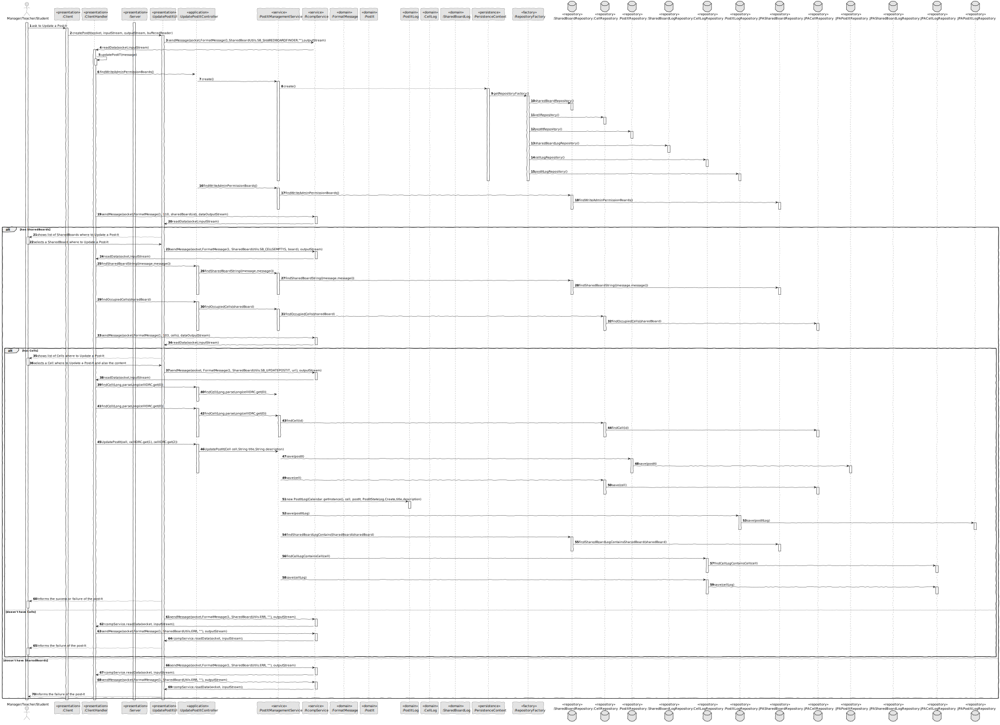
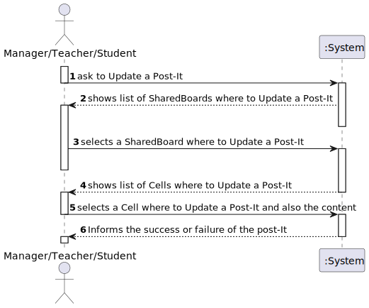
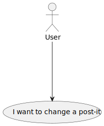
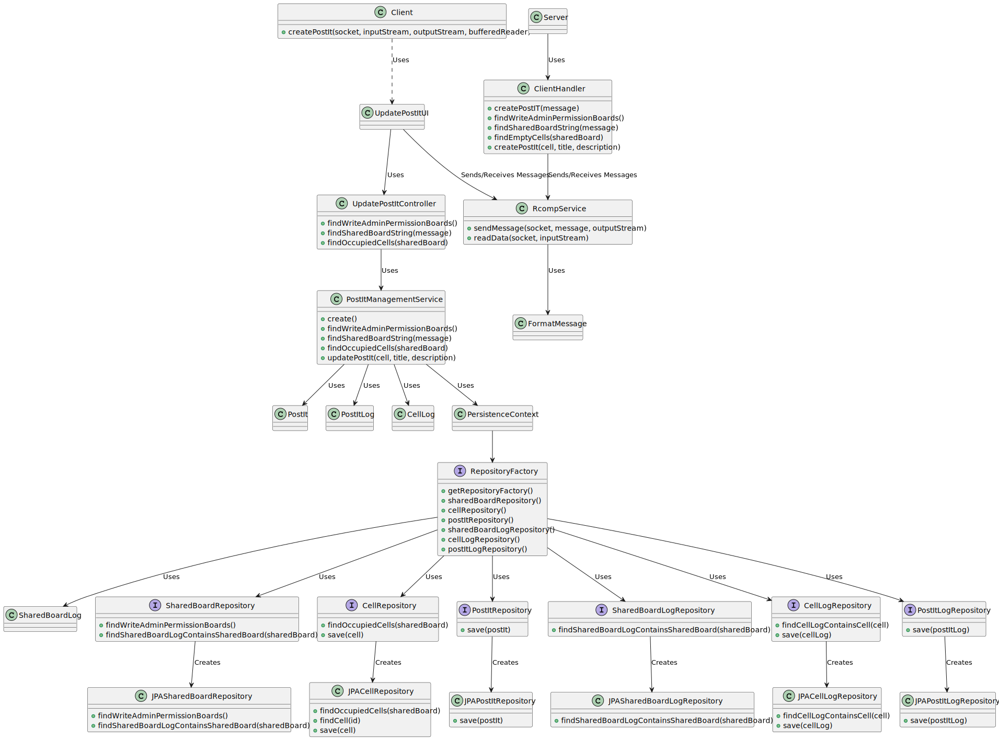
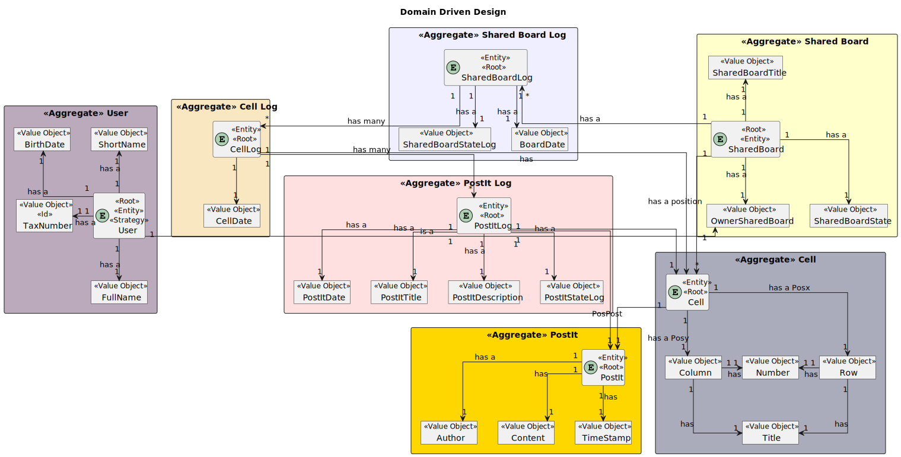

# US 3007 - As User, I want to change a post-it

## 1. Context

*Is the first time this task is assigned to be developed should be done by the end of the Sprint C.*

## 2. Requirements

> **US 3007**  As User, I want to change a post-it

Related to...
> NFR13 - **Design and Implement Shared Board Synchronization** This functional
part of the system has very specific technical requirements, particularly some concerns
about synchronization problems. In fact, several clients will try to concurrently update
boards. As such, the solution design and implementation must be based on threads,
condition variables and mutexes. Specic requirements will be provided in SCOMP.


> FRB04


### 2.1 Found Out Dependencies

* There is a dependency with US3001, which is responsible for preparing the communication infrastructure for the Shared Boards and the deployment of the solution.
* There is a dependency with US3002, which is responsible for the creation of a shared board.
* * There is a dependency with US3004, which is responsible for sharing of the Board.
* There is a dependency with US3006, which is responsible for the creation of a board post-it.


### 2.2 Customer Specifications and Clarifications

**From the specifications document:**
> This functional part of the system has very
specic technical requirements. It must follow a client-server architecture, where a
client application is used to access the shared boards that should be implemented in
a server. Communications between these two components must follow specic protocol described in a document from RCOMP ("Application Protocol"). Also, the client application can not access the relational database, it can only access the server application. The
client app should implement an HTTP server to be able to generate the "views" of the
boards. This should be done automatically, without the intervention of the users (i.e.,
without reload of the web page) by using AJAX.

**From the client clarifications:**
> **Question:** "The client wants only a web page to be developed for viewing the boards and authentication in the command line (cli), as shown on page 11 of the project specification, or else, he would also accept an application fully developed on a web page (with authentication executed in it)"
>
> **Answer:** "As a customer, and if I understood correctly, the first option will be what I want. In other words, all the functionalities of the Shared Board App are carried out in the "console" type application in java, with the exception of the part related to the real-time visualization of the boards."

> **Question:**
Good afternoon!
As a client, do you want us to persist post-its in the database or they can be available only while the server is running (deleted if the server stops)?
>
> **Answer:**
Hello.
For me the information regarding the shared boards may be available only during the shared board server execution.
However, if you are also developing the functionality "FRB08 - Archive Board", there should be some way to archive and the restore the board for "testing" purposes.

> > **Question:**
Boa tarde caro cliente,
Nas especificações do sistema é dito o seguinte:
"Users with write permission may post content to a cell in the board. The content can be a text or an image."
Quando um User cria um post-it deve passar um link da imagem por exemplo:
"https://www.isep.ipp.pt/img/logo_20230106.png"
Ou devemos anexar uma imagem que está no nosso computador?
>
> **Answer:**
Boa tarde.
Para o cliente é um pouco indiferente o mecanismo que usam para fazer o "post" de imagens (assim como o(s) formato(s) suportado(s)).
Podem optar pela solução que for mais simples. Suponho que suportar o "upload" de imagens locais e suportar um formato comum, como png ou jpeg, seja suficiente.
Cumprimentos.


> > **Question:**
Good evening!
In this US can we assume that any user can undo the last change in a post-it that any other user made? Or we should allow only the author of a change to undo the change?
Regards,
Group 33


> **Answer:**
Hello.
Similarly to the last question, I must start by stating that we are very close to the deadline and I will only reply based on the contents of the system specification.
Page 15: "The user who created a post in a cell can change that post. It may change its contents or move the post into a free cell. The user can also undo the last change."
Regards.


## 4. Design

*In this section, the team should present the solution
design that was adopted to solve the requirement.
This should include, at least, a diagram of the realization
of the functionality (e.g., sequence diagram),
a class diagram (presenting the classes that support the functionality),
the identification and rationale behind the applied design patterns and
the specification of the main tests used to validate the functionality.*

Use the standard, layer-based application framework

Domain classes: SharedBoard(SharedBoard Aggregate),Cell (Cell Aggregate),PostIt(PostIt Aggregate),SharedBoardLog(SharedBoardLog Aggregate),CellLog (CellLog Aggregate),PostItLog(PostItLog Aggregate)

Controller: CreatePostItController
UI: CreatePostItUI
Service: PostItManagementService
Repository: SharedBoardRepository,CellRepository,PostItRepository,SharedBoardLogRepository,CellLogRepository,PostItLogRepository
### 4.1. Realization (Sequence Diagram)



### 4.2. System Sequence Diagram (Sequence Diagram)



### 4.3. Use Case Diagram



### 4.4. Class Diagram



### 4.5. Domain Model Excert



### 4.6. Applied Patterns

Low Coupling:

    Low Coupling is a design principle in software 
    engineering that aims to reduce the dependencies 
    between software components or modules. 
    It suggests that modules should have minimal knowledge about each other and should be loosely coupled. 
    In other words, changes in one module should have minimal impact on other modules.
    This promotes modularity, flexibility, and ease of maintenance in software systems. 
    By reducing coupling, it becomes easier to understand, modify, and test individual components without affecting the entire system.

High Cohesion:

        High Cohesion is a design principle that emphasizes organizing related functionality together within a software module or component. 
        It suggests that a module should have a single, well-defined responsibility or purpose. 
        Modules with high cohesion are focused and perform a specific set of related tasks, making them more maintainable and reusable. 
        High cohesion allows for better code organization, readability, and the ability to easily modify or extend the functionality of a 
        particular module without affecting unrelated parts of the system.

State Pattern:

    The State Pattern is a behavioral design pattern that allows an object to alter its behavior when its internal state changes. 
    It is useful when an object's behavior needs to change dynamically based on its internal state, without resorting to large conditional statements. 
    The pattern involves defining separate classes for each possible state of an object and encapsulating the behavior associated with each state within 
    its respective class. The object maintains a reference to the current state, and when the state changes, 
    it delegates the behavior to the appropriate state class. 
    This pattern promotes extensibility, maintainability, and flexibility in managing complex state-dependent behaviors.

Protected Variation:

    Protected Variation is a design principle that aims to isolate or decouple the parts of a system that are most likely to change due to external factors. 
    It suggests designing interfaces or abstractions that protect the core components of a system from being affected 
    by variations in other parts of the system or external dependencies. By encapsulating the volatile or varying aspects, 
    such as specific implementation details or external integrations, the core components become less dependent on them. 
    This principle helps to manage change and mitigate the impact of modifications, promoting system stability and maintainability.

Creator:
> Provides a way to create objects without exposing the instantiation logic to the client code.
> It separates the creation of objects from their use, and provides a way to easily extend the types of objects that
can be created.

Repository:
> To manage and store objects in a persistent data store.
> It simplifies data access and decouples application components from data persistence technology.

Factory:
> Provides an interface for creating objects, while hiding the implementation details from the client code.
> It allows for flexibility and extensibility by delegating the responsibility of object creation to subclasses.

DDD - Domain Driven Design:
> The design of the project started right away with DDD in mind. The domain model was elaborated with the business
rules and the DDD overlay for representing aggregates, entities and roots following the necessary rules.

GRASP:
>   With each representation of an actor or user story, GRASP was always taken into account, as it was a fundamental
basis for the good development of the project.
>   Whether it's Information Expert, Low coupling/High cohesion or the controller concept, all these principles are very
present in the minds of the group members.

SOLID:
>   The SOLID was mainly present with the Single Responsibility Principle, and the responsibilities that a class should
have were always taken into account.
>   Already implemented with the base project of EAPLI, the Interface Seggregation Principle proved to be useful and
enlightening, taking into account the different repositories that had to be created.


### 4.5. Tests


```
class CellTest {
    private CellRow cellRow1;
    private CellRow cellRow2;
    private CellColumn cellColumn1;
    private CellColumn cellColumn2;
    private SharedBoard sharedBoard1;
    private SharedBoard sharedBoard2;
    private Cell cell1;
    private Cell cell2;
    private Cell cell3;

    @BeforeEach
    void setUp() {
        cellRow1 = new CellRow("Title 1", 1);
        cellRow2 = new CellRow("Title 2", 2);
        cellColumn1 = new CellColumn("Title 1", 1);
        cellColumn2 = new CellColumn("Title 2", 2);
        sharedBoard1 = new SharedBoard();
        sharedBoard2 = new SharedBoard();
        cell1 = new Cell(cellRow1, cellColumn1, sharedBoard1);
        cell2 = new Cell(cellRow2, cellColumn2, sharedBoard2);
        cell3 = new Cell(cellRow1, cellColumn1, sharedBoard1);
    }

    @Test
    void testSameAs_SameObject() {
        assertTrue(cell1.sameAs(cell1));
    }


    @Test
    void testSameAs_Null() {
        assertFalse(cell1.sameAs(null));
    }

    @Test
    void testSameAs_DifferentObjectType() {
        assertFalse(cell1.sameAs("not a Cell object"));
    }
    
    
    public class PostItTest {

    @Test
    public void createPostIt_ValidTitleAndDescription_Success() {
        // Arrange
        Title validTitle = new Title("Valid Title");
        Description validDescription = new Description("Valid Description");

        // Act
        PostIt postIt = new PostIt(validTitle, validDescription);

        // Assert
        Assertions.assertEquals(validTitle, postIt.title());
        Assertions.assertEquals(validDescription, postIt.description());
    }

    @Test
    public void replaceTitle_ValidTitle_Success() {
        // Arrange
        Title initialTitle = new Title("Initial Title");
        Title newTitle = new Title("New Title");
        Description description = new Description("Description");
        PostIt postIt = new PostIt(initialTitle, description);

        // Act
        postIt.replaceTitle(newTitle);

        // Assert
        Assertions.assertEquals(newTitle, postIt.title());
    }

    @Test
    public void replaceDescription_ValidDescription_Success() {
        // Arrange
        Title title = new Title("Title");
        Description initialDescription = new Description("Initial Description");
        Description newDescription = new Description("New Description");
        PostIt postIt = new PostIt(title, initialDescription);

        // Act
        postIt.replaceDescription(newDescription);

        // Assert
        Assertions.assertEquals(newDescription, postIt.description());
    }

    @Test
    public void sameAs_SamePostIt_ReturnsTrue() {
        // Arrange
        Title title = new Title("Title");
        Description description = new Description("Description");
        PostIt postIt1 = new PostIt(title, description);
        PostIt postIt2 = new PostIt(title, description);

        // Act & Assert
        Assertions.assertNotEquals(postIt1, postIt2);
    }
    
    
    class SharedBoardTest {
    private SystemUser owner;

    @BeforeEach
    void setUp() {
        final SystemUserBuilder userBuilder = UserBuilderHelper.builder();
        userBuilder.withUsername("joe").withPassword("Password1").withName("joe", "power")
                .withEmail("joe@email.org").withRoles(BaseRoles.nonUserValues());
         owner = userBuilder.build();
    }

    @Test
    void testCreateSharedBoard() {
        // Act
        SharedBoard sharedBoard = new SharedBoard(Designation.valueOf("Shared Board Title"), owner);

        // Assert
        assertNotNull(sharedBoard);
        assertEquals(Designation.valueOf("Shared Board Title"), sharedBoard.sharedBoardTitle());
        assertEquals(owner, sharedBoard.ownerSharedBoard());
    }

    @Test
    void testSameAs() {
        SharedBoard sharedBoard1 = new SharedBoard(Designation.valueOf("Shared Board Title"), owner);
        SharedBoard sharedBoard2 = new SharedBoard(Designation.valueOf("Shared Board Title"), owner);

        // Act & Assert
        assertTrue(sharedBoard1.sameAs(sharedBoard2));
    }
}


public class SharedBoardLogTest {

    @Test
    public void testConstructorAndGetters() {
        Calendar date = Calendar.getInstance();
        SharedBoard sharedBoard = new SharedBoard();
        List<CellLog> cellLogList = new ArrayList<>();

        SharedBoardLog sharedBoardLog = new SharedBoardLog(date, sharedBoard);

        Assertions.assertEquals(date, sharedBoardLog.date());
        Assertions.assertEquals(sharedBoard, sharedBoardLog.sharedBoard());
        Assertions.assertEquals(cellLogList, sharedBoardLog.cellLogList());
        Assertions.assertEquals(SharedBoardStateLog.Created, sharedBoardLog.sharedBoardStateLog());
    }

    @Test
    public void testReplaceId() {
        SharedBoardLog sharedBoardLog = new SharedBoardLog();
        Long newId = 1L;

        sharedBoardLog.replaceId(newId);

        Assertions.assertEquals(newId, sharedBoardLog.id());
    }

    @Test
    public void testReplaceDate() {
        SharedBoardLog sharedBoardLog = new SharedBoardLog();
        Calendar newDate = Calendar.getInstance();

        sharedBoardLog.replaceDate(newDate);

        Assertions.assertEquals(newDate, sharedBoardLog.date());
    }

    @Test
    public void testReplaceSharedBoard() {
        SharedBoardLog sharedBoardLog = new SharedBoardLog();
        SharedBoard newSharedBoard = new SharedBoard();

        sharedBoardLog.replaceSharedBoard(newSharedBoard);

        Assertions.assertEquals(newSharedBoard, sharedBoardLog.sharedBoard());
    }

    @Test
    public void testReplaceCellLogList() {
        SharedBoardLog sharedBoardLog = new SharedBoardLog();
        List<CellLog> newCellLogList = new ArrayList<>();

        sharedBoardLog.replaceCellLogList(newCellLogList);

        Assertions.assertEquals(newCellLogList, sharedBoardLog.cellLogList());
    }

    @Test
    public void testReplaceSharedBoardStateLog() {
        SharedBoardLog sharedBoardLog = new SharedBoardLog();
        SharedBoardStateLog newStateLog = SharedBoardStateLog.Updated;

        sharedBoardLog.replaceSharedBoardStateLog(newStateLog);

        Assertions.assertEquals(newStateLog, sharedBoardLog.sharedBoardStateLog());
    }

}


public class CellLogTest {

    @Test
    public void testConstructorAndGetters() {
        Calendar date = Calendar.getInstance();
        Cell cell = new Cell();
        List<PostItLog> postItLogList = new ArrayList<>();

        CellLog cellLog = new CellLog(date, cell);

        Assertions.assertEquals(date, cellLog.date());
        Assertions.assertEquals(cell, cellLog.cell());
        Assertions.assertEquals(postItLogList, cellLog.postItLogList());
    }

    @Test
    public void testReplaceId() {
        CellLog cellLog = new CellLog();
        Long newId = 1L;

        cellLog.replaceId(newId);

        Assertions.assertEquals(newId, cellLog.id());
    }

    @Test
    public void testReplaceDate() {
        CellLog cellLog = new CellLog();
        Calendar newDate = Calendar.getInstance();

        cellLog.replaceDate(newDate);

        Assertions.assertEquals(newDate, cellLog.date());
    }

    @Test
    public void testReplaceCell() {
        CellLog cellLog = new CellLog();
        Cell newCell = new Cell();

        cellLog.replaceCell(newCell);

        Assertions.assertEquals(newCell, cellLog.cell());
    }

    @Test
    public void testReplacePostItLogList() {
        CellLog cellLog = new CellLog();
        List<PostItLog> newPostItLogList = new ArrayList<>();

        cellLog.replacePostItLogList(newPostItLogList);

        Assertions.assertEquals(newPostItLogList, cellLog.postItLogList());
    }

}


public class PostItLogTest {

    @Test
    public void testConstructorAndGetters() {
        Calendar date = Calendar.getInstance();
        Cell cell = new Cell();
        PostIt postIt = new PostIt();
        PostItStateLog postItStateLog = PostItStateLog.Create;

        PostItLog postItLog = new PostItLog(Calendar.getInstance(),cell,postIt,PostItStateLog.Create,new Title("Title"),new Description("Description"));

        Assertions.assertEquals(cell, postItLog.cell());
        Assertions.assertEquals(postIt, postItLog.postIt());
        Assertions.assertEquals(postItStateLog, postItLog.postItStateLog());
    }

    @Test
    public void testReplaceId() {
        PostItLog postItLog = new PostItLog();
        Long newId = 1L;

        postItLog.replaceId(newId);

        Assertions.assertEquals(newId, postItLog.id());
    }

    @Test
    public void testReplaceDate() {
        PostItLog postItLog = new PostItLog();
        Calendar newDate = Calendar.getInstance();

        postItLog.replaceDate(newDate);

        Assertions.assertEquals(newDate, postItLog.date());
    }

    @Test
    public void testReplaceCell() {
        PostItLog postItLog = new PostItLog();
        Cell newCell = new Cell();

        postItLog.replaceCell(newCell);

        Assertions.assertEquals(newCell, postItLog.cell());
    }

    @Test
    public void testReplacePostIt() {
        PostItLog postItLog = new PostItLog();
        PostIt newPostIt = new PostIt();

        postItLog.replacePostIt(newPostIt);

        Assertions.assertEquals(newPostIt, postItLog.postIt());
    }

    @Test
    public void testReplacePostItStateLog() {
        PostItLog postItLog = new PostItLog();
        PostItStateLog newStateLog = PostItStateLog.Create;

        postItLog.replacePostItStateLog(newStateLog);

        Assertions.assertEquals(newStateLog, postItLog.postItStateLog());
    }

    @Test
    public void testEqualsAndHashCode() {
        PostItLog postItLog1 = new PostItLog();
        postItLog1.replaceId(1L);
        PostItLog postItLog2 = new PostItLog();
        postItLog2.replaceId(1L);
        PostItLog postItLog3 = new PostItLog();
        postItLog3.replaceId(2L);

        Assertions.assertEquals(postItLog1, postItLog2);
        Assertions.assertNotEquals(postItLog1, postItLog3);

        Assertions.assertEquals(postItLog1.hashCode(), postItLog2.hashCode());
        Assertions.assertNotEquals(postItLog1.hashCode(), postItLog3.hashCode());
    }

    @Test
    public void testSameAs() {
        PostItLog postItLog1 = new PostItLog();
        postItLog1.replaceId(1L);
        PostItLog postItLog2 = new PostItLog();
        postItLog2.replaceId(1L);
        PostItLog postItLog3 = new PostItLog();
        postItLog3.replaceId(2L);

        Assertions.assertTrue(postItLog1.sameAs(postItLog2));
        Assertions.assertFalse(postItLog1.sameAs(postItLog3));
    }
}

    
````

## 5. Implementation

*In this section the team should present, if necessary, some evidencies that the implementation is according to the
design. It should also describe and explain other important artifacts necessary to fully understand the implementation
like, for instance, configuration files.*
...

    public class PostItManagement {
    private final AuthorizationService authorizationService;
    private final SharedBoardRepository sharedBoardRepository;
    private final CellRepository cellRepository;
    private final PostItRepository postItRepository;
    private final PermissionRepository permissionRepository;
    private final SharedBoardLogRepository sharedBoardLogRepository;
    private final CellLogRepository cellLogRepository;
    private final PostItLogRepository postItLogRepository;


    /**
     * Instantiates a new Post it management.
     */
    public PostItManagement() {
        this.authorizationService = AuthzRegistry.authorizationService();
        this.sharedBoardRepository = PersistenceContext.repositories().sharedBoardRepository();
        this.cellRepository = PersistenceContext.repositories().cellRepository();
        this.postItRepository = PersistenceContext.repositories().postItRepository();
        this.sharedBoardLogRepository = PersistenceContext.repositories().sharedBoardLogRepository();
        this.cellLogRepository = PersistenceContext.repositories().cellLogRepository();
        this.postItLogRepository = PersistenceContext.repositories().postItLogRepository();
        this.permissionRepository = PersistenceContext.repositories().permissionRepository();
    }

    /**
     * Find empty cells list.
     *
     * @param sharedBoard the shared board
     * @return the list
     */
    public List<Cell> findEmptyCells(SharedBoard sharedBoard) {
        return this.cellRepository.findBoardEmptyCells(sharedBoard);
    }

    /**
     * Find occupied cells list.
     *
     * @param sharedBoard the shared board
     * @return the list
     */
    public List<Cell> findOccupiedCells(SharedBoard sharedBoard) {
        return this.cellRepository.findOccupiedCells(sharedBoard);
    }

    /**
     * Find occupied cells list.
     *
     * @param sharedBoard the shared board
     * @return the list
     */
    public List<Cell> findUpdatedOccupiedCells(SharedBoard sharedBoard) {
        return this.cellRepository.findUpdatedOccupiedCells(sharedBoard);
    }

    /**
     * Find owned shared boards iterable.
     *
     * @param emailAddress the email address
     * @return the iterable
     */
    public Iterable<SharedBoard> findOwnedSharedBoards(EmailAddress emailAddress) {
        return this.sharedBoardRepository.listOwnedBoards(emailAddress);
    }

    /**
     * Find write admin permission boards list.
     *
     * @param emailAddress the email address
     * @return the list
     */
    public List<String> findWriteAdminPermissionBoards(EmailAddress emailAddress) {

        Iterable<Permission> list = new ArrayList<>();
        try {
            list = this.permissionRepository.findWriteAdmin(emailAddress);
        } catch (Exception e) {
            System.out.println("No Permissions");
        }

        System.out.println(list);
        List<String> sharedBoardList = new ArrayList<String>();
        for (Permission permission : list) {
            if (permission.SharedBoard().sharedBoardState().equals(SharedBoardState.ENABLED)) {
                sharedBoardList.add(permission.SharedBoard().sharedBoardTitle().toString());
            }
        }
        return sharedBoardList;
    }

    /**
     * Find autenticated user email address.
     *
     * @return the email address
     */
    public EmailAddress findAutenticatedUser() {
        EmailAddress emailAddress = this.authorizationService.session().get().authenticatedUser().email();
        return emailAddress;
    }


    /**
     * Find cell cell.
     *
     * @param id the id
     * @return the cell
     */
    public Cell findCell(long id) {
        Cell cell = this.cellRepository.findById(id);

        synchronized (cell) {
            return cell;
        }
    }

    /**
     * Create post it.
     *
     * @param cell        the cell
     * @param title       the title
     * @param description the description
     */
    public void createPostIt(Cell cell, String title, String description) {
        PostIt postIt = new PostIt(new Title(title), new Description(description));
        postIt = this.postItRepository.save(postIt);
        cell.replacePostIt(postIt);
        cell.replaceCellState(CellState.OCCUPIED);
        cell = this.cellRepository.save(cell);
        PostItLog postItLog = new PostItLog(Calendar.getInstance(), cell, postIt, PostItStateLog.Create, new Title(title), new Description(description));
        postItLog = this.postItLogRepository.save(postItLog);
        Boolean flag;
        CellLog cellLog = null;
        SharedBoardLog sharedBoardLog = null;

        try {
            sharedBoardLog = this.sharedBoardLogRepository.findSharedBoardLogContainsSharedBoard(cell.sharedBoard());
        } catch (Exception e) {
            sharedBoardLog = new SharedBoardLog(Calendar.getInstance(), cell.sharedBoard());
            sharedBoardLog = this.sharedBoardLogRepository.save(sharedBoardLog);
        }

        try {
            cellLog = this.cellLogRepository.findCellLogContainsCell(cell);
        } catch (Exception e) {
            cellLog = new CellLog(Calendar.getInstance(), cell);
            cellLog = this.cellLogRepository.save(cellLog);
            sharedBoardLog.addCellLogList(cellLog);
            sharedBoardLog = this.sharedBoardLogRepository.save(sharedBoardLog);
        }

        cellLog.addPostItLogList(postItLog);
        cellLog = this.cellLogRepository.save(cellLog);

    }

    /**
     * Update post it.
     *
     * @param cell        the cell
     * @param title       the title
     * @param description the description
     */
    public void updatePostIt(Cell cell, String title, String description) {

        PostIt postIt = cell.postIt();
        postIt.replaceTitle(new Title(title));
        postIt.replaceDescription(new Description(description));
        postIt = this.postItRepository.save(postIt);
        cell.replacePostIt(postIt);

        cell = this.cellRepository.save(cell);
        PostItLog postItLog = new PostItLog(Calendar.getInstance(), cell, postIt, PostItStateLog.Update, new Title(title), new Description(description));
        postItLog = this.postItLogRepository.save(postItLog);
        Boolean flag;
        CellLog cellLog = null;
        SharedBoardLog sharedBoardLog = null;

        try {
            sharedBoardLog = this.sharedBoardLogRepository.findSharedBoardLogContainsSharedBoard(cell.sharedBoard());
        } catch (Exception e) {
            sharedBoardLog = new SharedBoardLog(Calendar.getInstance(), cell.sharedBoard());
            sharedBoardLog = this.sharedBoardLogRepository.save(sharedBoardLog);
        }

        try {
            cellLog = this.cellLogRepository.findCellLogContainsCell(cell);
        } catch (Exception e) {
            cellLog = new CellLog(Calendar.getInstance(), cell);
            cellLog = this.cellLogRepository.save(cellLog);
            sharedBoardLog.addCellLogList(cellLog);
            sharedBoardLog = this.sharedBoardLogRepository.save(sharedBoardLog);
        }

        cellLog.addPostItLogList(postItLog);
        cellLog = this.cellLogRepository.save(cellLog);
        sharedBoardLog = this.sharedBoardLogRepository.save(sharedBoardLog);
    }

    public void undoPostIt(Cell cell) {

        PostIt postIt = cell.postIt();

        PostItLog lastPostItLog = this.postItLogRepository.findLastPostItLog(postIt);

        System.out.println(lastPostItLog.title() + " " + lastPostItLog.description());

        postIt.replaceTitle(lastPostItLog.title());
        postIt.replaceDescription(lastPostItLog.description());
        postIt = this.postItRepository.save(postIt);
        cell.replacePostIt(postIt);
        cell = this.cellRepository.save(cell);

        PostItLog postItLog = new PostItLog(Calendar.getInstance(), cell, postIt, PostItStateLog.Undo, lastPostItLog.title(), lastPostItLog.description());
        postItLog = this.postItLogRepository.save(postItLog);
        Boolean flag;
        CellLog cellLog = null;
        SharedBoardLog sharedBoardLog = null;

        try {
            sharedBoardLog = this.sharedBoardLogRepository.findSharedBoardLogContainsSharedBoard(cell.sharedBoard());
        } catch (Exception e) {
            sharedBoardLog = new SharedBoardLog(Calendar.getInstance(), cell.sharedBoard());
            sharedBoardLog = this.sharedBoardLogRepository.save(sharedBoardLog);
        }

        try {
            cellLog = this.cellLogRepository.findCellLogContainsCell(cell);
        } catch (Exception e) {
            cellLog = new CellLog(Calendar.getInstance(), cell);
            cellLog = this.cellLogRepository.save(cellLog);
            sharedBoardLog.addCellLogList(cellLog);
            sharedBoardLog = this.sharedBoardLogRepository.save(sharedBoardLog);
        }

        cellLog.addPostItLogList(postItLog);
        cellLog = this.cellLogRepository.save(cellLog);
        sharedBoardLog = this.sharedBoardLogRepository.save(sharedBoardLog);

    }


    /**
     * Find shared board string shared board.
     *
     * @param title the title
     * @return the shared board
     */
    public SharedBoard findSharedBoardString(String title) {
    }


}


...
*It is also a best practice to include a listing (with a brief summary) of the major commits regarding this
requirement.*
List of some commits:


@FabioMCSilva FabioMCSilva self-assigned this 3 days ago
@FabioMCSilva FabioMCSilva added this to sem4pi-22-23-4 3 days ago
@FabioMCSilva FabioMCSilva changed the title US3006 US3007 3 days ago
JorgeCunha07 and FabioMCSilva added a commit that referenced this issue 3 days ago
@JorgeCunha07
@FabioMCSilva
Started Documentation US 3007 …
c387ee8
Started Documentation US 3007
Co-Authored-By: Fábio Silva <102294243+FabioMCSilva@users.noreply.github.com>
#39


JorgeCunha07 and FabioMCSilva added a commit that referenced this issue 3 days ago
@JorgeCunha07
@FabioMCSilva
Continue Documentation US 3007 …
08a60ed
Continue Documentation US 3007
Co-Authored-By: Fábio Silva <102294243+FabioMCSilva@users.noreply.github.com>
#39


JorgeCunha07 and FabioMCSilva added a commit that referenced this issue 3 days ago
@JorgeCunha07
@FabioMCSilva
Implemented US 3007 …
1bc6db5
Implemented US 3007
Co-Authored-By: Fábio Silva <102294243+FabioMCSilva@users.noreply.github.com>
#39


JorgeCunha07 and FabioMCSilva added a commit that referenced this issue 9 hours ago
@JorgeCunha07
@FabioMCSilva
Fixes On UI …
70364a3
#38 #39

FabioMCSilva and FabioMCSilva added a commit that referenced this issue 2 minutes ago
@FabioMCSilva
Synchronization …
def4b0e
First implementation of thread synchronization #35 #39


## 6. Integration/Demonstration


## 7. Observations

The User Story was fully developed, with success.