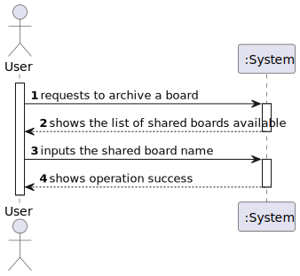

# US 3010 - As User, I want to archive a board I own

## 1. Context

*Is the first time this task is assigned to be developed should be done by the end of the Sprint C.*

## 2. Requirements

> **US 3010** As User, I want to archive a board I own

Related to...
> **FRB08** - **Archive Board** The owner of a board can archive the board

### 2.1 Found Out Dependencies

* There is a dependency with US3001, which is responsible for preparing the communication infrastructure for the Shared Boards and the deployment of the solution.
* There is a dependency with US3002, which is responsible for the creation of a shared board.

### 2.2 Customer Specifications and Clarifications

**From the specifications document:**
>The owner of a board can archive the board when it will no longer be used.

**From the client clarifications:**

n/a

## 3. Analysis

### 3.1 Use Case Diagram

### 3.2 Relevant Domain Model Excerpt

## 3.3 System Sequence Diagram (SSD)

## 4. Design

### 4.1. Realization (Sequence Diagram)

### 4.1.1 SD_SendMessage (SubSequence Diagram)

### 4.2. Class Diagram

### 4.3. Applied Patterns

* **Low Coupling**

  > Low Coupling is a design principle in software
  engineering that aims to reduce the dependencies
  between software components or modules.
  It suggests that modules should have minimal knowledge about each other and should be loosely coupled.
  In other words, changes in one module should have minimal impact on other modules.
  This promotes modularity, flexibility, and ease of maintenance in software systems.
  By reducing coupling, it becomes easier to understand, modify, and test individual components without affecting the entire system.

* **High Cohesion**

  > High Cohesion is a design principle that emphasizes organizing related functionality together within a software module or component.
  It suggests that a module should have a single, well-defined responsibility or purpose.
  Modules with high cohesion are focused and perform a specific set of related tasks, making them more maintainable and reusable.
  High cohesion allows for better code organization, readability, and the ability to easily modify or extend the functionality of a
  particular module without affecting unrelated parts of the system.

* **State Pattern**

  > The State Pattern is a behavioral design pattern that allows an object to alter its behavior when its internal state changes.
  It is useful when an object's behavior needs to change dynamically based on its internal state, without resorting to large conditional statements.
  The pattern involves defining separate classes for each possible state of an object and encapsulating the behavior associated with each state within
  its respective class. The object maintains a reference to the current state, and when the state changes,
  it delegates the behavior to the appropriate state class.
  This pattern promotes extensibility, maintainability, and flexibility in managing complex state-dependent behaviors.

* **Protected Variation**

  > Protected Variation is a design principle that aims to isolate or decouple the parts of a system that are most likely to change due to external factors.
  It suggests designing interfaces or abstractions that protect the core components of a system from being affected
  by variations in other parts of the system or external dependencies. By encapsulating the volatile or varying aspects,
  such as specific implementation details or external integrations, the core components become less dependent on them.
  This principle helps to manage change and mitigate the impact of modifications, promoting system stability and maintainability.

* **Creator**
  > Provides a way to create objects without exposing the instantiation logic to the client code.
  > It separates the creation of objects from their use, and provides a way to easily extend the types of objects that
  can be created.

* **Repository**
  > To manage and store objects in a persistent data store.
  > It simplifies data access and decouples application components from data persistence technology.

* **Factory**
  > Provides an interface for creating objects, while hiding the implementation details from the client code.
  > It allows for flexibility and extensibility by delegating the responsibility of object creation to subclasses.

* DDD - Domain Driven Design.
  > The design of the project started right away with DDD in mind. The domain model was elaborated with the business
  rules and the DDD overlay for representing aggregates, entities and roots following the necessary rules.

* GRASP
  > With each representation of an actor or user story, GRASP was always taken into account, as it was a fundamental
  basis for the good development of the project.
  > Whether it's Information Expert, Low coupling/High cohesion or the controller concept, all these principles are very
  present in the minds of the group members.

* SOLID
  > The SOLID was mainly present with the Single Responsibility Principle, and the responsibilities that a class should
  have were always taken into account.
  > Already implemented with the base project of EAPLI, the Interface Seggregation Principle proved to be useful and
  enlightening, taking into account the different repositories that had to be created.

### 4.4 Message Exchange Flow between Server and Client
When client requests a request, over a TCP connection, the following communication flow follows:
1. Wait for the message from the Client.
2. Sends the Client the Understood Code.
3. Client requests the desired request through its associated code
4. Socket waits for message from client and checks which request to execute via code

<----------------------- Execution of Request----------------------->

To terminate the request, the server:
5. Waits for message from Client.
6. Sends the Client the Understood Code.
7. Closes the Socket.

### 4.4. Tests

    class SharedBoardTest {
    private SystemUser owner;

    @BeforeEach
    void setUp() {
        final SystemUserBuilder userBuilder = UserBuilderHelper.builder();
        userBuilder.withUsername("joe").withPassword("Password1").withName("joe", "power")
                .withEmail("joe@email.org").withRoles(BaseRoles.nonUserValues());
         owner = userBuilder.build();
    }

    @Test
    void testCreateSharedBoard() {
        // Act
        SharedBoard sharedBoard = new SharedBoard(Designation.valueOf("Shared Board Title"), owner);

        // Assert
        assertNotNull(sharedBoard);
        assertEquals(Designation.valueOf("Shared Board Title"), sharedBoard.sharedBoardTitle());
        assertEquals(owner, sharedBoard.ownerSharedBoard());
    }

    @Test
    void testSameAs() {
        SharedBoard sharedBoard1 = new SharedBoard(Designation.valueOf("Shared Board Title"), owner);
        SharedBoard sharedBoard2 = new SharedBoard(Designation.valueOf("Shared Board Title"), owner);

        // Act & Assert
        assertTrue(sharedBoard1.sameAs(sharedBoard2));
    }
    }

## 5. Implementation

**PostItManagement**

    public List<String> findAdminPermissionBoards(EmailAddress emailAddress){

        Iterable<Permission> list =new ArrayList<>();
        try {
            list = this.permissionRepository.findWriteAdmin(emailAddress);
        }catch(Exception e){
            System.out.println("No Permissions");
        }

        List<String> sharedBoardList = new ArrayList<String>();
        for (Permission permission :list) {
            if(permission.SharedBoard().sharedBoardState().equals(SharedBoardState.ENABLED)
                    && permission.SharedBoard().ownerSharedBoard().email().equals(emailAddress)
                    && permission.AccessLevel().equals(AccessLevel.ADMIN)){

                sharedBoardList.add(permission.SharedBoard().sharedBoardTitle().toString());

            }
        }
        return sharedBoardList;
    }

    public void archiveSharedBoard(String title) {
        SharedBoard sharedBoard = this.sharedBoardRepository.findSharedBoardByTitle(Designation.valueOf(title));

        sharedBoard.disable();
        sharedBoard = this.sharedBoardRepository.save(sharedBoard);

    }

**UI**

    public static void archiveBoardUI(Socket socket, DataOutputStream outputStream, DataInputStream inputStream, BufferedReader bufferedReader) throws IOException {
    rcompService.sendMessage(socket, new FormatMessage(1, SharedBoardUtils.SB_ARCHIVEBOARDSTART, ""), outputStream);
    FormatMessage message = rcompService.readData(socket, inputStream);

      if (message.code() ==SharedBoardUtils.SB_SHAREDBOARDSTOARCHIVE){
          List<String> list = List.of(message.message().split(","));
          if(!list.isEmpty()) {
              for (String boards : list) {
                  System.out.println(boards);
              }
              String board = Console.readLine("Choose a board:");
              rcompService.sendMessage(socket, new FormatMessage(1, SharedBoardUtils.SB_SHAREDBOARDSTOARCHIVE, board), outputStream);
          }else{
              rcompService.sendMessage(socket, new FormatMessage(1, SharedBoardUtils.ERR, ""), outputStream);
          }
      }

        message = rcompService.readData(socket, inputStream);
      if (message.code() == SharedBoardUtils.ACK){
          System.out.println("Sucess");
      }else {
          System.out.println("Insucess");
      }

    }

**ClientHandler**

    public void archiveSharedBoard(FormatMessage message) throws IOException {
    ArchiveBoardController archiveBoardController = new ArchiveBoardController();

        List<String> sharedBoards = archiveBoardController.findAdminPermissionBoards();
        String sharedBoardList = String.join(",", sharedBoards);
        rcompService.sendMessage(socket, new FormatMessage(1, SharedBoardUtils.SB_SHAREDBOARDSTOARCHIVE, sharedBoardList), dataOutputStream);
        message = rcompService.readData(socket, dataInputStream);
        if (message.code()==SharedBoardUtils.SB_SHAREDBOARDSTOARCHIVE){
            archiveBoardController.archiveSharedBoard(message.message());
            rcompService.sendMessage(socket, new FormatMessage(1, SharedBoardUtils.ACK, ""), dataOutputStream);
        }else {
            rcompService.sendMessage(socket, new FormatMessage(1, SharedBoardUtils.ERR, ""), dataOutputStream);
        }

    }

**Controller**

    public List<String> findAdminPermissionBoards(){
    return postItManagement.findAdminPermissionBoards(findAutenticatedUser());
    }
   
    public EmailAddress findAutenticatedUser() {
    return this.postItManagement.findAutenticatedUser();
    }

    public void archiveSharedBoard(String sharedBoard){
        postItManagement.archiveSharedBoard(sharedBoard);
    }

*It is also a best practice to include a listing (with a brief summary) of the major commits regarding this
requirement.*
List of some commits:

    @FabioMCSilva FabioMCSilva self-assigned this 5 days ago

    @FabioMCSilva FabioMCSilva added this to sem4pi-22-23-4 5 days ago

    FabioMCSilva added a commit that referenced this issue 18 hours ago
    @FabioMCSilva
    Started Mark Down US3010 …
    ba4320b

    FabioMCSilva added a commit that referenced this issue 18 hours ago
    @FabioMCSilva
    Created the Documentation US3010 …
    e342d2b

    FabioMCSilva added a commit that referenced this issue 18 hours ago
    @FabioMCSilva
    Created UI,Controller,Service US3010 …
    616d609

## 6. Integration/Demonstration

n/a

## 7. Observations

The User Story was fully developed, with success.