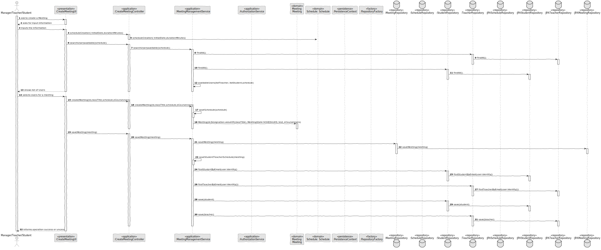
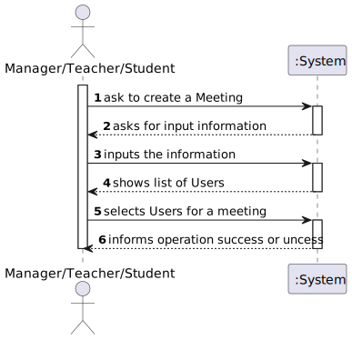
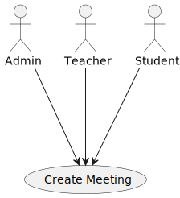
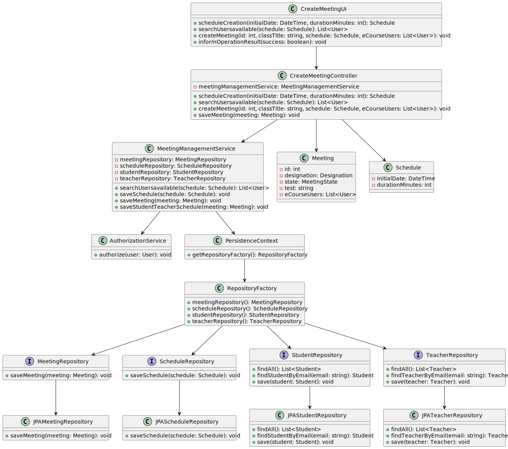

# US 4001

## 1. Context

* It is the first time the task is assigned to be developed
* I want to schedule a meeting.

## 2. Requirements

> **US 4001** As User, I want to schedule a meeting

* Regarding this requirement we understand
* that it relates to making a scheduling meeting on the app user.

## 3. Analysis

> Interpretar caso de uso: perceção dos objetivos. pre-requesitos, esecuções, pos-requesitos

Decisions to take the best design decisions for the requirement. This section should also include supporting
diagrams/artifacts (such as domain model; use case diagrams, etc.),*

Acceptance Criteria:
-> The system must check if all participants are available and send invitations to participants.

### 3.1. Customer Specifications and Clarifications

Acceptance Criteria:
-> The system must check if all participants are available and send invitations to participants.

Questions:

## Question:
none
## Answer:
none


## 4. Design

*In this section, the team should present the solution
design that was adopted to solve the requirement.
This should include, at least, a diagram of the realization
of the functionality (e.g., sequence diagram),
a class diagram (presenting the classes that support the functionality),
the identification and rational behind the applied design patterns and
the specification of the main tests used to validade the functionality.*

Use the standard, layer-based application framework

Domain classes: Meeting (Meeting Aggregate)

Controller: CreateMeetingController
UI: CreateMeetingUI
Service: MeetingManagementService
Repository: MeetingRepository, TeacherRepository,StudentRepository,ScheduleRepository

### 4.1. Realization (Sequence Diagram)



### 4.2. System Sequence Diagram (Sequence Diagram)



### 4.3. Use Case Diagram



### 4.4. Class Diagram



### 4.5. Applied Patterns

-Low Coupling

-High Cohesion

-State Pattern

-Protected Variation

### 4.6. Tests

**Test 1:** *Verifies that it is not possible to create an instance of the Example class with null values.*

```
@Test(expected = IllegalArgumentException.class)
public void ensureNullIsNotAllowed() {
	Example instance = new Example(null, null);
}
````

## 5. Implementation

*In this section the team should present, if necessary, some evidencies that the implementation is according to the
design. It should also describe and explain other important artifacts necessary to fully understand the implementation
like, for instance, configuration files.*
/*

    public class MeetingManagementService {

    private final AuthorizationService authorizationService;
    private final MeetingRepository meetingRepository;
    private final ScheduleRepository scheduleRepository;
    private final StudentRepository studentRepository;
    private final TeacherRepository teacherRepository;


    /**
     * Instantiates a new Meeting management service.
     */
    public MeetingManagementService() {
        this.authorizationService = AuthzRegistry.authorizationService();
        this.meetingRepository = PersistenceContext.repositories().meetingRepository();
        this.scheduleRepository =PersistenceContext.repositories().scheduleRepository();
        this.studentRepository = PersistenceContext.repositories().studentRepository();
        this.teacherRepository = PersistenceContext.repositories().teacherRepository();
    }


    /**
     * Save meeting.
     *
     * @param meeting the meeting
     */
    public void saveMeeting(Meeting meeting) {
    }

    /**
     * Save schedule.
     *
     * @param schedule the schedule
     * @return schedule
     */
    public Schedule saveSchedule(Schedule schedule) {
    }

    private void saveStudentTeacherSchedule(Meeting meeting) {
    }

    /**
     * Create meeting.
     *
     * @param id           the id
     * @param classTitle   the class title
     * @param schedule     the schedule
     * @param eCourseUsers the e course users
     * @return the meeting
     */
    public Meeting createMeeting(long id,String classTitle, Schedule schedule, List<ECourseUser> eCourseUsers) {
    }

    /**
     * Search usersavailable list.
     *
     * @param schedule the schedule
     * @return the list
     */
    public List<ECourseUser> searchUsersavailable(Schedule schedule) {
    }


    private List<ECourseUser> availableUsers(Iterable<Teacher> listTeacher, Iterable<Student> listStudent, Schedule schedule) {
    }

*/


*It is also a best practice to include a listing (with a brief summary) of the major commits regarding this
requirement.*

@JorgeCunha07 JorgeCunha07 self-assigned this 2 weeks ago
JorgeCunha07 added a commit that referenced this issue last week
@JorgeCunha07
Fixed issues …
a25495f

JorgeCunha07 added a commit that referenced this issue 6 hours ago
@JorgeCunha07
Persistence For Schedule /Meeting …
6847827

JorgeCunha07 added a commit that referenced this issue 5 hours ago
@JorgeCunha07
US4001 …
0ec8401

JorgeCunha07 added a commit that referenced this issue 1 hour ago
@JorgeCunha07
US 4001 …
eb603e7

JorgeCunha07 added a commit that referenced this issue 7 minutes ago
@JorgeCunha07
US 4001 …
ef6e81c
@JorgeCunha07


## 6. Integration/Demonstration

*In this section the team should describe the efforts realized in order to integrate this functionality with the other
parts/components of the system*

*It is also important to explain any scripts or instructions required to execute an demonstrate this functionality*

## 7. Observations

*This section should be used to include any content that does not fit any of the previous sections.*

*The team should present here, for instance, a critical prespective on the developed work including the analysis of
alternative solutioons or related works*

*The team should include in this section statements/references regarding third party works that were used in the
development this work.*