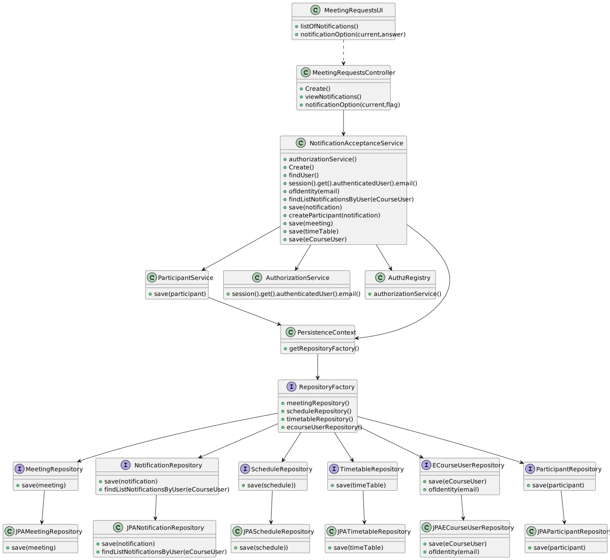

# US 4003

## 1. Context

* It is the first time the task is assigned to be developed
* I want to accept or reject a meeting request

## 2. Requirements

> **US 4003** As User, I want to accept or reject a meeting request

This User Story it has dependencies to the USs:
> **US 1001** As Manager, I want to be able to register, disable/enable, and list users of the system (Teachers and Students, as well as Managers)
>
> **US 4001** As User, I want to schedule a meeting
>
> **US 4002** As User, I want to cancel a meeting 

This relates to cancel a schedule meeting on the app user.

## 3. Analysis

> Interpretar caso de uso: perceção dos objetivos. pre-requesitos, execuções, pos-requesitos

Decisions to take the best design decisions for the requirement. This section should also include supporting
diagrams/artifacts (such as domain model; use case diagrams, etc.),*

Acceptance Criteria:
-> Does not exist 

### 3.1. Customer Specifications and Clarifications

Acceptance Criteria:
Regarding this requirement we understand that it relates list participants in the meeting created by the user, and their status (accepted/rejected)


## Question:

Bom dia,

Em relação a esta US deveríamos simplesmente considerar os "meeting request" que não foram aceites ou rejeitados?

Um "meeting request" que já foi aceite ou rejeitado poderá ser alterado, depois?
Obrigado pela atenção,

Lourenço Mayol 1211206 G32.
## Answer:

Bom dia Lourenço.

Não sei se discutiu o assunto na aula OT presencial, mas a intenção nesta US é fazer exactamente o que está descrito: aceitar ou rejeitar um pedido de reunião. 

A decisão é tomada uma única vez pelo utilizador.
Cumprimentos.


## 4. Design

*In this section, the team should present the solution
design that was adopted to solve the requirement.
This should include, at least, a diagram of the realization
of the functionality (e.g., sequence diagram),
a class diagram (presenting the classes that support the functionality),
the identification and rationale behind the applied design patterns and
the specification of the main tests used to validate the functionality.*

Use the standard, layer-based application framework

Domain classes: Meeting (Meeting Aggregate),Notification (Notification Aggregate),Participant (Participant Aggregate)

Controller: MeetingRequestsController
UI: MeetingRequestsUI
Service: MeetingManagementService,ParticipantService,NotificationAcceptanceService
Repository: MeetingRepository, TeacherRepository,StudentRepository,ScheduleRepository, EcourseUserRepository ,ParticipantRepository

### 4.1. Realization (Sequence Diagram)


### 4.2. System Sequence Diagram (Sequence Diagram)


### 4.3. Use Case Diagram


### 4.4. Class Diagram



### 4.5. Domain Model Excert


### 4.6. Applied Patterns

Low Coupling:

    Low Coupling is a design principle in software 
    engineering that aims to reduce the dependencies 
    between software components or modules. 
    It suggests that modules should have minimal knowledge about each other and should be loosely coupled. 
    In other words, changes in one module should have minimal impact on other modules.
    This promotes modularity, flexibility, and ease of maintenance in software systems. 
    By reducing coupling, it becomes easier to understand, modify, and test individual components without affecting the entire system.

High Cohesion:

        High Cohesion is a design principle that emphasizes organizing related functionality together within a software module or component. 
        It suggests that a module should have a single, well-defined responsibility or purpose. 
        Modules with high cohesion are focused and perform a specific set of related tasks, making them more maintainable and reusable. 
        High cohesion allows for better code organization, readability, and the ability to easily modify or extend the functionality of a 
        particular module without affecting unrelated parts of the system.

State Pattern:

    The State Pattern is a behavioral design pattern that allows an object to alter its behavior when its internal state changes. 
    It is useful when an object's behavior needs to change dynamically based on its internal state, without resorting to large conditional statements. 
    The pattern involves defining separate classes for each possible state of an object and encapsulating the behavior associated with each state within 
    its respective class. The object maintains a reference to the current state, and when the state changes, 
    it delegates the behavior to the appropriate state class. 
    This pattern promotes extensibility, maintainability, and flexibility in managing complex state-dependent behaviors.

Protected Variation:

    Protected Variation is a design principle that aims to isolate or decouple the parts of a system that are most likely to change due to external factors. 
    It suggests designing interfaces or abstractions that protect the core components of a system from being affected 
    by variations in other parts of the system or external dependencies. By encapsulating the volatile or varying aspects, 
    such as specific implementation details or external integrations, the core components become less dependent on them. 
    This principle helps to manage change and mitigate the impact of modifications, promoting system stability and maintainability.

Creator:
> Provides a way to create objects without exposing the instantiation logic to the client code.
> It separates the creation of objects from their use, and provides a way to easily extend the types of objects that
can be created.

Repository:
> To manage and store objects in a persistent data store.
> It simplifies data access and decouples application components from data persistence technology.

Factory:
> Provides an interface for creating objects, while hiding the implementation details from the client code.
> It allows for flexibility and extensibility by delegating the responsibility of object creation to subclasses.

DDD - Domain Driven Design:
> The design of the project started right away with DDD in mind. The domain model was elaborated with the business
rules and the DDD overlay for representing aggregates, entities and roots following the necessary rules.

GRASP:
>   With each representation of an actor or user story, GRASP was always taken into account, as it was a fundamental
basis for the good development of the project.
>   Whether it's Information Expert, Low coupling/High cohesion or the controller concept, all these principles are very
present in the minds of the group members.

SOLID:
>   The SOLID was mainly present with the Single Responsibility Principle, and the responsibilities that a class should
have were always taken into account.
>   Already implemented with the base project of EAPLI, the Interface Seggregation Principle proved to be useful and
enlightening, taking into account the different repositories that had to be created.


### 4.6. Tests


**Test 1:** *Verifies that it is not possible to create an instance of the Example class with null values.*

```
class ParticipantTest {

    private Participant participant;
    private Long idParticipant;
    private Meeting meeting;
    private ECourseUser eCourseUser;
    private ParticipantState participantState;

    @BeforeEach
    void setUp() {
        idParticipant = 1L;
        meeting = null;
        eCourseUser = null;
        participantState = ParticipantState.ACCEPTED;

        participant = new Participant(meeting, eCourseUser, participantState);
    }


    @Test
    void testReplaceMeeting() {
        Meeting newMeeting = null;
        participant.replaceMeeting(newMeeting);
        assertEquals(newMeeting, participant.meeting());
    }

    @Test
    void testReplaceECourseUser() {
        ECourseUser newECourseUser = null;
        participant.replaceeCourseUser(newECourseUser);
        assertEquals(newECourseUser, participant.eCourseUser());
    }

    @Test
    void testSameAs() {
        Participant sameParticipant = new Participant(meeting, eCourseUser, participantState);
        assertTrue(participant.sameAs(sameParticipant));

        Participant differentParticipant = new Participant(meeting, eCourseUser, ParticipantState.DECLINED);
        assertTrue(participant.sameAs(differentParticipant));
    }
    
}

class ParticipantStateTest {

    @Test
    void testAcceptedState() {
        ParticipantState state = ParticipantState.ACCEPTED;
        assertEquals("ACCEPTED", state.name());
        assertEquals(0, state.ordinal());
    }

    @Test
    void testDeclinedState() {
        ParticipantState state = ParticipantState.DECLINED;
        assertEquals("DECLINED", state.name());
        assertEquals(1, state.ordinal());
    }
}

public class NotificationTest {

    private Notification notification;
    private ECourseUser eCourseUser;

    @BeforeEach
    public void setup() {
        // Create a sample meeting and user
        Schedule sh = new Schedule();
        Meeting meeting = new Meeting(Designation.valueOf("Meeting 1"), MeetingState.FINISHED, Calendar.getInstance(),1,null,null);
        Course c1 = new Course(Designation.valueOf("Java"), Description.valueOf("Java - avancado"),null, Code.valueOf("Edicao 1"), 10, 20,null);

        // Create a sample notification
        NotificationState notificationState = NotificationState.PENDING;
        TypeOfNotification typeOfNotification = TypeOfNotification.EMAIL;
        notification = new Notification(notificationState, typeOfNotification, meeting, eCourseUser);
    }

    @Test
    public void testReplaceMeeting() {
        // Create a new meeting
        Schedule sh = new Schedule();
        Meeting newMeeting = new Meeting(Designation.valueOf("Meeting 2"), MeetingState.FINISHED, Calendar.getInstance(),2,null,null);

        // Replace the meeting of the notification
        notification.replaceMeeting(newMeeting);

        // Verify that the meeting has been replaced
        assertEquals(newMeeting, notification.Meeting());
    }

    @Test
    public void testReplaceCourseUser() {
        // Create a new user
        Course c1 = new Course(Designation.valueOf("Java"), Description.valueOf("Java - avancado"),null, Code.valueOf("Edicao 1"), 10, 20,null);
        Acronym acronym = new Acronym("ABC");
        final SystemUserBuilder userBuilder = UserBuilderHelper.builder();
        userBuilder.withUsername("joe").withPassword("Password1").withName("joe", "power")
                .withEmail("joe@email.org").withRoles(BaseRoles.STUDENT);
        final SystemUser newUser = userBuilder.build();
        ECourseUser eCourseUser = new ECourseUser(newUser.email(),new ShortName("joe"),new FullName("joe","power"), Calendar.getInstance(),new TaxNumber("123456789"),null);
        // Replace the user of the notification
        notification.replaceCourseUser(eCourseUser);

        // Verify that the user has been replaced
        assertEquals(eCourseUser, notification.eCourseUser());
    }
}

public class NotificationBuilderTest {

    @Test
    void testBuildNotification() {
        MeetingBuilder builderr = new MeetingBuilder();
        NotificationState notificationState = NotificationState.PENDING;
        TypeOfNotification typeOfNotification = TypeOfNotification.EMAIL;
        Meeting meeting = builderr.withMeetingState(MeetingState.SCHEDULED).withmeetingTitle(Designation.valueOf("Titulo")).
                withCalendarInitial(Calendar.getInstance()).withDuration(60).
                withListUsers(new ArrayList<>()).withUserOwner(null).build();
        ECourseUser eCourseUser = null;

        NotificationBuilder builder = new NotificationBuilder()
                .withNotificationState(notificationState)
                .withTypeOfNotification(typeOfNotification)
                .withMeeting(meeting)
                .withUser(eCourseUser);

        Notification notification = builder.build();

        assertNotNull(notification);
        assertEquals(notificationState, notification.notificationState());
        assertEquals(typeOfNotification, notification.typeOfNotification());
        assertEquals(meeting, notification.Meeting());
        assertEquals(eCourseUser, notification.eCourseUser());
    }
}

class MeetingTest {

    @Test
    void testIsOccurring() {
        MeetingState classType = MeetingState.OCCURRING;
        Schedule schedule = new Schedule();
        Meeting meeting = new Meeting(Designation.valueOf("Meeting 1"),MeetingState.SCHEDULED, Calendar.getInstance(),60,new ArrayList<>(),null);
        assertFalse(meeting.isOccurring());
        assertFalse(meeting.isFinished());
    }

    @Test
    void testIsFinished() {
        MeetingState classType = MeetingState.FINISHED;
        Schedule schedule = new Schedule();
        Meeting meeting = new Meeting(Designation.valueOf("Meeting 2"),MeetingState.SCHEDULED, Calendar.getInstance(),60,new ArrayList<>(),null);
        assertFalse(meeting.isOccurring());
        assertFalse(meeting.isFinished());
    }

    @Test
    void testIdentity() {
        MeetingState classType = MeetingState.SCHEDULED;
        Schedule schedule = new Schedule();
        Meeting meeting = new Meeting(Designation.valueOf("Meeting 3"),MeetingState.SCHEDULED, Calendar.getInstance(),160,new ArrayList<>(),null);
        assertNotEquals(3L, meeting.identity());
    }

}

````

## 5. Implementation

*In this section the team should present, if necessary, some evidencies that the implementation is according to the
design. It should also describe and explain other important artifacts necessary to fully understand the implementation
like, for instance, configuration files.*


   public class NotificationAcceptanceService {

    private final AuthorizationService authorizationService;
    private MeetingRepository meetingRepository;

    private NotificationRepository notificationRepository;
    private TimetableRepository timetableRepository;
    private NotificationBuilder notificationBuilder;
    private ECourseUserRepository eCourseUserRepository;
    private ParticipantService participantService;


    /**
     * Instantiates a new Notification acceptance service.
     */
    public NotificationAcceptanceService() {
        this.authorizationService = AuthzRegistry.authorizationService();
        this.meetingRepository = PersistenceContext.repositories().meetingRepository();
        this.notificationRepository = PersistenceContext.repositories().notificationRepository();
        this.eCourseUserRepository = PersistenceContext.repositories().eCourseUserRepository();
        this.timetableRepository = PersistenceContext.repositories().timetableRepository();
        this.notificationBuilder = new NotificationBuilder();
        this.participantService = new ParticipantService();
    }

    /**
     * Create notifications.
     *
     * @param meeting the meeting
     * @param users   the users
     */
    public void createNotifications(Meeting meeting, ArrayList<ECourseUser> users) {
        Notification notification;
        for (ECourseUser user : users) {
            notification = notificationBuilder.withNotificationState(NotificationState.PENDING).withTypeOfNotification(TypeOfNotification.EMAIL).withMeeting(meeting).withUser(user).build();
            this.notificationRepository.save(notification);
        }

    }

    /**
     * Find all notifications for this meeting array list.
     *
     * @param current the current
     * @return the array list
     */
    public ArrayList<Notification> findAllNotificationsForThisMeeting(Meeting current) {
        return  notificationRepository.findAllNotificationsForThisMeeting(current);
    }

    /**
     * Delete notifications.
     *
     * @param list the list
     */
    public void deleteNotifications(ArrayList<Notification> list) {
        for (Notification notification : list) {
            notificationRepository.remove(notification);
        }
    }

    /**
     * View notifications iterable.
     *
     * @return the iterable
     */
    public Iterable<Notification> viewNotifications() {
        ECourseUser eCourseUser = findUser();
        Iterable<Notification> notifications = new ArrayList<>();
        try {
            notifications = notificationRepository.findListNotificationsByUser(eCourseUser);
        }catch (Exception e) {
            System.out.println("Doesnt exit Notifications.");
        }
        return notifications;


    }

    private ECourseUser findUser() {
        EmailAddress email = authorizationService.session().get().authenticatedUser().email();
        return eCourseUserRepository.ofIdentity(email).get();
    }


    /**
     * Notification option.
     *
     * @param notification the notification
     * @param flag         the flag
     */
    @Transactional
    public void notificationOption(Notification notification,Boolean flag) {
        if (flag){
            notification.replaceNotificationState(NotificationState.ACCEPTED);
        }else {
            notification.replaceNotificationState(NotificationState.DECLINED);
        }
        notification =notificationRepository.save(notification);
        Meeting meeting = notification.Meeting();
        Participant participant = participantService.createParticipant(notification);
        meeting.addCourseUsers(participant);
        meeting =meetingRepository.save(meeting);

        if (flag) {
            ECourseUser eCourseUser = notification.eCourseUser();
            TimeTable timeTable = eCourseUser.timeTable();
            timeTable.addSchedules(meeting);
            timeTable = timetableRepository.save(timeTable);
            eCourseUser.replaceTimeTable(timeTable);
            eCourseUserRepository.save(eCourseUser);
        }

    }


}


*It is also a best practice to include a listing (with a brief summary) of the major commits regarding this
requirement.*

@JorgeCunha07 JorgeCunha07 self-assigned this 2 weeks ago
@JorgeCunha07 JorgeCunha07 added this to sem4pi-22-23-4 2 weeks ago
@JorgeCunha07 JorgeCunha07 moved this to 📋 Backlog in sem4pi-22-23-4 2 weeks ago
JorgeCunha07 added a commit that referenced this issue last week
@JorgeCunha07
Test Driven Design …
410cc93

JorgeCunha07 added a commit that referenced this issue last week
@JorgeCunha07
Started Documentation of US4003 …
6ce1a4c

JorgeCunha07 added a commit that referenced this issue last week
@JorgeCunha07
Continuation of the Documentation US 4003 …
f48f621

JorgeCunha07 added a commit that referenced this issue last week
@JorgeCunha07
US 4003,Started the code …
df08d09

JorgeCunha07 added a commit that referenced this issue last week
@JorgeCunha07
Implemented the UI -> US 4003 …
6a8d12e


JorgeCunha07 added a commit that referenced this issue last week
@JorgeCunha07
Finished US 4002,4003 Testing …


## 6. Integration/Demonstration

*In this section the team should describe the efforts realized in order to integrate this functionality with the other
parts/components of the system*

*It is also important to explain any scripts or instructions required to execute an demonstrate this functionality*

## 7. Observations

*This section should be used to include any content that does not fit any of the previous sections.*

*The team should present here, for instance, a critical perspective on the developed work including the analysis of
alternative solutions or related works*

*The team should include in this section statements/references regarding third party works that were used in the
development this work.*