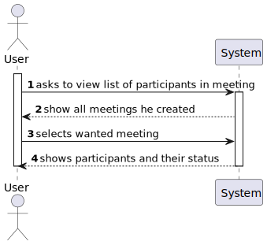

# US 4004

## 1. Context

* It is the first time the task is assigned to be developed

## 2. Requirements

> **US 4004** As User, I want to view a list of participants in my meeting and their status (accept or reject)

Related to...
> FRM04 List Participants: The system displays the lists of participants in a meeting and
the response status (accept or reject meeting)

* There is a dependency with US4003, which is responsible for accepting/rejecting the meeting.

### 2.1. Customer Specifications and Clarifications

> Regarding this requirement we understand that it relates list participants in the meeting
> created by the user, and their status (accepted/rejected)

## 3. Analysis

Decisions to take the best design decisions for the requirement. This section should also include supporting
diagrams/artifacts (such as domain model; use case diagrams, etc.),*

### 3.1. Use Case Diagram

### 3.2. Domain Model

### 3.3. System Sequence Diagram

## 4. Design

*In this section, the team should present the solution design that was adopted to solve the requirement. This should
include, at least, a diagram of the realization of the functionality (e.g., sequence diagram), a class diagram (
presenting the classes that support the functionality), the identification and rational behind the applied design
patterns and the specification of the main tests used to validade the functionality.*

### 4.1. Realization (Sequence Diagram)

### 4.2. Class Diagram

### 4.3. Applied Patterns

* **Repository**
  > To manage and store objects in a persistent data store.
  > It simplifies data access and decouples application components from data persistence technology.

* **Factory**
  > Provides an interface for creating objects, while hiding the implementation details from the client code.
  > It allows for flexibility and extensibility by delegating the responsibility of object creation to subclasses.

* DDD - Domain Driven Design.
  > The design of the project started right away with DDD in mind. The domain model was elaborated with the business
  rules and the DDD overlay for representing aggregates, entities and roots following the necessary rules.

* GRASP
  > With each representation of an actor or user story, GRASP was always taken into account, as it was a fundamental
  basis for the good development of the project.
  > Whether it's Information Expert, Low coupling/High cohesion or the controller concept, all these principles are very
  present in the minds of the group members.

* SOLID
  > The SOLID was mainly present with the Single Responsibility Principle, and the responsibilities that a class should
  have were always taken into account.
  > Already implemented with the base project of EAPLI, the Interface Seggregation Principle proved to be useful and
  enlightening, taking into account the different repositories that had to be created.

### 4.4. Tests

## 5. Implementation

*In this section the team should present, if necessary, some evidences that the implementation is according to the
design. It should also describe and explain other important artifacts necessary to fully understand the implementation
like, for instance, configuration files.*

public class ListMeetingParticipantsController {

    private MeetingManagementService meetingManagementService ;
    private ParticipantRepository participantRepository;
    public ListMeetingParticipantsController(){
        this.meetingManagementService = new MeetingManagementService();
        this.participantRepository = PersistenceContext.repositories().participantRepository();
    }

    public Iterable<Meeting> userMeetings(){
        return meetingManagementService.listOfMeetingsOwner();
    }

    public List<Participant>  meetingParticipants (Meeting selectedMeeting){
        return participantRepository.meetingParticipants(selectedMeeting);
    }

}

public class MeetingManagementService {

    public Iterable<Meeting> listOfMeetingsOwner() {
        ECourseUser owner = findOwnerMeeting();
        return meetingRepository.meetingOwnerList(owner);
    }

    private ECourseUser findOwnerMeeting() {
        EmailAddress email = authorizationService.session().get().authenticatedUser().email();
        return eCourseUserRepository.ofIdentity(email).get();
    }

}

*It is also a best practice to include a listing (with a brief summary) of the major commits regarding this
requirement.*

## 6. Integration/Demonstration

*In this section the team should describe the efforts realized in order to integrate this functionality with the other
parts/components of the system*

*It is also important to explain any scripts or instructions required to execute and demonstrate this functionality*

## 7. Observations

*This section should be used to include any content that does not fit any of the previous sections.*

*The team should present here, for instance, a critical perspective on the developed work including the analysis of
alternative solutions or related works*

*The team should include in this section statements/references regarding third party works that were used in the
development this work.*